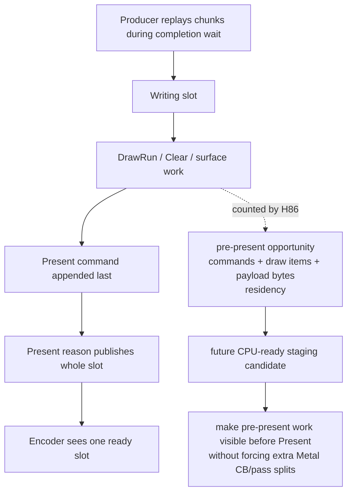

# Present-Pacing 86 - Present-tail CPU-ready opportunity

## Question

H85 proved that GT1 work lives in the writing slot until a `Present` publish.
Is that slot mostly a bare Present command, or does it already contain a large
tail-Present stream that could be made CPU-ready before the Present command
without changing app-visible order?

## Change

`prepareSlotForPublish()` now scans `Present`-published slots and records the
work before the first `Present` command:

| Counter | Meaning |
|---|---|
| `chunk_publish_present_pre_present_opportunity_slots` | Present-published slots with work before Present |
| `*_tail_slots` / `*_nontail_slots` | whether Present is the last command in the slot |
| `*_commands`, `*_draw_runs`, `*_draw_items` | work that is already before Present |
| `*_non_draw_commands` | clear/surface/present-adjacent non-draw commands before Present |
| `*_payload_bytes` | slot-local draw payload bytes held until Present publication |
| `*_residency_ms`, `*_p50_ms`, `*_p95_ms` | same first-command-to-publish residency for opportunity slots |

This is observation-only. It does not publish earlier and does not alter the
Metal command-buffer or render-pass shape.



## Runtime Check

Run:
`experiments/output/app-d3d9-3dmark05-h86-pre-present-opportunity-r1`.

```sh
scripts/tools/run_3dmark05_perf_probe.sh \
  --suffix h86-pre-present-opportunity-r1 \
  --no-gputrace \
  --timeout 120 \
  --wait-unlocked-sec 60 \
  --no-encoder-breakdown
```

The run completed with `status=pass`, `present_encoded=1800`,
`draw_skipped_no_pipeline=0`, and `gpu_command_buffer_errors=0`. The smoke
image is an effects-heavy GT1 frame and does not show the recent
black/translucent-vertex class.

| Metric | Value |
|---|---:|
| `completion_wait_ms_per_present` | `27.232` |
| `completion_wait_with_enqueue_ms_per_present` | `0.108` |
| `completion_wait_without_enqueue_ms_per_present` | `27.124` |
| `encode_ready_depth_avg` | `1.000` |
| `encode_ready_depth_gt1_per_present` | `0.000` |
| `chunk_publish_reason_present` | `1800` |
| `chunk_publish_commands_present_per_present` | `329.962` |
| `chunk_publish_slot_residency_present_ms_per_present` | `35.649` |
| `chunk_publish_slot_residency_nonpresent_ms_per_present` | `0.000` |
| `pre_present_opportunity_slots_per_present` | `1.000` |
| `pre_present_opportunity_tail_slot_share` | `100.00%` |
| `pre_present_opportunity_commands_per_present` | `328.962` |
| `pre_present_opportunity_draw_runs_per_present` | `325.024` |
| `pre_present_opportunity_draw_items_per_present` | `738.675` |
| `pre_present_opportunity_non_draw_commands_per_present` | `3.938` |
| `pre_present_opportunity_payload_mib` | `340.667` |
| `pre_present_opportunity_residency_ms_per_present` | `35.649` |
| `commit_chunk_replay_cpu_ms_per_present` | `8.017` |
| `encode_chunk_cpu_ms_per_present` | `11.225` |
| `gpu_command_buffer_time_ms_per_present` | `3.171` |

## Verdict

The current GT1 P4 owner is not a bare Present wait and not a missing producer.
Every sampled Present-published slot has useful work before the Present command,
and every one has Present as the tail command. On average, each frame holds
about `329` pre-Present commands, `325` draw-run commands, `739` draw items, and
`198 KiB` of draw payload in the writing slot until Present publishes it.

That makes the next P4 candidate more specific:

1. Split logical CPU-ready visibility at the tail Present boundary.
2. Keep the pre-Present work and the Present tail order-preserving.
3. Encode/coalesce so this does not become the H74/H75 failure mode of many
   Metal command buffers or extra render-pass splits.
4. Use H84/H85/H86 counters before spending another `.gputrace`.

## Next Gate

A valid candidate should show:

| Gate | Required direction |
|---|---|
| `chunk_publish_present_pre_present_opportunity_slots_per_present` | baseline is `1.000`; candidate should consume this opportunity |
| `completion_wait_with_enqueue_ms_per_present` | increases materially |
| `completion_wait_without_enqueue_ms_per_present` | decreases |
| `encode_ready_depth_gt1_per_present` | increases from zero |
| `chunk_publish_slot_residency_present_ms_per_present` | decreases |
| `chunk_publish_slot_residency_nonpresent_ms_per_present` | stays bounded and explained |
| `command_buffers_per_present`, `passes_per_present`, tile preservation | non-increasing or explicitly explained |
| visual gate | matches `v0.0.3` |

**Related.** [[present-pacing-publish-residency-counters.85]] ·
[[present-pacing-completion-wait-overlap-current.84]] ·
[[present-pacing-batch-carrier-current.82]].
