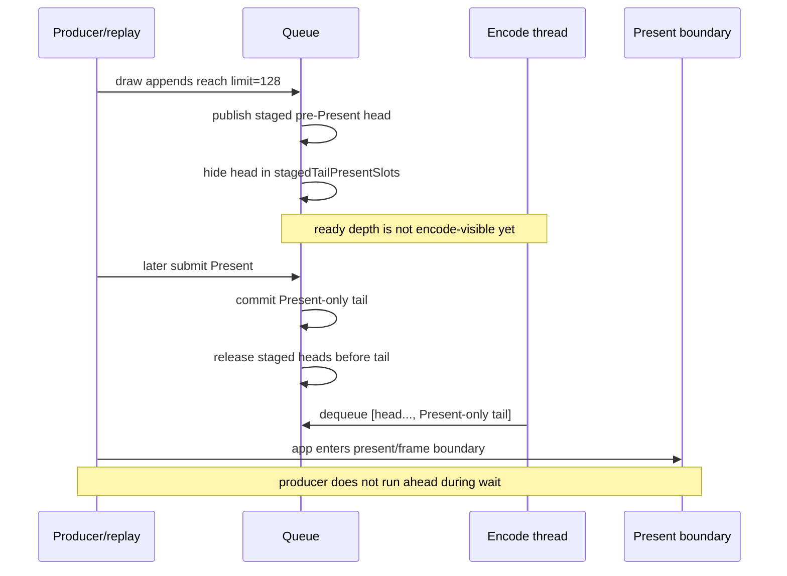

# Present Pacing / Pre-Present Command-Limit Runtime Gate 99

**Question.** Does the H98 default-off carrier recover P4 overlap when it stages
pre-Present chunks before the actual `Present` and releases them as one
tail-Present batch?

**Answer.** No. `DXMT9_STAGE_PRE_PRESENT_COMMAND_LIMIT=128` proves that the new
carrier reaches the queue/backend surface, but it does not create useful
producer/encode overlap. Ready backlog rises sharply, locality is not the
failure mode, and the screenshot is visually coherent, but
`completion_wait_with_enqueue` falls to zero and replay/publish staging cost
increases enough to reject promotion.

## Run

```sh
DXMT9_ENCODE_TAIL_PRESENT_BATCH=1 \
DXMT9_STAGE_PRE_PRESENT_COMMAND_LIMIT=128 \
bash scripts/tools/run_3dmark05_perf_probe.sh \
  --suffix h98-pre-present-limit128-r1 \
  --no-gputrace \
  --timeout 120 \
  --wait-unlocked-sec 120 \
  --frame-sampling \
  --compare-baseline-output experiments/output/app-d3d9-3dmark05-h86-pre-present-opportunity-r1 \
  --require-encode-ready-depth-gt1-increase \
  --require-completion-wait-with-enqueue-increase \
  --require-completion-wait-without-enqueue-decrease \
  --require-command-buffers-per-present-not-increase \
  --require-render-passes-per-present-not-increase \
  --require-tile-preservation-not-increase
```

The app run itself passed and `actual.png` shows a normal effects-heavy GT1
frame with bloom, sparks, and no obvious black/translucent vertex class.
The comparison gate failed on overlap:

```text
requirement failed: completion_wait_with_enqueue_ms did not increase (193.963 -> 0)
```

## Result

| Metric | H86 baseline | H98 limit128 | Direction |
|---|---:|---:|---|
| `encode_ready_depth_avg` | `1.000` | `3.942` | carrier reached backend |
| `encode_ready_depth_gt1_per_present` | `0.000` | `0.997` | carrier reached backend |
| `chunk_publish_reason_present_split_before` | `0` | `4,704` | staged heads created |
| `chunk_publish_present_pre_present_opportunity_slots_per_present` | `1.000` | `0.003` | opportunity consumed |
| `command_buffers_per_present` | `3.999` | `3.999` | locality OK |
| `passes_per_present` | `11.779` | `11.407` | locality OK/no regression |
| `tile_preservation_mib` | `216,777.633` | `184,847.508` | locality OK/no regression |
| `completion_wait_with_enqueue_ms_per_present` | `0.108` | `0.000` | P4 overlap failed |
| `completion_wait_without_enqueue_ms_per_present` | `27.124` | `26.722` | tiny/noisy improvement |
| `commit_chunk_replay_cpu_ms_per_present` | `8.017` | `18.522` | staging cost regression |
| `no_enqueue_before_publish_closure_ms_per_present` | `15.586` | `23.025` | first-publish path worse |
| `encode_chunk_cpu_ms_per_present` | `11.225` | `11.788` | encode CPU worse |
| `sampled_avg_fps` | not sampled in H86 | `14.599` | not a promotion |

## Why This Fails



The preserved-tail-batch design deliberately hides pre-Present heads until the
Present tail exists. That preserves command-buffer/render-pass/tile shape, but
it also means the queue does not expose work early enough to overlap the
completion/present wait. H98 moves work from the final Present slot into
several staged slots, then releases them just before the app enters the
present-return boundary; the encoder sees a backlog, but the producer is not
making useful N+1 progress while the wait is active.

## Implication

H98 is a useful contract proof, not an FPS lever. The next overlap design needs
one of these stronger mechanisms:

1. pre-encode staged heads into an open Metal command buffer/encoder and commit
   only when the Present tail arrives;
2. encode early as separate command buffers only at a render-pass-safe boundary
   with strict locality gates;
3. reduce replay/publish/producer cadence directly instead of trying to hide it.

Do not spend `.gputrace` / Xcode replay budget on H98 limit sweeps. A different
architecture must first show no-gputrace movement in P4 or a real replay/CPU
owner reduction while preserving the `v0.0.3` visual gate.
