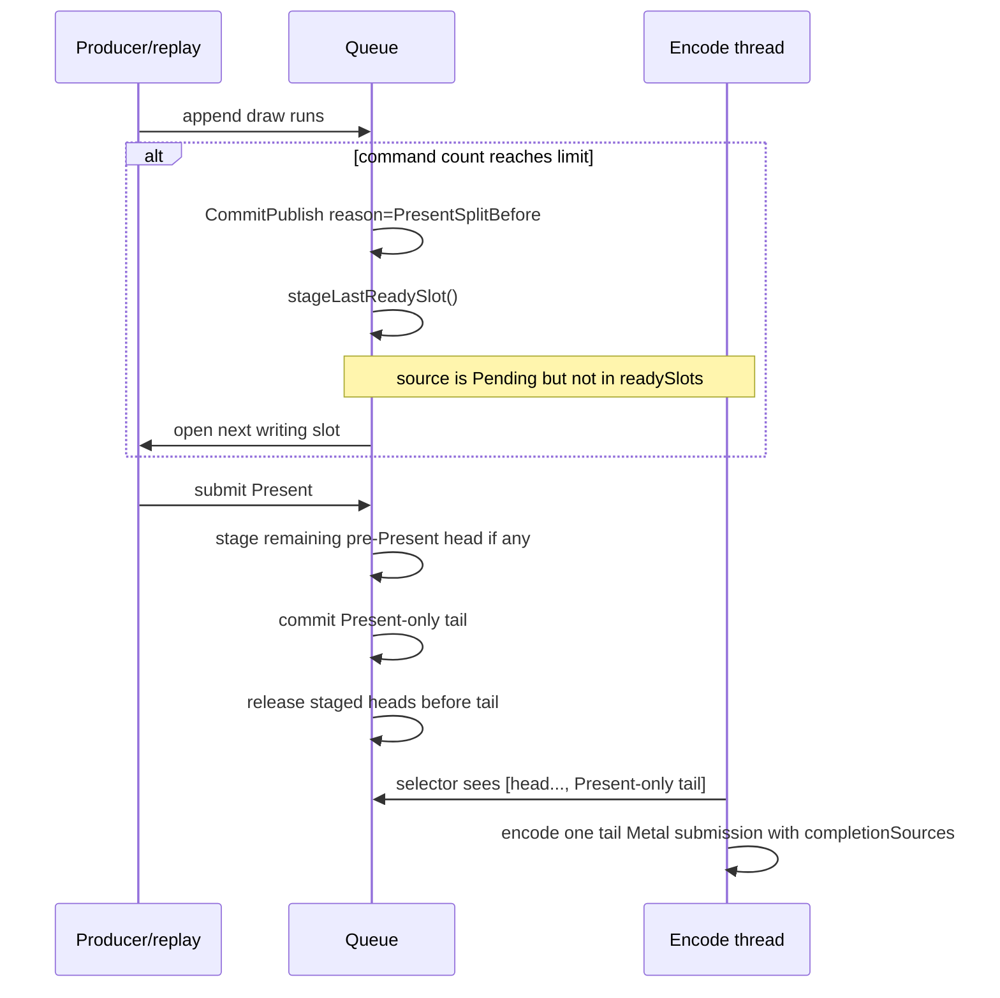

# Present Pacing / Pre-Present Command-Limit Stage Trigger 98

> **Outdated — the knob or code path this experiment measured no longer exists in `src/`.** It cannot be re-run. Kept as history; do not cite it as current evidence.

**Question.** With H96/H97 in place, can dxmt9 create earlier CPU-ready
pre-Present heads without making them encode-visible as separate Metal command
buffers?

**Answer.** A default-off runtime candidate now exists:
`DXMT9_STAGE_PRE_PRESENT_COMMAND_LIMIT=N`, active only with
`DXMT9_ENCODE_TAIL_PRESENT_BATCH=1`. After a draw-run append makes the current
writing slot reach `N` commands, the queue commits that slot, immediately moves
it out of `readySlots` into `stagedTailPresentSlots_`, and opens a new writing
slot. The staged slot remains `Pending` and in-flight, but encode cannot consume
it until a later Present releases staged heads before the tail.

This differs from `DXMT9_DRAW_CHUNK_COMMAND_LIMIT`: draw-limit publish makes
the chunk encode-visible immediately and is the known bad CB/pass/tile
fragmenting carrier. The new trigger publishes CPU-ready work early while
keeping it encoder-invisible until the tail-Present batch is complete.

## Runtime Flow



## Guardrails

- The knob is ignored unless `DXMT9_ENCODE_TAIL_PRESENT_BATCH=1` is also set.
- Early staging keeps enough in-flight headroom for the later current head and
  Present tail (`postCommitHeadroom=2`) so the producer should not fill the ring
  with encode-invisible staged work before Present.
- Present-time staging uses one-slot headroom for the tail.
- If Present-time staging cannot keep the final tail Present-only, correctness
  falls back to single-source encode: H97's selector rejects the multi-source
  shape instead of exposing a head-only batch to inline completion.
- Multi-head release order is covered by native queue tests.

## Status

This closes the H95-H97 implementation sequence, but it is not a performance
claim. H99 runs the first supervised no-gputrace GT1 gate and rejects the
`limit=128` carrier as an overlap/FPS promotion: ready depth increases, but
`completion_wait_with_enqueue` falls to zero and replay/publish staging cost
regresses. Keep the command below as the shape of any future re-check, but do
not spend Xcode budget on H98 limit sweeps without a different overlap
mechanism:

```sh
DXMT9_ENCODE_TAIL_PRESENT_BATCH=1 \
DXMT9_STAGE_PRE_PRESENT_COMMAND_LIMIT=<N> \
bash scripts/tools/run_3dmark05_perf_probe.sh \
  --suffix <tag> --no-gputrace --timeout 120 --frame-sampling
```

Candidate gates:

- `encode_ready_depth_gt1_per_present` increases;
- `completion_wait_with_enqueue_ms_per_present` increases or
  `completion_wait_without_enqueue_ms_per_present` / no-enqueue closure falls;
- command buffers, render passes, and tile-preservation MiB do not increase
  materially versus the `v0.0.3` visual-safe baseline;
- broad screenshot passes the `v0.0.3` visual gate before any FPS reading is
  trusted.

Only after those no-gputrace gates pass should any successor candidate spend
`.gputrace` / Xcode counter budget. H98 itself did not pass them.
