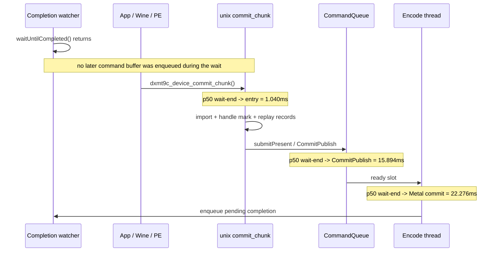

# Present-Pacing 07 — Pre-Publish Stage Split

## Question

After [present-pacing-boundary-latency-ab.06](present-pacing-boundary-latency-ab.06.md) rejected dxmt9's explicit
present-boundary wait as the producer-overlap owner, the remaining question was
where the post-completion no-enqueue gap lives:

- app/Wine/macdrv does not call back into dxmt9 until after completion, or
- dxmt9 receives the next `commit_chunk` quickly but spends the gap replaying and
  building/publishing the next chunk.

## Verdict

Accepted attribution: the app/Wine side re-enters unix `commit_chunk` quickly.
The exposed no-enqueue gap is primarily inside unix commit/replay/submit before
the queue publishes the next chunk.



## Sources

Command:

```sh
bash scripts/tools/run_3dmark05_perf_probe.sh \
  --suffix commit-entry-stage-r1-20260613 \
  --frame 60 \
  --no-gputrace \
  --no-encoder-breakdown \
  --frame-sampling \
  --timeout 120
```

Artifacts:

- `experiments/output/app-d3d9-3dmark05-commit-entry-stage-r1-20260613/result.json`
- `experiments/output/app-d3d9-3dmark05-commit-entry-stage-r1-20260613/3dmark05-perf-summary.md`
- `experiments/output/app-d3d9-3dmark05-commit-entry-stage-r1-20260613/3dmark05-perf-frames.csv`

## Counter Result

| Metric | Value | Read |
|---|---:|---|
| `present_encoded` | `1740` | same current-shape workload |
| `completion_waits` | `1739` | present-bearing wait samples |
| `completion_present_wait_ms` | `44434.044` | `25.552ms/present` exposed wait |
| `completion_wait_with_enqueue_ms` | `0.000` | no overlap recovered |
| `completion_wait_without_enqueue_ms` | `44434.044` | all wait remains no-enqueue wait |
| wait-end -> `commit_chunk` entry p50 / p95 | `1.040 / 2.668ms` | app/Wine/PE re-enters quickly |
| wait-end -> replay start p50 / p95 | `1.043 / 2.689ms` | import/handle work before replay is tiny on this edge |
| wait-end -> replay end p50 / p95 | `0.845 / 2.767ms` | first-observed sample set differs; do not subtract percentiles |
| wait-end -> `CommitPublish` p50 / p95 | `15.894 / 29.912ms` | queue publish remains much later than unix entry |
| wait-end -> `EncodeDequeue` p50 / p95 | `11.244 / 34.289ms` | cross-sample percentile ordering is not strictly monotonic |
| wait-end -> Metal commit p50 / p95 | `22.276 / 54.146ms` | encode still runs after exposed wait |
| wait-end -> next enqueue p50 / p95 | `22.295 / 54.178ms` | commit-to-enqueue is negligible |
| `commit_chunk_replay_cpu_ms` | `18981.064` | replay/submit is the large pre-publish CPU bucket |
| `commit_chunk_queue_draw_submission_cpu_ms` | `8154.509` | nested draw submission is a major replay child |
| `d3d9_snapshot_draw_submission_cpu_ms` | `6636.191` | nested snapshot work remains a major child |
| sampled frame wall p50 / p95 | `55.489 / 85.576ms` | normal current FPS envelope |
| sampled FPS p50 / p95 / last | `18.005 / 26.288 / 24.319` | no regression from the probe |

The `commit_chunk_replay_*` and no-enqueue stage counters are not paired by a
single seq id. Use them to locate the owner class, not to subtract percentile
rows into exact per-frame subsegments.

## Interpretation

The previous unknown `wait-end -> CommitPublish` edge is no longer primarily an
app-side or Wine/macdrv event wait. The producer reaches unix `commit_chunk`
about one millisecond after completion wait ends. The gap then expands before
`CommitPublish`, while the large run-level CPU buckets are
`commit_chunk_replay_cpu_ms`, `commit_chunk_queue_draw_submission_cpu_ms`, and
nested `d3d9_snapshot_draw_submission_cpu_ms`.

The next average-FPS work should stay on the commit/replay/snapshot/submit path:

- reduce `commit_chunk_queue_draw_submission_cpu_ms` and its snapshot child,
- reduce backend encode buckets that occur after `EncodeDequeue`,
- judge each win by whether `completion_wait_with_enqueue_ms` appears or
  `completion_wait_without_enqueue_ms` / frame-sampling wall time drops.

Do not spend more time on `DXMT9_*PRESENT_BOUNDARY*` tuning for current GT1
unless a future run first shows nonzero `present_boundary_waits`.
