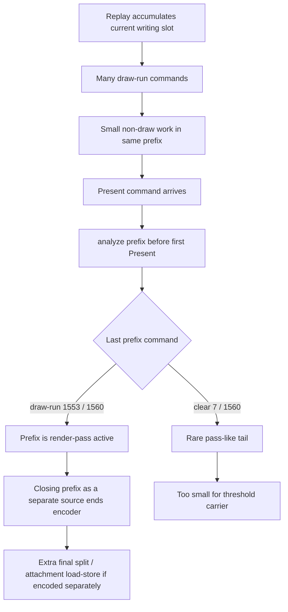
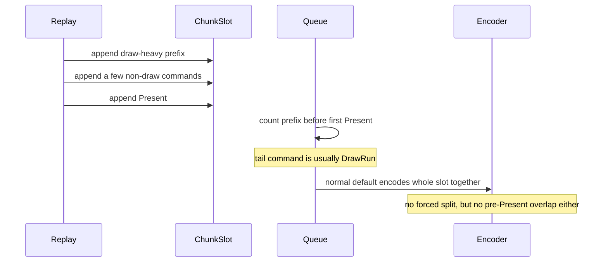

# Present Pacing / Present-Published Prefix Tail-Shape Attribution 112

**Question.** Does the normal Present-published pre-Present prefix contain
natural pass-safe tail boundaries, or does it also end in active draw work?

**Answer.** It almost always ends in active draw work. The current default
no-gputrace run reports one Present-published prefix per present, and the last
command before Present is a draw-run in `1,553 / 1,560` slots (`99.55%`). Only
`7` slots end at a clear, and `draw_only_pre_present_opportunity_share=0.00%`
because each opportunity slot also carries a small number of non-draw commands.

This closes the simpler "stage the existing prefix at a natural pass-safe
boundary" idea for current GT1. A P4 carrier that wants to consume this prefix
before Present must either carry active render-pass state across staged sources,
stream into one still-open encoder/command buffer, or avoid this carrier and
reduce producer/replay cadence directly.

## Evidence

The 120s foreground no-gputrace run used the current default path:

```sh
bash scripts/tools/run_3dmark05_perf_probe.sh \
  --suffix h187-present-prefix-tailshape-r1 \
  --no-gputrace \
  --timeout 120 \
  --keep-frontmost \
  --frame-sampling
```

Result:

| Metric | Value | Interpretation |
|---|---:|---|
| `present_encoded` | `1,560` | enough frames for a current scout |
| `sampled_avg_fps` | `14.468` | timing sample only, not a candidate win |
| `draw_skipped_no_pipeline` | `0` | no pipeline-skip correctness counter |
| `gpu_command_buffer_errors` | `0` | no Metal command-buffer fault counter |
| `chunk_publish_reason_present_split_before` | `0` | default path did not force split heads |
| `render_split_final` | `0` | no chunk-final split regression in default |
| `chunk_publish_present_pre_present_opportunity_slots` | `1,560` | one prefix opportunity per present |
| `chunk_publish_present_pre_present_opportunity_tail_slots` | `1,560` | every opportunity slot has Present as tail |
| `chunk_publish_present_pre_present_opportunity_tail_draw_run` | `1,553` | `99.55%` of prefixes end at draw-run |
| `chunk_publish_present_pre_present_opportunity_tail_clear` | `7` | `0.45%` clear tail, too small for a carrier |
| `chunk_publish_present_pre_present_opportunity_draw_only` | `0` | prefix also contains non-draw commands |
| `commands_per_slot` | `323.680` | large enough to matter if safely overlapped |
| `draw_runs_per_slot` | `319.889` | draw-dominated prefix |
| `draw_items_per_slot` | `728.447` | large draw numerator |
| `non_draw_commands_per_slot` | `3.791` | not a pure draw-only prefix |
| `payload_mib` | `291.153` | substantial payload residency |
| `residency_ms_per_present` | `41.183` | long-lived prefix work before Present |
| `completion_wait_ms_per_present` | `25.847` | still under-pipelined no-enqueue |
| `completion_wait_with_enqueue_ms_per_present` | `0.000` | no useful overlap |

The summary table is:

| Prefix tail command | slots | share |
|---|---:|---:|
| draw-run | `1,553` | `99.55%` |
| clear | `7` | `0.45%` |

## Mechanism





## Implication

H111 showed the forced `PresentSplitBefore` command-limit path cuts directly
after draw-runs and creates chunk-final render-pass closures. H112 shows the
normal missed prefix is also draw-run-tailed. That means the obvious alternate
trigger, "just stage the natural prefix before Present", does not by itself
avoid the same render-pass-state problem.

Do not spend `.gputrace` budget on another pass-safe threshold search unless a
new no-gputrace counter first proves a nontrivial clear/present/empty tail
population. The next useful P4 work should be one of:

1. carry active render-pass state across staged sources;
2. stream encode the prefix and Present tail into one still-open Metal encoder
   and command buffer;
3. reduce replay/producer cadence directly so the no-enqueue wait shrinks
   without source splitting.

Any promotion remains gated by P4 movement, command-buffer/pass/tile locality,
encoder-sidecar final/color-load/depth-load no-regression, and the `v0.0.3`
visual-safe anchor.
