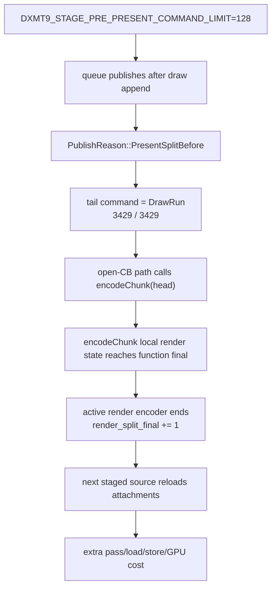
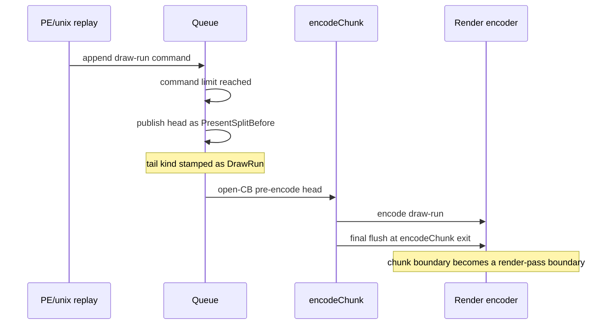

# Present Pacing / PresentSplitBefore Tail-Shape Attribution 111

**Question.** Can the current `DXMT9_STAGE_PRE_PRESENT_COMMAND_LIMIT` open-CB
path be rescued by choosing a better command threshold, or is it cutting
through active draw/pass work by construction?

**Answer.** The current command-limit trigger always cuts a draw-run tail in
the measured GT1 path. That means it is not finding pass-safe boundaries. It is
publishing pre-Present heads immediately after draw appends, and `encodeChunk()`
then closes the active render encoder at chunk final. This explains why H110's
`encoder_sidecar_final_end_reason` and attachment load/store rows move in
lockstep with the split count.

H111 adds counters for the last command in every `PresentSplitBefore` source:
empty, draw-run, clear, surface-copy, stretch-rect, readback, color-fill,
depth-resolve, and present. It also counts whether the split source was
draw-only. The summary tool renders a `PresentSplitBefore Tail Shape` block,
and the compare tool exposes per-present and share rows.

## Evidence

The 120s foreground no-gputrace run used:

```sh
DXMT9_OPEN_CB_PREENCODE_TAIL_PRESENT=1 \
DXMT9_STAGE_PRE_PRESENT_COMMAND_LIMIT=128 \
bash scripts/tools/run_3dmark05_perf_probe.sh \
  --suffix h185-open-cb-tailshape-r1 \
  --no-gputrace \
  --timeout 120 \
  --keep-frontmost \
  --frame-sampling
```

Result:

| Metric | Value | Interpretation |
|---|---:|---|
| `chunk_publish_reason_present_split_before` | `3,429` | split heads reached the runtime |
| `chunk_publish_present_split_before_tail_draw_run` | `3,429` | every split tail is a draw-run |
| `chunk_publish_present_split_before_tail_clear` | `0` | no clear-boundary splits |
| `chunk_publish_present_split_before_tail_present` | `0` | no Present tails in split heads |
| `chunk_publish_present_split_before_draw_only` | `1,196` | `34.88%` are draw-only sources |
| `render_split_final` | `3,429` | one chunk-final render split per head |
| `sampled_avg_fps` | `15.417` | not a promotion run |
| `completion_wait_ms_per_present` | `36.494` | P4 worsens versus normal current bands |
| `gpu_command_buffer_time_ms` | `60,273.307` | same failure class as H109 |

The key equality is:

```text
PresentSplitBefore heads == draw-run tail heads == chunk-final render splits
3,429                    == 3,429              == 3,429
```

## Mechanism





## Implication

Do not run more H108/H185 command-limit threshold sweeps as a likely fix. The
measured numerator for pass-safe threshold tuning is zero: the current trigger
does not naturally hit clear, present, or empty boundaries. A useful open-CB
variant needs one of these changes:

1. carry active render-pass state across staged sources;
2. stage only at proven pass-safe boundaries, using a different trigger than
   draw-count/command-count after draw append;
3. stop pursuing open-CB pre-encode for now and return to replay/producer
   cadence reduction.

Any future variant still needs the existing gates: P4/no-enqueue movement,
ready-depth movement, no command-buffer/pass/tile regression, no
encoder-final/color-load/depth-load regression, and the `v0.0.3` visual-safe
gate before FPS or Xcode counter deltas are promoted.
