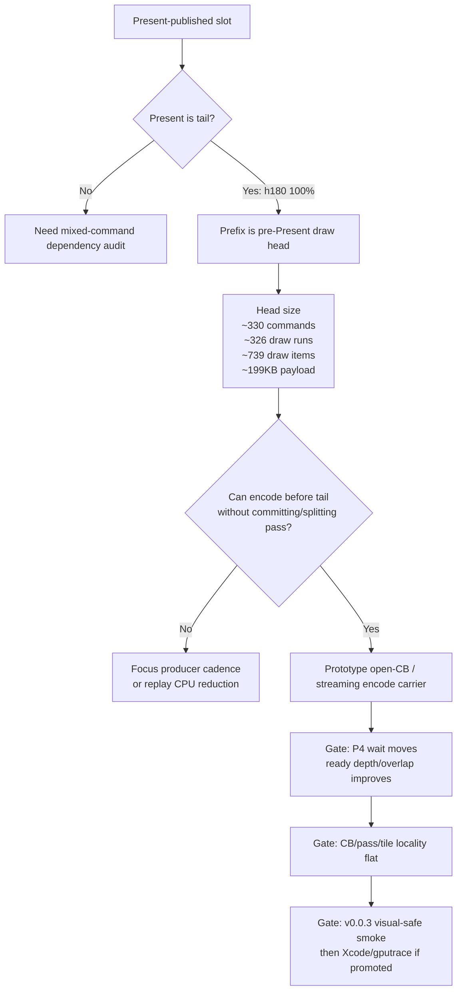

# Present Pacing / Present Tail Prefix Is The Missed Draw Head 102

**Question.** H101 showed that the first slot published after a no-enqueue wait
is draw-heavy. Is that draw work actually before the Present command, or is the
slot shape mixed in a way that makes a pre-Present head carrier less direct?

**Answer.** The draw work is before Present, and Present is a tail command in
every sampled Present-published slot. H180 reports
`chunk_publish_present_pre_present_opportunity_tail_slot_share_pct=100.000` and
`chunk_publish_present_pre_present_opportunity_slots_per_present=1.000`. The
pre-Present prefix alone is large:

| Metric | h179 baseline | h180 |
|---|---:|---:|
| `chunk_publish_present_pre_present_opportunity_commands_per_slot` | `327.776` | `329.652` |
| `chunk_publish_present_pre_present_opportunity_draw_runs_per_slot` | `323.858` | `325.709` |
| `chunk_publish_present_pre_present_opportunity_draw_items_per_slot` | `735.715` | `739.172` |
| `chunk_publish_present_pre_present_opportunity_non_draw_commands_per_slot` | `3.918` | `3.943` |
| `chunk_publish_present_pre_present_opportunity_payload_bytes_per_slot` | `197,626.167` | `198,595.993` |
| `chunk_publish_present_pre_present_opportunity_residency_p50_ms` | `31.934` | `50.060` |
| `chunk_publish_present_pre_present_opportunity_residency_p95_ms` | `67.521` | `68.299` |

This confirms the next P4 target more precisely than H101: the missed work is a
large pre-Present draw head followed by a Present tail, not an opaque mixed
slot.

## Implication

The rejected H98 command-limit staging was the right shape mechanically
(`head... + Present tail`) but the wrong overlap timing: it hid staged heads
until Present and then merged them, so encode backlog appeared only after the
producer had already reached the frame boundary. H102 says the next candidate
should preserve the same final command-buffer/pass locality but move work
earlier in a different way:

- encode the pre-Present head into an open command buffer/encoder before the
  Present tail arrives, then append/present/commit at the tail boundary; or
- create another render-pass-safe early CPU-ready path that lets encode consume
  this prefix while still emitting one tail-local Metal submission; or
- reduce the producer/replay cadence enough that the same prefix is published
  earlier without queue staging.

Do not revive draw-count splitting as a promotion candidate: it creates overlap
by increasing command-buffer/pass churn, which H50/H99 already rejected.

## Decision Flow

## Tooling Change

`compare_3dmark05_perf_counters.py` now exposes these derived rows, matching the
summary's `Present Pre-Present Work Opportunity` section:

- `chunk_publish_present_pre_present_opportunity_draw_runs_per_slot`
- `chunk_publish_present_pre_present_opportunity_non_draw_commands_per_slot`
- `chunk_publish_present_pre_present_opportunity_payload_bytes_per_slot`

These rows make the pre-Present head size visible in A/B reports without
manually dividing the raw totals.
