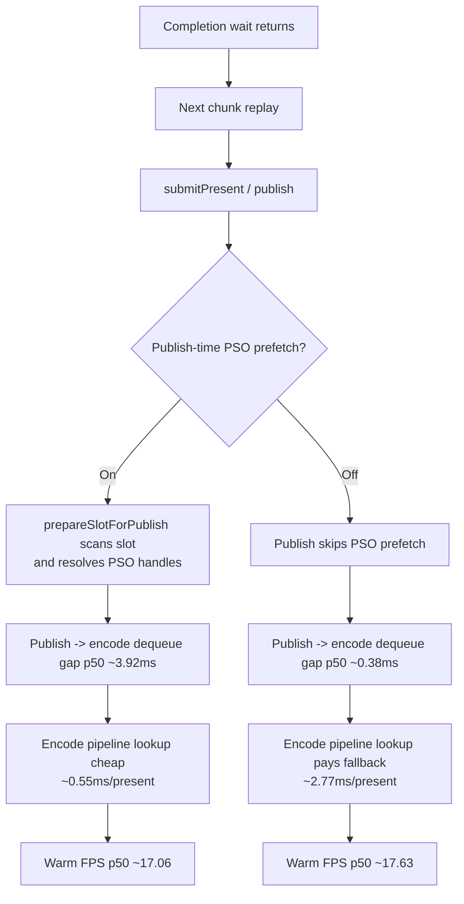

# Present Pacing 26 - Publish-Time PSO Prefetch Placement

**Question.** If completion wait is followed by serialized P2/P3 work, can
moving a known pre-publish CPU bucket change wall-clock FPS even when total CPU
mostly shifts to a later stage?

**Method.** Reuse the Phase 69 prefetch-on/off runs and compare same-sample
stage-delta counters plus frame sampling.

| Metric | Publish prefetch on | Prefetch off avg (r1/r2) | Delta |
|---|---:|---:|---:|
| `commit_chunk_replay_cpu_ms / present` | `11.183ms` | `8.445ms` | `-2.739ms` |
| `commit_chunk_replay_present_record_cpu_ms / present` | `2.757ms` | `0.269ms` | `-2.488ms` |
| `encode_draw_cpu_ms / present` | `9.591ms` | `11.812ms` | `+2.221ms` |
| `completion_wait_ms / present` | `30.153ms` | `27.733ms` | `-2.420ms` |
| `completion_wait_without_enqueue_ms / present` | `29.989ms` | `25.747ms` | `-4.242ms` |
| `completion_no_enqueue_stage_publish_to_encode_dequeue_p50_ms` | `3.924ms` | `0.377ms` | `-3.547ms` |
| `completion_no_enqueue_stage_encode_dequeue_to_command_buffer_commit_p50_ms` | `12.324ms` | `21.459ms` | `+9.135ms` |
| Warm FPS p50 | `17.064` | `17.628` | `+0.564` |
| Warm FPS avg | `17.628` | `18.343` | `+0.715` |

**Decision.** Accepted as a placement signal; superseded by the default
promotion in [present-pacing-publish-pso-prefetch.27](present-pacing-publish-pso-prefetch.27.md).
The A/B proves one current P4/P2 coupling: CPU moved from pre-publish replay to
encode can improve sampled FPS even when the same logical PSO lookup work still
happens. That means average FPS is sensitive to where the work sits in the
post-completion pipeline, not only to the total CPU milliseconds.

The result also refines the pacing model:

- `Present` record CPU is not display acquire or boundary policy.
- `prepareSlotForPublish()` can be part of the no-enqueue post-wait exposed
  path.
- A local encode regression can still be acceptable if it shortens the
  serialized publish gap and reduces completion wait enough.
- The next design should seek async/lazy PSO handle resolution, not simply
  "disable all prefetch" as a universal policy.

**Related.** [present-pacing](index.md) · [state-churn-encode-encode-phase.69](../state-churn-encode/state-churn-encode-encode-phase.69.md) ·
[present-pacing-lowoverhead-serial.24](present-pacing-lowoverhead-serial.24.md) ·
[present-pacing-subcb-cap.25](present-pacing-subcb-cap.25.md).
