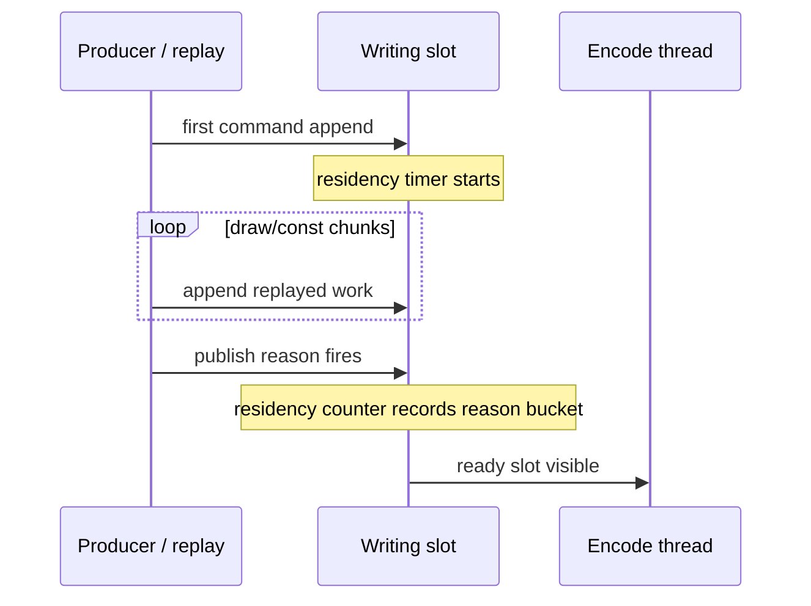

# Present-Pacing 85 - Publish residency counters for present-gated work

## Question

After H84 proved that GT1 replay work runs during completion waits but does not
become ready/enqueued until `Present`, what counter can directly show how long
work sits in a writing slot before publication?

## Change

`CommandQueue` now records a diagnostic timestamp per chunk-ring slot when the
first command is appended to an empty writing slot. `prepareSlotForPublish()`
consumes that timestamp and records slot residency by publish reason:

| Counter | Meaning |
|---|---|
| `chunk_publish_slot_residency_ms` | total first-command-to-publish time for sampled slots |
| `chunk_publish_slot_residency_present_ms` | residency for `Present` / present-adjacent publication reasons |
| `chunk_publish_slot_residency_nonpresent_ms` | residency for draw-limit, payload-limit, flush, stretch, map-wait, or unknown publication |
| `*_samples`, `*_max_ms`, `*_p50_ms`, `*_p95_ms` | count and distribution for the same buckets |

The summary and A/B compare reports also expose:

- `chunk_publish_slot_residency_ms_per_present`
- `chunk_publish_slot_residency_present_ms_per_present`
- `chunk_publish_slot_residency_nonpresent_ms_per_present`

## Interpretation



For the current H84 shape, the expected pattern is high present residency and
near-zero non-present residency, because all accepted publications are
`Present`. A future P4 candidate should not merely move time from the present
bucket into many non-present slots. It should reduce present residency while
also passing the existing gates:

| Gate | Required direction |
|---|---|
| `completion_wait_with_enqueue_ms_per_present` | increases materially |
| `completion_wait_without_enqueue_ms_per_present` | decreases |
| `encode_ready_depth_gt1_per_present` | increases from zero |
| `chunk_publish_slot_residency_present_ms_per_present` | decreases |
| `chunk_publish_slot_residency_nonpresent_ms_per_present` | does not increase enough to imply draw-count fragmentation |
| `command_buffers_per_present`, `passes_per_present`, tile preservation | non-increasing or explained |
| visual gate | matches `v0.0.3` |

## Scope

This is instrumentation only. It does not reintroduce the reverted run-ahead
paths and does not change the default publish policy.

## Runtime Check

Run:
`experiments/output/app-d3d9-3dmark05-h85-publish-residency-r1`.

```sh
scripts/tools/run_3dmark05_perf_probe.sh \
  --suffix h85-publish-residency-r1 \
  --no-gputrace \
  --timeout 120 \
  --wait-unlocked-sec 60 \
  --no-encoder-breakdown
```

The run completed with `status=pass`, `present_encoded=1800`,
`draw_skipped_no_pipeline=0`, and `gpu_command_buffer_errors=0`. The captured
`actual.png` shows a normal GT1 effects-heavy frame; no H75-style black vertical
artifact or obvious weapon/vertex transparency regression was visible in the
smoke image.

| Metric | Value |
|---|---:|
| `completion_wait_ms_per_present` | `27.088` |
| `completion_wait_with_enqueue_ms_per_present` | `0.032` |
| `completion_wait_without_enqueue_ms_per_present` | `27.056` |
| `completion_wait_commit_chunk_entries_per_present` | `10.527` |
| `completion_wait_commit_chunk_replay_ends_per_present` | `10.347` |
| `completion_wait_commit_chunk_replay_cpu_ms_per_present` | `3.735` |
| `encode_ready_depth_avg` | `1.000` |
| `encode_ready_depth_gt1_per_present` | `0.000` |
| `chunk_publish_reason_present` | `1800` |
| `chunk_publish_reason_draw_limit` | `0` |
| `chunk_publish_reason_payload_limit` | `0` |
| `chunk_publish_reason_flush` | `0` |
| `chunk_publish_slot_residency_samples` | `1800` |
| `chunk_publish_slot_residency_ms_per_present` | `35.647` |
| `chunk_publish_slot_residency_present_ms_per_present` | `35.647` |
| `chunk_publish_slot_residency_present_p50_ms` | `32.746` |
| `chunk_publish_slot_residency_present_p95_ms` | `66.468` |
| `chunk_publish_slot_residency_nonpresent_samples` | `0` |
| `chunk_publish_slot_residency_nonpresent_ms_per_present` | `0.000` |

This confirms the counter is live and matches H84's attribution. All sampled
first-command-to-publish residency belongs to the present bucket; no non-present
publish reason contributes to the current default GT1 run. The current owner is
therefore still present-gated publication/ready-slot visibility, not absent
producer work.

**Related.** [[present-pacing-completion-wait-overlap-current.84]] ·
[[present-pacing-batch-carrier-current.82]].
