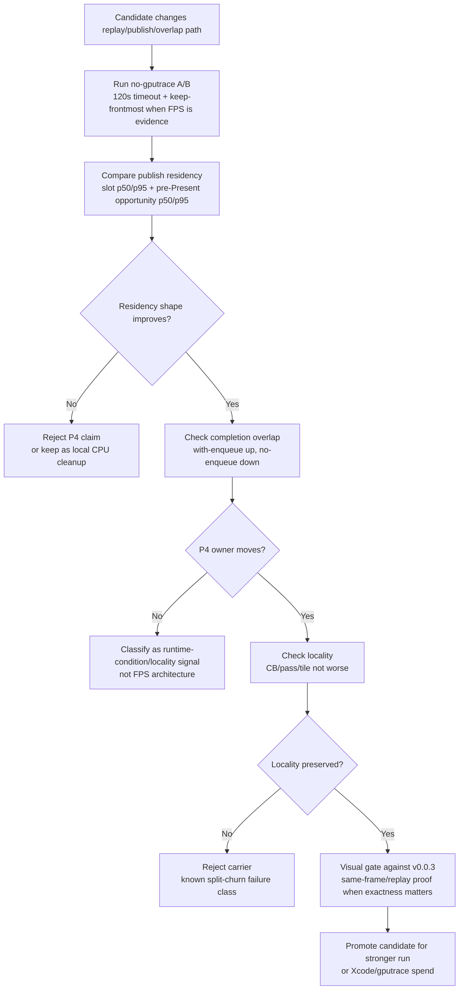

# Present Pacing / Publish Residency Percentile Gate 100

**Question.** Should P4 candidates be judged only by aggregate slot residency
and completion-wait totals, or should the compare tooling expose publish
residency p50/p95 directly?

**Answer.** Expose the percentiles. H179 shows why: foreground control restores
the current inline path to the h174 FPS/progress band and improves slot
residency p50, but it does not move the actual P4 owner. The no-enqueue wait
remains flat and ready depth remains `1.000`. A future P4 candidate needs to
move both residency shape and the completion-overlap/no-enqueue gates before it
can be treated as an architecture win.

## Tooling Change

`compare_3dmark05_perf_counters.py` now reports these derived rows:

- `chunk_publish_slot_residency_p50_ms`
- `chunk_publish_slot_residency_p95_ms`
- `chunk_publish_slot_residency_present_p50_ms`
- `chunk_publish_slot_residency_present_p95_ms`
- `chunk_publish_slot_residency_nonpresent_p50_ms`
- `chunk_publish_slot_residency_nonpresent_p95_ms`
- `chunk_publish_present_pre_present_opportunity_residency_p50_ms`
- `chunk_publish_present_pre_present_opportunity_residency_p95_ms`

The script test fixture covers before/after values for all rows so missing
percentile plumbing is caught by `tests/scripts/test_compare_3dmark05_perf_counters.py`.

## Current Reading

The h179 standardized foreground repeat is a control sample, not a P4 fix:

| Metric | h174 inline baseline | h179 keep-frontmost current | Direction |
|---|---:|---:|---|
| sampled FPS mean | `18.381` | `18.527` | baseline band restored |
| `present_encoded` | `1,740` | `1,800` | baseline band restored |
| `chunk_publish_slot_residency_p50_ms` | `50.898` | `31.934` | p50 shorter |
| `chunk_publish_slot_residency_p95_ms` | `69.618` | `67.521` | tail mostly flat |
| `chunk_publish_present_pre_present_opportunity_residency_p50_ms` | `50.898` | `31.934` | p50 shorter |
| `chunk_publish_present_pre_present_opportunity_residency_p95_ms` | `69.618` | `67.521` | tail mostly flat |
| `completion_wait_without_enqueue_ms_per_present` | `27.922` | `28.032` | P4 owner flat |
| `completion_wait_with_enqueue_ms_per_present` | `0.077` | `0.026` | overlap absent |
| `encode_ready_depth_avg` | `1.000` | `1.000` | no run-ahead backlog |

The p50 residency improvement is therefore a useful runtime-condition signal:
it separates "this sample reached a healthier scene/progress window" from
"this code recovered pipeline overlap." P4 remains blocked until a candidate
reduces no-enqueue wait or creates useful enqueue overlap while preserving
command-buffer/pass/tile locality and the `v0.0.3` visual-safe gate.

## Gate Shape

## Implication

H179 is the current healthy foreground-controlled baseline after the full
uniform sidecar rejection. It confirms the restored inline carrier is not the
regression owner, but it also confirms the average-FPS limit is still the same
under-pipelined path: producer/replay/publish/encode do not advance enough while
Metal completion waits.

Use the new percentile rows for future P4 review. A candidate that only lowers
aggregate residency or p50 residency, while leaving no-enqueue wait and ready
depth flat, should not be promoted.
