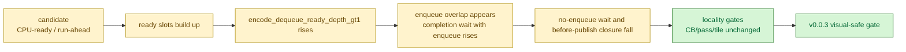

# Present-Pacing 81 - Encode ready-depth compare gate

## Question

Future P4 overlap candidates must show that the producer/queue actually creates
encode backlog, not only that a local CPU bucket moved. The runtime already
counts `encode_dequeue_ready_depth_*`, but the A/B report did not promote those
rows into derived metrics or wrapper/finalizer gates.

## Tooling

`compare_3dmark05_perf_counters.py` now derives:

| Metric | Meaning |
|---|---|
| `encode_ready_depth_avg` | average ready-slot depth observed before the encode thread pops one slot |
| `encode_ready_depth_gt1_per_present` | dequeue samples per present where at least two ready slots existed |
| `encode_ready_depth_gt2_per_present` | samples per present where depth exceeded two |
| `encode_ready_depth_gt4_per_present` | samples per present where depth exceeded four |
| `encode_ready_depth_gt*_share_pct` | ready-depth backlog samples as a share of encode dequeue samples |

It also adds `--require-encode-ready-depth-gt1-increase`. The probe wrapper and
finalizer forward that flag through `--compare-baseline-output` /
`--baseline-output`, so no-gputrace scouts and post-Xcode finalization use the
same run-level gate.

## Interpretation

Use this as a necessary signal for run-ahead / CPU-ready / multi-slot coalescing
candidates, not as a standalone win. A good P4 candidate should satisfy:

1. `completion_wait_with_enqueue_ms_per_present` rises and
   `completion_wait_without_enqueue_ms_per_present` falls.
2. `encode_ready_depth_gt1_*` rises, proving the encoder saw queued work beyond
   the single-slot baseline.
3. The before-publish closure or dominant inter-replay gap falls.
4. Locality gates do not regress command buffers, render passes, or
   tile-preservation traffic.
5. Visual output still passes the `v0.0.3` safety anchor.

## Verification

- `python3 -m pytest tests/scripts/test_compare_3dmark05_perf_counters.py`
- `python3 -m pytest tests/scripts/test_3dmark05_probe_scripts.py -k pacing_compare`
- `git diff --check`

**Related.** [present-pacing-noenqueue-compare-closure.80](present-pacing-noenqueue-compare-closure.80.md) ·
[present-pacing-run-ahead-current-code.73](present-pacing-run-ahead-current-code.73.md) ·
[present-pacing-run-ahead-design.68](present-pacing-run-ahead-design.68.md).
