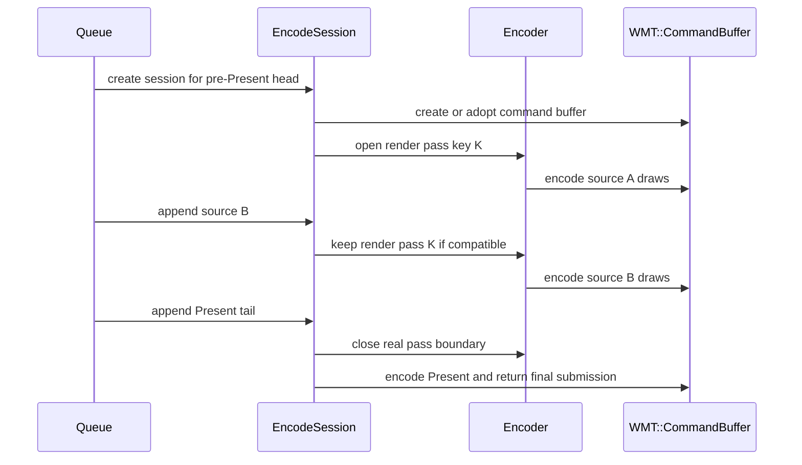
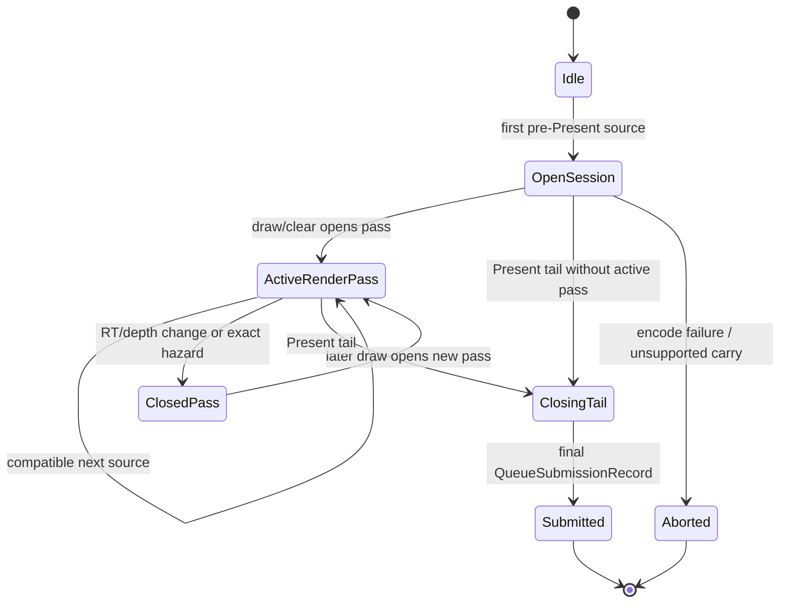

# Present Pacing / Render-Pass Carry Contract 128

**Question.** H127 proves that the first slot after a no-enqueue completion
wait has a large pre-Present draw prefix. What implementation contract is
required before trying to overlap that work again?

**Answer.** The next overlap candidate must carry a render-pass session, not
only a `WMT::CommandBuffer`. H108 already proved that an injected command
buffer without active render-pass carry is structurally wrong: `encodeChunk()`
still owns `activeRenderEncoder` as a local and always executes
`flushRender(Final)` before returning. H127 says there is enough pre-Present
work to hide, but H115/H116 say a carrier that cuts active render passes will
increase final same-key reopens, load/store traffic, and GPU time.

## Current Contract Gap

`EncodeChunkOptions` can currently carry:

| Field | What it preserves | What it does not preserve |
|---|---|---|
| `commandBuffer` | uncommitted Metal command-buffer lifetime | active render encoder lifetime |
| `disableMidChunkCommits` | prevents per-render-pass sub-CB commit | render-pass locality |
| `disablePresentAcquireSplit` | prevents pre-Present acquire split commit | active attachment / dirty / sidecar state |

The queue open-CB path in `runOpenCbTailPresentEncodeLoop()` retains
completion sources and merges records, but it calls `encodeChunk()` for each
source. Every call creates local render state and ends it at function exit:

```text
flushPendingClear()
flushRender(Final)
flushBlit()
```

That means the carrier can be "one command buffer" while still being "many
render passes." This is exactly the H108/H185 failure class.

## Required Session State

A promotable `EncodeSession` must externalize the state that currently makes a
render pass chunk-local.

| State group | Why it must survive across staged sources | Close / reset owner |
|---|---|---|
| `WMT::CommandBuffer` | all staged heads and the Present tail must commit once | final tail submit or abort |
| `activeRenderEncoder` / `activeBlitEncoder` | continuing same `rt`/`depth` pass must not close at source boundary | real RT/depth change, hazard, Present, abort |
| `activeKey` / `activeWriteHazard` | split decisions must compare against the live pass | pass close |
| `pendingClear` and command index | clear coalescing and lookahead must not lose ordering | clear execution or pass close |
| dirty state / texture-sampler shadow | avoid redundant bind/build while preserving encoder-boundary reset | pass close |
| argbuf table/shadows/storage | table identity and cbuf offsets are encoder-session state | pass close or argbuf mode switch |
| active color touched-set | load/store proof depends on when a color attachment is actually stored | pass close |
| sidecars, dumps, visibility scout, GPU samples | diagnostics must describe the logical encoder, not source fragments | pass close |
| post-commit and completion callbacks | retained resources must release at the final tail completion source | final tail submit |
| transient/arena sequence identity | uploads must live until all staged work completes | final tail seqId or source seq chain |

## Interaction Model





## Implementation Boundaries

The safe implementation path is staged:

| Step | Purpose | Promotion gate |
|---|---|---|
| Extract session struct without runtime use | make ownership explicit while keeping default path byte-identical | native compile + existing queue/encoder tests |
| Route default `encodeChunk()` through a one-shot session | prove no behavior change | no-gputrace control remains in baseline band |
| Let open-CB path keep one session across heads/tail | attempt P4 overlap | no final same-key reopen/load-store regression |
| Only then capture `.gputrace` | inspect Xcode counters for GPU-side side effects | no-gputrace P4/locality/visual gates already pass |

Two alternatives remain valid but lower priority:

| Alternative | Use when |
|---|---|
| Logical command-tape merge before Metal encode | replay/tape construction can run early enough to hide wait without opening Metal encoders |
| Producer/replay cadence reduction | session extraction is too risky or no-gputrace gates stay flat |

## No-Gputrace Gates

A candidate must pass these before Xcode/gputrace promotion:

- Use `--require-render-pass-carry-promotion-gates` when comparing a
  candidate against its no-gputrace baseline. This bundles the rows below into
  one H128 promotion gate.
- `completion_wait_with_enqueue_ms_per_present` increases or
  `completion_wait_without_enqueue_ms_per_present` decreases in a repeated
  120s foreground no-gputrace run.
- `encode_ready_depth_avg` or `encode_ready_depth_gt1_per_present` shows real
  overlap instead of only delayed tail batching.
- `command_buffers_per_present`, `passes_per_present`,
  `encoder_sidecar_rows_per_present`,
  `tile_preservation_mib_per_present`, and GPU command-buffer time do not
  regress outside normal noise.
- `encoder_sidecar_final_end_reason_per_present` does not increase.
- `encoder_sidecar_final_same_key_reopen_per_present` does not increase.
- color/depth load/store MiB per present do not regress.
- `gpu_command_buffer_errors=0` and `draw_skipped_no_pipeline=0`.
- The output passes the `v0.0.3` visual-safe smoke; any new weapon/lighting
  artifact demotes the run until a draw/window owner is found.

## Verdict

H128 turns the next P4 work into a contract rather than another threshold
experiment. The current evidence says:

| Evidence | Meaning |
|---|---|
| H127 large tail-Present prefix | there is real work to overlap before Present |
| H108/H115/H116 open-CB failure | command-buffer carry alone is insufficient |
| Current `encodeChunk()` locals | render-pass state is not externally carryable yet |

The next code change should either introduce an `EncodeSession` in a default
byte-identical way or return to producer/replay cadence reduction. Do not spend
`.gputrace` on another H108-style open-CB run until the no-gputrace locality
gates above pass.

Example no-gputrace promotion command:

```sh
bash scripts/tools/run_3dmark05_perf_probe.sh \
  --suffix <candidate> --frame 60 \
  --no-gputrace --timeout 120 --keep-frontmost \
  --compare-baseline-output experiments/output/<baseline-run> \
  --require-render-pass-carry-promotion-gates
```
