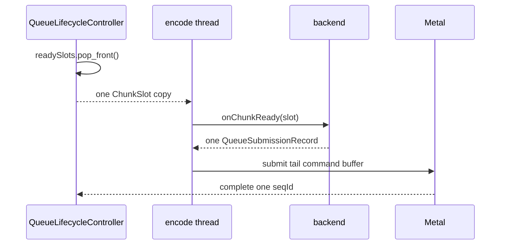
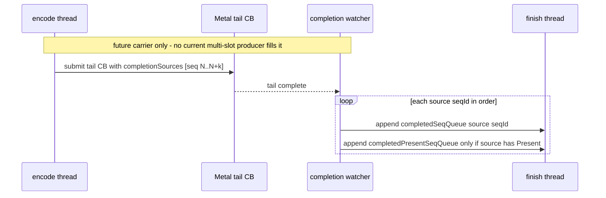
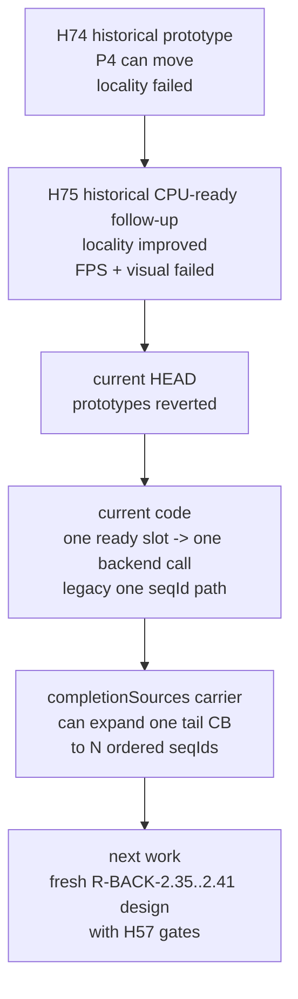

# Present Pacing 73 - Current HEAD has no run-ahead runtime knob

## Question

Can the current HEAD still run the historical `DXMT9_OFFSCREEN_RUN_AHEAD` /
ready-slot coalescing experiments described by H74/H75?

## Method

- Checked the current git history for the queue files. The current branch head
  is after `Revert run-ahead coalescing code changes`, following
  `Revert CPU-ready run-ahead code changes`.
- Searched source for `DXMT9_OFFSCREEN_RUN_AHEAD`,
  `DXMT9_ENCODE_COALESCE_READY_SLOTS`, `DXMT9_ENCODE_COALESCE_READY_SLOT_LIMIT`,
  `offscreenRunAhead`, and ready-slot coalescing helpers.
- Re-read `QueueLifecycleController::runEncodeIteration()`,
  `QueueLifecycleController::processOnePendingCompletion()`, and
  `CommandQueue::runEncodeLoop()`.

## Observation

The current source no longer honors the historical run-ahead envs. The present
rules file and `specs/backend/gap.md` still described them as if they were available,
but the implementation has been reverted. The queue now has a small
future-facing completion carrier for R-BACK-2.41, but no code path fills it from
multiple ready slots yet:

| Area | Current code shape |
|---|---|
| Env parsing | no source reads for `DXMT9_OFFSCREEN_RUN_AHEAD`, `DXMT9_ENCODE_COALESCE_READY_SLOTS`, or `DXMT9_ENCODE_COALESCE_READY_SLOT_LIMIT` |
| Queue ready slots | `dequeueReadySlot()` pops one slot for the current path; `dequeueReadySlotBatch()` can move several ready slots into `Encoding` and `runEncodeBatchIteration()` can hand a caller-owned source span to a future coalesced backend path |
| Encode loop | `runEncodeIteration()` still calls the backend once for one slot |
| Submission record | legacy path still submits one `slotIndex` and one `seqId`; optional `completionSources` can carry several strict-order source seqIds for future coalesced tails |
| Pending completion | legacy path still completes one seqId; `processOnePendingCompletion()` can expand a coalesced tail into strict-order per-source completion queue entries |
| Carrier invariant | debug builds require every listed source slot to already be in `Encoding` with the matching `seqId` before `submit()` moves it to GPU |
| Diagnostics | when `completionSources` is present, `submit()` aggregates draw/present/blit diagnostics from every source slot so completion-wait counters are not attributed only to the tail slot |

## Verdict

Accepted current-code audit: H74/H75 remain valid historical experiments, but
they are not runnable knobs in current HEAD. New average-FPS work should not
schedule runs with those envs unless the run-ahead implementation is
intentionally reintroduced in the same change.

The open design target remains R-BACK-2.35-R-BACK-2.41: overlap the producer
and encode path with present completion while preserving command-buffer,
render-pass, tile-preservation, present-token, and resource-lifetime gates. The
next implementation must still build CPU-ready staging and encode-side
multi-slot selection. The completion carrier alone does not create run-ahead,
overlap, or a runtime knob; the batch dequeue and completion carrier only make
the eventual coalesced-tail path strict-order and assertion-guarded.

