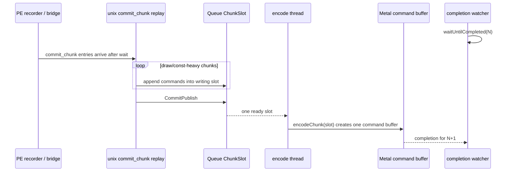
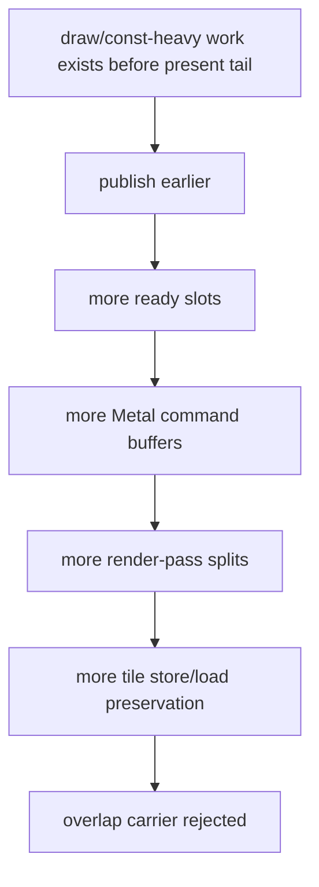
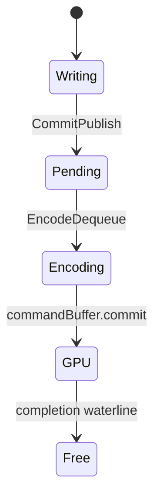
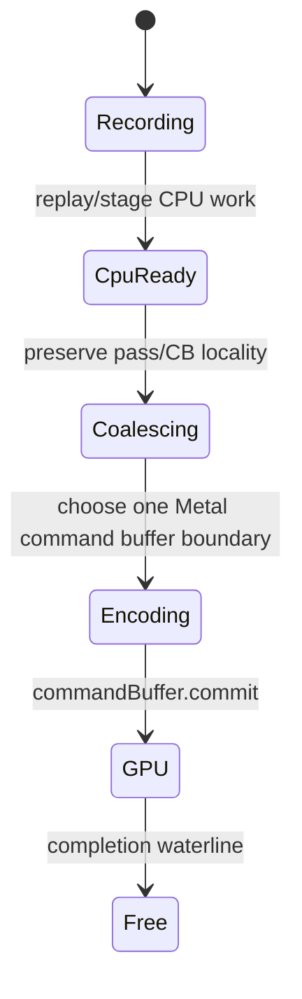

# Present Pacing 68 - Run-Ahead Must Decouple Logical Readiness From Metal Command Buffers

## Question

The current low-overhead baseline remains `under-pipelined-no-enqueue`: the GPU
command buffer is short, but the next command buffer is not enqueued while the
completion watcher is waiting. Which run-ahead architecture is still consistent
with the evidence after state-elision, direct-cbuf, draw-count publish, and PE
desc-cache experiments?

## Verdict

The next FPS-facing run-ahead design must decouple **logical CPU readiness**
from **Metal command-buffer publication**. In the current queue shape,
`CommitPublish` turns the writing `ChunkSlot` into a ready slot, and
`encodeChunk()` encodes one ready slot into one Metal command buffer. Therefore
any simple "publish earlier" knob also tends to create more Metal command
buffers, render-pass boundaries, and tile preservation.

This explains the accepted/rejected split:

| Evidence | Result | Design implication |
|---|---|---|
| [present-pacing-current-lowoverhead.52](present-pacing-current-lowoverhead.52.md) | `gpu_command_buffer_time=3.020ms/present`, `completion_wait_without_enqueue=29.336ms/present`, `wait -> next enqueue=30.482ms/present` | The average-FPS owner is serialized CPU/publish/encode cadence, not GPU execution floor. |
| [state-churn-encode-encode-phase.146](../state-churn-encode/state-churn-encode-encode-phase.146.md) | direct-cbuf cuts encode `11.110 -> 8.500ms/present`, but `wait -> next enqueue` stays flat | Local encode cleanup can expose another serialized stage instead of creating overlap. |
| [present-pacing-drawchunk-limit.48](present-pacing-drawchunk-limit.48.md) | draw limit 64 raises `completion_wait_with_enqueue` `1.191 -> 21.032ms/present` | Earlier publication can create overlap. |
| [present-pacing-drawchunk-limit.48](present-pacing-drawchunk-limit.48.md) / [present-pacing-overlap-locality-gates.51](present-pacing-overlap-locality-gates.51.md) | same knob increases command buffers `+217%`, render passes `+23.76%`, tile preservation `+75.63%`, GPU CB time `+571.85%` | Publication granularity is coupled to Metal locality and cannot be the final carrier. |
| [present-pacing-noenqueue-inter-replay-gap.55](present-pacing-noenqueue-inter-replay-gap.55.md) | first-publish residual is inter-replay producer gap plus completed replay CPU | The useful work exists, but arrives through the wrong boundary. |
| [present-pacing-pe-desc-cache.67](present-pacing-pe-desc-cache.67.md) | a real local getter cleanup does not move aggregate P2/P3/P4 | Microfixes must be gated by `wait -> next enqueue` or overlap movement. |

## Current Coupling

In this shape, an early publish is not just a CPU-visibility event. It also
changes the command-buffer/pass boundary that the Metal backend observes. That
is why draw-count limits recover overlap while failing the locality gates.

## Candidate Architectures

| Candidate | Pros | Cons / risk | Required proof |
|---|---|---|---|
| CPU run-ahead staging before `ChunkSlot` publish | Lets PE/unix replay produce owned CPU work earlier without forcing a Metal command-buffer boundary. | Requires a new staging representation, resource-retention accounting, and clear promotion rules into the normal queue. | `completion_wait_with_enqueue` rises or `wait -> next enqueue` falls while command buffers, render passes, and tile preservation stay flat. |
| Encode-side multi-slot coalescing | Keeps existing early `CommitPublish` mechanics but lets the encoder merge compatible ready slots into one command buffer/pass chain. | Harder TLA/resource-lifetime change: seq IDs, present/query/readback ordering, completion waterline, and per-slot diagnostics must remain sound. | Same overlap/locality gates plus deterministic tests for seq completion and present/query ordering. |
| Render-pass-boundary-only early publish | Smaller change than full staging; avoids mid-pass splits if boundary detection is exact. | May still map one publish to one command buffer and fail to create enough overlap; pass-boundary proof must be conservative. | Overlap improves without increasing `command_buffers_per_present`, `render_passes_per_present`, or tile-preservation bytes. |
| More local replay/snapshot/encode cleanup | Low-risk and already produces accepted local wins. | Evidence so far shows local wins shift time between serialized stages and do not automatically move FPS. | Must pass P2/P3 local gate and P4 overlap/no-enqueue gate together. |

## State Machine Target

The current queue state machine has one durable published object:

The next design needs an intermediate CPU-ready state or an encoder merge
state that does not imply a new Metal command buffer:

## Next Experiment Gate

Do not judge the next run-ahead candidate by local CPU reduction alone. A valid
candidate must pass all of these before promotion:

| Gate | Required direction |
|---|---|
| Visual | normal GT1 frame; no black/yellow/dark-band regression; `draw_skipped_no_pipeline=0`; `gpu_command_buffer_errors=0` |
| P4 overlap | increase `completion_wait_with_enqueue_ms_per_present` or reduce `completion_wait_without_enqueue_ms_per_present` |
| No-enqueue stage | reduce `completion_no_enqueue_wait_to_next_enqueue_ms_per_present`, or reduce a named stage while not increasing the others enough to erase the win |
| Locality | no increase in `command_buffers_per_present`, `render_passes_per_present`, or `render_pass_tile_preservation_bytes_per_present` |
| Stall counters | keep `queue_sequence_wait_ms`, `map_buffer_wait_ms`, and hazard counters clean |
| Xcode spend | only after no-gputrace gates pass; use `.gputrace` to verify GPU locality, not to discover a CPU-only run-ahead failure |

## Decision

The current investigation should stop treating draw-count publish, global PE
chunk-size reduction, or post-`Clear` flush as viable final fixes. They are
diagnostics that prove overlap is possible. The production direction is either
CPU run-ahead staging or encode-side multi-slot coalescing, with a smaller
render-pass-boundary publish experiment allowed only if it preserves command
buffer and tile locality.
