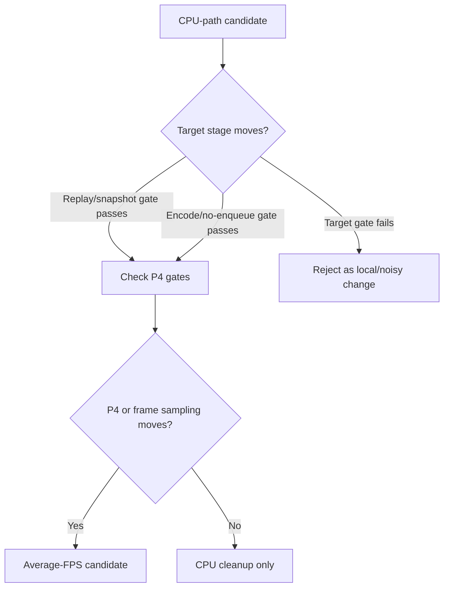

# Present-Pacing 38 - P2/P3 Serial-Stage Compare Gates

## Question

P4 wait movement is the average-FPS proof, but current GT1 still spends large
post-wait time in P2/P3 replay, snapshot, queue submission, and backend encode.
Make those serial-stage targets visible in the same A/B report and gate them
per present, so a candidate can prove the intended CPU stage moved before it is
judged against P4 overlap.

## Tooling

`scripts/tools/compare_3dmark05_perf_counters.py` now reports these derived
metrics:

| Metric | Owner |
|---|---|
| `commit_chunk_replay_cpu_ms_per_present` | unix replay and submit preparation |
| `commit_chunk_queue_draw_submission_cpu_ms_per_present` | queued draw-submission path |
| `d3d9_snapshot_draw_submission_cpu_ms_per_present` | draw snapshot materialization |
| `d3d9_snapshot_cache_lookup_cpu_ms_per_present` | snapshot cache lookup/hash path |
| `encode_chunk_cpu_ms_per_present` | backend chunk encode |
| `encode_draw_cpu_ms_per_present` | per-draw backend encode |
| `no_enqueue_stage_commit_entry_to_publish_ms_per_present` | post-wait replay/snapshot to publish |
| `no_enqueue_stage_publish_to_encode_dequeue_ms_per_present` | queue handoff to encoder thread |
| `no_enqueue_stage_encode_dequeue_to_command_buffer_commit_ms_per_present` | backend encode to Metal commit |
| `no_enqueue_wait_to_next_enqueue_ms_per_present` | full exposed wait-end to next enqueue |

The compare tool also adds requirement gates for those owners:

```sh
python3 scripts/tools/compare_3dmark05_perf_counters.py \
  <baseline-output> <candidate-output> \
  --require-commit-chunk-replay-cpu-per-present-decrease \
  --require-encode-chunk-cpu-per-present-decrease \
  --require-no-enqueue-encode-dequeue-to-commit-decrease
```

Use narrower gates when the candidate targets a specific child:

```sh
  --require-queue-draw-submission-cpu-per-present-decrease \
  --require-snapshot-cpu-per-present-decrease \
  --require-snapshot-cache-lookup-cpu-per-present-decrease \
  --require-no-enqueue-commit-entry-to-publish-decrease \
  --require-no-enqueue-publish-to-encode-dequeue-decrease \
  --require-no-enqueue-wait-to-next-enqueue-decrease
```

The wrapper/finalizer path accepts the same gates with
`--compare-baseline-output`. For no-gputrace runs the wrapper executes
`compare_3dmark05_perf_counters.py` directly; for `.gputrace` runs it prints a
`finalize_cmd_after_xcode_export` command that preserves the gates for the
post-Xcode export step.



## Interpretation

These gates complement [present-pacing-compare-gates.37](present-pacing-compare-gates.37.md):

- P2/P3 gates prove the intended serialized CPU stage actually shrank.
- P4 gates prove that shrinkage affected exposed completion/present wait or
  recovered overlap.
- A candidate that passes only P2/P3 remains useful cleanup, but it is not an
  average-FPS fix until P4 or frame sampling moves with normal visual output.

The report verdict now prints commit replay, encode chunk, and no-enqueue
encode-to-commit deltas beside the P4 deltas, so the high-level review can see
whether a candidate changed the intended stage before opening the full counter
table.

## Verification

- `python3 -m pytest tests/scripts/test_compare_3dmark05_perf_counters.py -q`
- `python3 -m pytest tests/scripts/test_3dmark05_probe_scripts.py -q -k 'pacing_compare_gates'`
- `python3 -m pytest tests/scripts/test_summarize_3dmark05_perf.py -q`
- `meson test -C build-arm64-nowine dxmt9-perf-docs-source-audit`
- `git diff --check -- scripts/tools/compare_3dmark05_perf_counters.py scripts/tools/run_3dmark05_perf_probe.sh scripts/tools/finalize_3dmark05_perf_probe.sh tests/scripts/test_compare_3dmark05_perf_counters.py tests/scripts/test_3dmark05_probe_scripts.py docs/perfomance/present-pacing.md docs/perfomance/present-pacing/present-pacing-serial-stage-compare-gates.38.md`

**Related.** [present-pacing-compare-gates.37](present-pacing-compare-gates.37.md) ·
[present-pacing-stage-delta.08](present-pacing-stage-delta.08.md) · [present-pacing-lowoverhead-refresh.33](present-pacing-lowoverhead-refresh.33.md).
