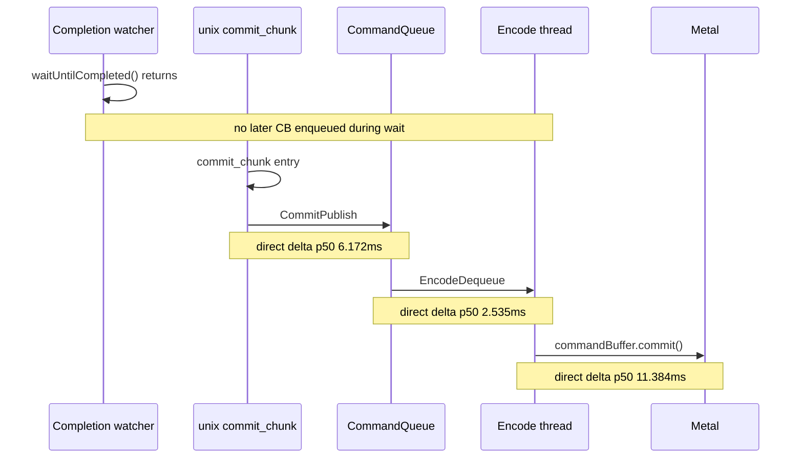

# Present-Pacing 08 — Same-Sample Stage Deltas

## Question

present-pacing-prepublish-stage.07 proved that the app/Wine/PE side reaches
unix `commit_chunk` quickly after a no-enqueue completion wait, but cumulative
wait-end percentiles could not be subtracted safely: each stage has a different
sample set and `CommitPublish` can occur before full chunk replay end. The open
question was which same-sample stage owns the exposed post-wait gap.

## Implementation

Add low-overhead no-enqueue stage-delta counters inside
`QueueLifecycleController`:

- `completion_no_enqueue_stage_commit_entry_to_publish_*`
- `completion_no_enqueue_stage_publish_to_encode_dequeue_*`
- `completion_no_enqueue_stage_encode_dequeue_to_command_buffer_commit_*`

Each counter fires only when both timestamps are observed within the same
no-enqueue completion-wait cycle. The older cumulative
`completion_no_enqueue_wait_to_*` counters remain for absolute timeline
position.



## Run

```sh
scripts/tools/run_3dmark05_perf_probe.sh \
  --suffix pacing-stage-delta-r1-20260614 \
  --frame 60 \
  --no-gputrace \
  --no-encoder-breakdown \
  --frame-sampling \
  --timeout 120
```

Status: pass. The wrapper timeout-finalized after complete artifacts. The
sampled `actual.png` is visually normal for the machine-gun bloom frame, and
there were no pipeline skips or GPU command-buffer errors.

## Result

| Metric | Value | Read |
|---|---:|---|
| `present_encoded` | `1,800` | normal fixed workload |
| `completion_wait_without_enqueue` | `1,799` | still every wait is exposed |
| `completion_wait_with_enqueue_ms` | `0.000` | no producer overlap recovered |
| `completion_wait_ms` | `45002.302` | `25.001ms/present` wait |
| wait-end -> `commit_chunk` entry p50 / p95 | `0.905 / 2.596ms` | app/Wine/PE is still not the long edge |
| wait-end -> `CommitPublish` p50 / p95 | `7.081 / 28.472ms` | publish is delayed after unix entry |
| wait-end -> `EncodeDequeue` p50 / p95 | `6.310 / 32.994ms` | cumulative percentile order remains non-subtractable |
| wait-end -> command-buffer commit p50 / p95 | `17.993 / 52.831ms` | next CB reaches Metal late |
| `entry -> publish` p50 / p95 | `6.172 / 28.101ms` | exposed replay/submit before publish |
| `publish -> encode dequeue` p50 / p95 | `2.535 / 5.086ms` | queue wake/dequeue is secondary |
| `encode dequeue -> command-buffer commit` p50 / p95 | `11.384 / 22.232ms` | exposed backend encode is the largest p50 stage |
| `commit_chunk_replay_cpu_ms` | `18151.627` | run-level replay/submit bucket |
| `commit_chunk_queue_draw_submission_cpu_ms` | `7053.343` | major replay child |
| `d3d9_snapshot_draw_submission_cpu_ms` | `5960.430` | major replay child |
| `encode_chunk_cpu_ms` | `19597.857` | backend encode bucket |
| `encode_draw_cpu_ms` | `16023.609` | backend draw-encode child |
| sampled FPS mean / p50 | `18.763 / 18.381` | normal low-overhead FPS envelope |

## Interpretation

The current average-FPS lane is still hard under-pipelined:
`completion_wait_with_enqueue_ms=0`, so no later command buffer is produced
while the watcher waits on the previous present-bearing command buffer.

The same-sample split refines the owner:

- `commit_chunk entry -> CommitPublish` is real exposed CPU work
  (`6.172ms` p50, `28.101ms` p95), owned by unix replay/submit/snapshot.
- `CommitPublish -> EncodeDequeue` is smaller (`2.535ms` p50), so queue
  notification/dequeue is not the primary lever.
- `EncodeDequeue -> commandBuffer.commit()` is the largest p50 stage
  (`11.384ms`, `22.232ms` p95), owned by backend encode.

Therefore the next average-FPS fixes should not tune present boundary policy or
queue wake mechanics. They should reduce the two exposed CPU stages that still
arrive after completion wait: pre-publish replay/submit/snapshot and
post-dequeue backend encode. A win is accepted only if it either creates overlap
(`completion_wait_with_enqueue_ms > 0`) or reduces
`completion_wait_without_enqueue_ms`, wait-end-to-enqueue, and sampled wall time.
