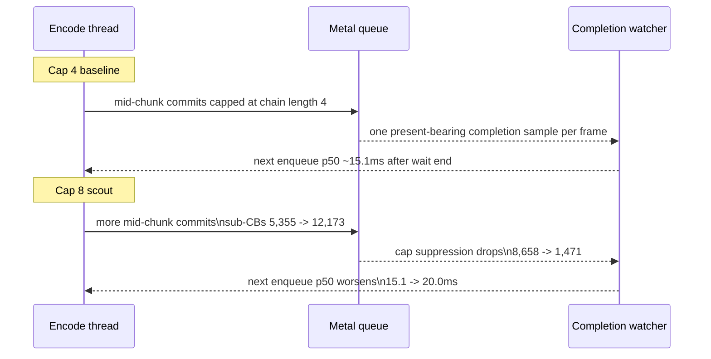
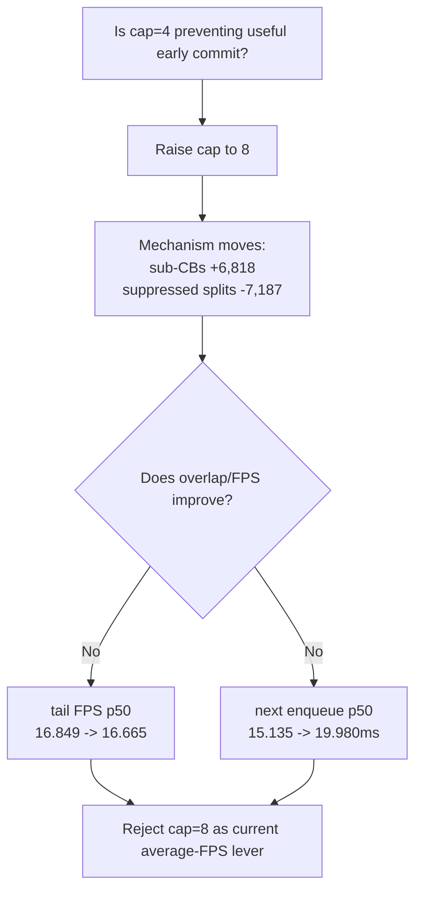

# Present Pacing 25 - Sub-Command Buffer Cap A/B

**Question.** Current low-overhead GT1 still spends large exposed time between
`EncodeDequeue` and `commandBuffer.commit()`. The default mid-chunk policy
already commits per render pass, but `subcb_split_suppressed_by_cap` is nonzero.
Does raising `DXMT9_MID_CHUNK_COMMIT_CAP_PER_RENDER_PASS` recover producer/GPU
overlap or average FPS?

**Method.** Compare the current Stage 2 low-overhead baseline with a cap-8
no-gputrace scout:

```sh
DXMT9_MID_CHUNK_COMMIT_CAP_PER_RENDER_PASS=8 \
bash scripts/tools/run_3dmark05_perf_probe.sh \
  --suffix subcb-cap8-lowoverhead-r1-20260614 \
  --no-gputrace --no-encoder-breakdown \
  --frame-sampling --timeout 120
```

The run timed out through the supervised 120s path but finalized normally with
`status=pass`. The cap override reached the runtime: `chunk_subcb_count_max`
changed from `4` to `8`.

| Metric | Cap 4 baseline | Cap 8 | Delta |
|---|---:|---:|---:|
| `present_encoded` | `1,786` | `1,740` | `-46` |
| `command_buffers` | `7,143` | `13,915` | `+6,772` |
| `sub_command_buffers` | `5,355` | `12,173` | `+6,818` |
| `chunk_subcb_count_max` | `4` | `8` | `+4` |
| `subcb_split_suppressed_by_cap` | `8,658` | `1,471` | `-7,187` |
| `command_buffer_commit_cpu_ms` | `112.571` | `158.180` | `+45.609` |
| `encode_chunk_cpu_ms / present` | `11.431ms` | `11.698ms` | `+0.267ms` |
| `encode_draw_cpu_ms / present` | `9.388ms` | `9.548ms` | `+0.160ms` |
| `completion_wait_ms / present` | `27.116ms` | `28.900ms` | `+1.784ms` |
| `completion_wait_with_enqueue` | `1` | `4` | `+3` |
| `wait end -> commit_chunk entry p50` | `0.861ms` | `0.859ms` | `-0.002ms` |
| `commit_chunk entry -> CommitPublish p50` | `14.068ms` | `14.626ms` | `+0.558ms` |
| `CommitPublish -> EncodeDequeue p50` | `3.678ms` | `3.893ms` | `+0.215ms` |
| `EncodeDequeue -> commandBuffer.commit p50` | `11.528ms` | `12.696ms` | `+1.168ms` |
| `wait end -> next enqueue p50` | `15.135ms` | `19.980ms` | `+4.845ms` |

Frame sampling rejects the FPS gate:

| Frame window | Metric | Cap 4 baseline | Cap 8 |
|---|---|---:|---:|
| warm (`frame >= 120`) | FPS p50 / p95 | `17.199 / 26.357` | `17.244 / 26.290` |
| warm (`frame >= 120`) | wall p50 / p95 | `58.122 / 85.941ms` | `57.964 / 86.074ms` |
| warm (`frame >= 120`) | completion wait p50 / p95 | `27.409 / 40.541ms` | `27.834 / 42.912ms` |
| tail-600 | FPS p50 / p95 | `16.849 / 25.377` | `16.665 / 25.217` |
| tail-600 | wall p50 / p95 | `59.310 / 96.841ms` | `60.001 / 97.115ms` |
| tail-600 | completion wait p50 / p95 | `27.147 / 36.038ms` | `27.428 / 38.791ms` |





**Counter caveat.** The cap-8 run shows much lower
`gpu_command_buffer_time_ms`, but that value must not be read as a GPU win for
this A/B. Frame rows still report one GPU-time sample per frame while
`command_buffers` rise to `8` in the tail, so the no-gputrace counter is not a
total GPU-time proof for mid-chunk chains. Use System Trace or Xcode counter
exports before making GPU-cost claims about sub-CB cap changes.

**Decision.** Rejected as the current FPS lever. Raising the cap proves that
the cap is active, but it adds command buffers, increases commit CPU, leaves
warm FPS flat, worsens tail FPS, and lengthens the no-enqueue next-enqueue
p50. Do not promote cap=8 or cap-unbounded to `perf` without a new proof that
moves `completion_wait_ms`, `completion_wait_with_enqueue`, and frame sampling
together.

**Next gates.**

- Keep the default cap at `4` for GT1.
- Avoid spending Xcode on sub-CB cap tuning unless a no-gputrace scout first
  shows FPS or overlap movement.
- Continue on replay/snapshot/submit and backend encode storage shape; cap
  tuning does not replace those P2/P3 reductions.

**Related.** [[present-pacing]] · [[present-pacing-lowoverhead-serial.24]] ·
[[state-churn-encode-encode-phase.68]] · [[overview]].
