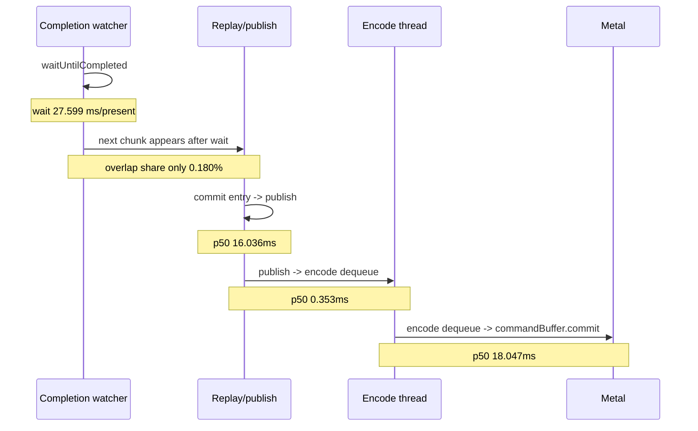

# Present-Pacing 41 - Current Summary-Triage Scout

## Question

After adding the `Pacing / CPU Stage Derived` block, what verdict does a fresh
low-overhead current run produce?

## Run

```sh
bash scripts/tools/run_3dmark05_perf_probe.sh \
  --suffix p4-summary-triage-current \
  --frame 60 \
  --no-gputrace \
  --no-encoder-breakdown \
  --frame-sampling \
  --timeout 120 \
  --wait-unlocked-sec 1 \
  --wait-unlocked-interval-sec 1 \
  --require-current-uniform-compact-saved-bytes-present
```

The wrapper rebuilt/restaged the PE/unix binaries, ran with normal rendering,
and completed with `status=pass`.

## Pacing Triage

| Metric | Value |
|---|---:|
| `present_encoded` | `1,842` |
| Sampled frames | `1,841` |
| Sampled avg FPS | `16.822` |
| `wall_ms` p50 / p95 | `53.842 / 84.123` |
| `completion_wait_ms_per_present` | `27.599` |
| `completion_wait_with_enqueue_ms_per_present` | `0.050` |
| `completion_wait_without_enqueue_ms_per_present` | `27.550` |
| `completion_wait_overlap_share` | `0.180%` |
| `completion_wait_no_enqueue_share` | `99.820%` |
| `gpu_command_buffer_time_ms_per_present` | `3.122` |
| `commit_chunk_replay_cpu_ms_per_present` | `8.207` |
| `commit_chunk_queue_draw_submission_cpu_ms_per_present` | `4.080` |
| `d3d9_snapshot_draw_submission_cpu_ms_per_present` | `3.377` |
| `d3d9_snapshot_cache_lookup_cpu_ms_per_present` | `2.820` |
| `encode_chunk_cpu_ms_per_present` | `10.566` |
| `encode_draw_cpu_ms_per_present` | `8.574` |

Same-cycle no-enqueue rows:

| Stage | total ms/present | p50 ms | p95 ms |
|---|---:|---:|---:|
| wait -> commit chunk entry | `3.796` | `1.018` | `2.983` |
| commit entry -> publish | `15.008` | `16.036` | `26.822` |
| publish -> encode dequeue | `0.242` | `0.353` | `0.483` |
| encode dequeue -> command buffer commit | `12.051` | `18.047` | `23.969` |
| wait -> next enqueue | `31.781` | `12.422` | `48.611` |

Summary verdict:

- `under-pipelined-no-enqueue`
- largest p50 no-enqueue row: `encode dequeue -> command buffer commit`



## Decision

Accepted as the current summary-triage baseline.

The run confirms [[present-pacing-frame-sampling-current.39]] rather than
changing the owner model: current average FPS is still not a GPU floor. The
useful work remains:

1. Reduce P2/P3 CPU time in replay/snapshot and backend encode.
2. Pair any local CPU win with P4 evidence: lower no-enqueue wait, increased
   useful overlap, or improved frame sampling.
3. Keep GPU/Xcode work as a hot-frame and backend-storage lane until Developer
   Mode allows `.gputrace` attach/export again.

## Verification

- `status=pass` in
  `experiments/output/app-d3d9-3dmark05-p4-summary-triage-current/result.json`
- `Pacing / CPU Stage Derived` in
  `experiments/output/app-d3d9-3dmark05-p4-summary-triage-current/3dmark05-perf-summary.md`

**Related.** [[present-pacing-summary-triage.40]] ·
[[present-pacing-frame-sampling-current.39]] ·
[[present-pacing-serial-stage-compare-gates.38]] · [[present-pacing]].
