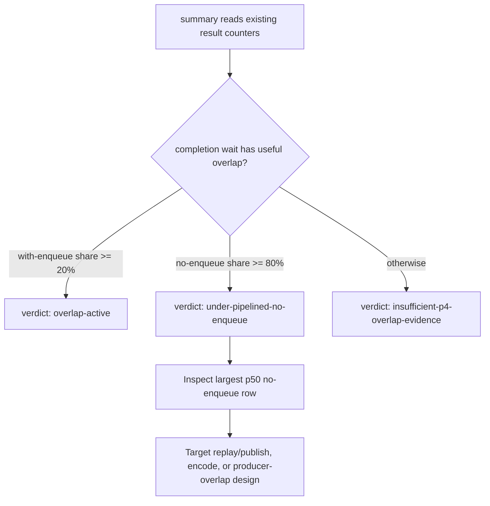

# Present-Pacing 40 - Current-Run P4 and CPU Stage Summary Triage

## Question

Can a single `summarize_3dmark05_perf.py` output make the current average-FPS
owner visible without opening `result.json` by hand?

## Change

`summarize_3dmark05_perf.py` now emits a `Pacing / CPU Stage Derived` block.
It uses existing counters only:

| Row | Purpose |
|---|---|
| `completion_wait_*_per_present` | Separates total completion wait, wait with later enqueue overlap, and no-enqueue wait. |
| `completion_wait_overlap_share` / `completion_wait_no_enqueue_share` | Classifies whether the run gained useful producer overlap. |
| replay / queue / snapshot / encode per-present rows | Names the P2/P3 CPU side that can shorten serialized frame cadence. |
| no-enqueue stage table | Shows same-cycle `wait -> commit`, `commit -> publish`, `publish -> encode`, and `encode -> commit` exposure. |

The block emits a simple current-run verdict:

## Why

The current baseline in present-pacing-frame-sampling-current.39 shows the
same shape repeatedly: GPU command-buffer time is not the average frame floor,
completion wait has almost no overlap, and exposed CPU stages remain large.
Before a candidate can claim average-FPS movement, the summary should make that
claim auditable from one report.

This does not replace the A/B gates from
[present-pacing-compare-gates.37](present-pacing-compare-gates.37.md) and
[present-pacing-serial-stage-compare-gates.38](present-pacing-serial-stage-compare-gates.38.md). It lowers the cost of reading
standalone current scouts and makes the next candidate selection less
dependent on ad hoc `jq` or Python snippets.

## Verification

- `python3 -m py_compile scripts/tools/summarize_3dmark05_perf.py tests/scripts/test_summarize_3dmark05_perf.py`
- `python3 -m pytest tests/scripts/test_summarize_3dmark05_perf.py -q`

**Related.** present-pacing-frame-sampling-current.39 ·
[present-pacing-serial-stage-compare-gates.38](present-pacing-serial-stage-compare-gates.38.md) ·
[present-pacing-compare-gates.37](present-pacing-compare-gates.37.md) · [present-pacing](index.md).
