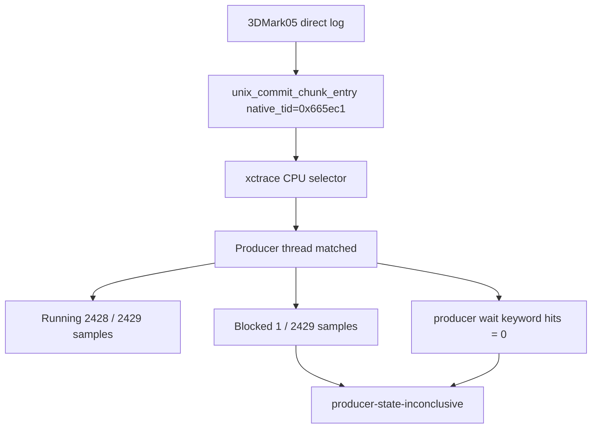

# Present-Pacing 35 - Current P4 System Trace Sidecar

## Question

After the current encode/snapshot cleanup state, does a short normal-rendering
System Trace still select the real native producer thread, and does it show
P4 wait-stack evidence while Xcode `.gputrace` attach is blocked by Developer
Mode?

## Run

```sh
bash scripts/tools/run_3dmark05_system_trace_sidecar.sh \
  --record-delay-sec 70 \
  --time-limit-sec 2 \
  --summary-top 10 \
  --export-cpu-summary \
  --cpu-producer-from-pe-log \
  -- \
  --suffix current-p4-sidecar-r1-20260615 \
  --frame 60 \
  --no-gputrace \
  --timeout 120 \
  --frame-sampling
```

The run completed without timeout:

| Field | Value |
|---|---:|
| Status / return code | `pass / 0` |
| `system_trace_xctrace_status` | `0` |
| `system_trace_wrapper_status` | `0` |
| Trace bundle size | `60MiB` |
| Probe output size | `553MiB` |
| Frame sampling rows | `1,678` |
| Captured seq range | `1052..1087` |
| Joined encoder rows | `386 / 386` |
| dxmt join coverage | `100%` |

`actual.png` is visually useful evidence, not a black or HUD-only frame: the
captured frame contains scene geometry, bloom, muzzle/impact light, and dense
particle streaks.

## CPU Selector Result

The CPU summary selected the same-run unix replay-boundary native thread id:

| Field | Value |
|---|---:|
| Producer selector | `0x665ec1` |
| Selector source | `native-log-commit-chunk-entry` |
| Producer profile weight | `2422.000ms` |
| Producer sample rows | `2,429` |
| Producer running rows | `2,428` |
| Producer blocked rows | `1` |
| Producer wait keyword hits | `0` |
| Non-producer wait keyword hits | `1` |

The verdict is intentionally weaker than the prior smoke:

```json
{
  "status": "producer-state-inconclusive",
  "producer_selection": "0x665ec1",
  "producer_selection_source": "native-log-commit-chunk-entry",
  "producer_wait_keyword_hits": "0",
  "producer_sample_running_rows": "2428",
  "producer_sample_blocked_rows": "1",
  "nonproducer_wait_keyword_hits": "1"
}
```

This is not positive `OnMainThread` evidence. The selected producer has zero
wait-keyword hits, but one `time-sample` blocked row prevents calling the scout
fully negative.



## Metal Timing Context

System Trace timing still joins cleanly and remains vertex-stage dominated:

| Metric | Value |
|---|---:|
| Stage sum | `1940.344ms` |
| Vertex stage sum | `1814.657ms` |
| Fragment stage sum | `125.688ms` |
| Vertex share | `93.52%` |
| Top-10 vertex ms/Mvertex p50 / p95 | `15.997 / 17.336` |

By route verdict:

| Group | Stage share | Vertex share |
|---|---:|---:|
| `needs-programmable-color-route` | `59.68%` | `95.21%` |
| `needs-programmable-textured-route` | `32.69%` | `90.41%` |
| `candidate-depth-only-route` | `7.39%` | `93.93%` |

Top rows are all `opaque-depth-indexed` /
`needs-programmable-color-route`; rank 1 is `1068/1` at `21.152ms` stage time,
with `20.300ms` vertex time and `1,138,056` vertices.

## Pacing Context

This run has all-frame encoder breakdown enabled, so the runtime FPS should not
be used as a low-overhead baseline. The counters still show the current
no-overlap shape:

| Metric | Total | Per present |
|---|---:|---:|
| `present_encoded` | `1,678` | n/a |
| `gpu_command_buffer_time_ms` | `5218.894ms` | `3.110ms` |
| `completion_wait_ms` | `44163.517ms` | `26.319ms` |
| `completion_wait_with_enqueue_ms` | `0.000ms` | `0.000ms` |
| `completion_wait_without_enqueue_ms` | `44163.517ms` | `26.319ms` |
| `commit_chunk_replay_cpu_ms` | `14280.583ms` | `8.510ms` |
| `commit_chunk_queue_draw_submission_cpu_ms` | `7125.739ms` | `4.247ms` |
| `d3d9_snapshot_draw_submission_cpu_ms` | `5919.780ms` | `3.528ms` |
| `d3d9_snapshot_cache_lookup_cpu_ms` | `5009.150ms` | `2.985ms` |
| `d3d9_snapshot_cache_batch_miss_cpu_ms` | `3662.602ms` | `2.183ms` |
| `encode_chunk_cpu_ms` | `22240.528ms` | `13.254ms` |
| `encode_draw_cpu_ms` | `17741.679ms` | `10.573ms` |

Same-cycle p50/p95 after no-enqueue waits:

| Stage | p50 | p95 |
|---|---:|---:|
| `commit_entry -> publish` | `4.293ms` | `33.414ms` |
| `publish -> encode_dequeue` | `0.222ms` | `0.480ms` |
| `encode_dequeue -> command_buffer_commit` | `14.605ms` | `27.903ms` |
| `wait -> next_enqueue` | `19.933ms` | `60.304ms` |

Clean gates remain clean: `draw_skipped_no_pipeline=0`,
`gpu_command_buffer_errors=0`, and `render_split_hazard=0`.

## Decision

Accepted as a successful current System Trace sidecar, but not as a positive
P4/winemac wait proof.

- Native producer selection still works from `unix_commit_chunk_entry`.
- The selected producer has no `OnMainThread`/`kevent`/macdrv wait-stack hits.
- One blocked sample makes the thread-state verdict inconclusive rather than a
  strict negative.
- The run still has no completion-wait overlap
  (`completion_wait_with_enqueue_ms=0`) and large serialized replay/snapshot/
  encode work after the wait.

The next average-FPS work should therefore stay on P2/P3 CPU reduction or a
larger overlap design. A future P4 claim needs either a targeted positive
producer wait-stack sample or direct movement in `completion_wait_with_enqueue_ms`
on a low-overhead visual-normal run.

**Related.** [[present-pacing-systemtrace-p4-smoke.34]] ·
[[state-churn-encode-encode-phase.91]] · [[present-pacing]].
