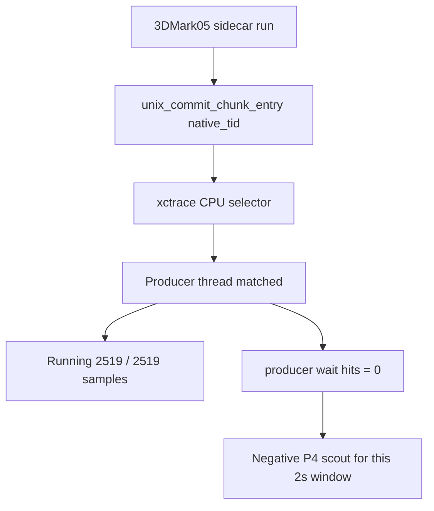

# Present-Pacing 34 - Short System Trace P4 Smoke

## Question

With Xcode `.gputrace` attach blocked by Developer Mode, can a short
normal-rendering Metal System Trace sidecar still join dxmt9 encoder timing and
select the native producer thread? If so, does this small window show
producer-thread P4 wait evidence?

## Run

```sh
bash scripts/tools/run_3dmark05_system_trace_sidecar.sh \
  --record-delay-sec 75 \
  --time-limit-sec 2 \
  --summary-top 12 \
  --min-free-mb 0 \
  --export-cpu-summary \
  --cpu-producer-from-pe-log \
  -- \
  --suffix systemtrace-p4-smoke-r1 \
  --frame 60 \
  --no-gputrace \
  --timeout 120
```

The run finalized as `status=pass` with `returncode=143` and `timed_out=true`,
which is acceptable for this workload because the wrapper timeout-finalizes
3DMark05 final-frame hangs. The sidecar recorded a 2-second all-processes Metal
System Trace and exported both GPU intervals and CPU thread tables.

| Field | Value |
|---|---:|
| `system_trace_xctrace_status` | `0` |
| `system_trace_wrapper_status` | `0` |
| Trace bundle size | `46MiB` |
| Probe output size | `555MiB` |
| Captured seq range | `1114..1148` |
| Joined encoder rows | `306 / 306` |
| dxmt join coverage | `100%` |
| `time-profile` rows matched to `3DMark05.exe` | `3,155` |
| `time-sample` rows matched to `3DMark05.exe` | `3,178` |

## CPU Selector Result

The CPU summary selected the unix replay-boundary native thread id from the
same run:

| Field | Value |
|---|---:|
| Producer selector | `0x6572ff` |
| Selector source | `native-log-commit-chunk-entry` |
| Producer thread | `3DMark05.exe (0x6572ff)` |
| Producer profile weight | `2515.000ms` |
| Producer sample rows | `2,519` |
| Producer running rows | `2,519` |
| Producer blocked rows | `0` |
| Producer wait keyword hits | `0` |
| Non-producer wait keyword hits | `0` |

The verdict is:

```json
{
  "status": "producer-running-negative-scout",
  "producer_selection": "0x6572ff",
  "producer_selection_source": "native-log-commit-chunk-entry",
  "producer_sample_rows": "2519",
  "producer_sample_running_rows": "2519",
  "producer_sample_blocked_rows": "0",
  "producer_wait_keyword_hits": "0"
}
```

This is only a short scout. It does not prove the producer never waits in other
windows, but it keeps broad winemac `OnMainThread` below the already measured
serialized replay/snapshot/encode lane.



## Metal Timing Context

The System Trace GPU timing join is valid and useful even without `.gputrace`
replay counters:

| Metric | Value |
|---|---:|
| Stage sum | `1007.373ms` |
| Vertex stage sum | `937.595ms` |
| Fragment stage sum | `69.778ms` |
| Vertex share | `93.07%` |
| Top-12 vertex ms/Mvertex p50 / p95 | `13.556 / 15.397` |

By primitive class:

| Group | Stage share | Vertex share | Draws | Triangles |
|---|---:|---:|---:|---:|
| `opaque-depth-indexed` | `68.22%` | `94.38%` | `12,218` | `19,978,076` |
| `alpha-blend-indexed` | `30.81%` | `92.71%` | `10,241` | `14,823,597` |
| `other-primitive` | `0.98%` | `13.02%` | `170` | `340` |

By route verdict:

| Group | Stage share | Vertex share |
|---|---:|---:|
| `needs-programmable-color-route` | `51.25%` | `96.67%` |
| `needs-programmable-textured-route` | `31.78%` | `90.27%` |
| `mixed-programmable-route` | `16.96%` | `87.45%` |

Top rows are all `opaque-depth-indexed` /
`needs-programmable-color-route`; rank 1 is `1119/1` at `18.462ms`
stage time with `17.980ms` vertex time and `1,149,930` vertices.

This trace does not expose `VS Buffer Device Memory Bytes Written`, so it is not
a replacement for an Xcode `.gputrace` counter export. It is a timing/join
fallback while Xcode attach is blocked.

## Pacing Context

The run has all-frame encoder breakdown enabled, so its runtime is not a
low-overhead FPS baseline. It still reports the same no-enqueue serialization
shape:

| Metric | Value | Per present |
|---|---:|---:|
| `present_encoded` | `1,560` | n/a |
| `gpu_command_buffer_time_ms` | `4,734.812ms` | `3.035ms` |
| `completion_present_wait_ms` | `39,948.147ms` | `25.608ms` |
| `completion_wait_with_enqueue_ms` | `0.000ms` | `0.000ms` |
| `completion_wait_without_enqueue_ms` | `39,948.147ms` | `25.608ms` |
| `commit_chunk_replay_cpu_ms` | `13,436.089ms` | `8.613ms` |
| `commit_chunk_queue_draw_submission_snapshot_cpu_ms` | `5,689.258ms` | `3.647ms` |
| `d3d9_snapshot_cache_lookup_cpu_ms` | `4,739.535ms` | `3.038ms` |
| `encode_chunk_cpu_ms` | `20,830.522ms` | `13.353ms` |
| `encode_draw_cpu_ms` | `16,719.706ms` | `10.718ms` |

Same-cycle p50/p95 after no-enqueue waits:

| Stage | p50 | p95 |
|---|---:|---:|
| `commit_entry -> publish` | `21.629ms` | `53.949ms` |
| `publish -> encode_dequeue` | `0.389ms` | `0.566ms` |
| `encode_dequeue -> command_buffer_commit` | `22.946ms` | `32.498ms` |
| `wait -> next_enqueue` | `46.973ms` | `89.016ms` |

Clean gates remain clean: `present_boundary_wait_ms=0`,
`queue_sequence_wait_ms=0`, `map_buffer_wait_ms=0`,
`draw_skipped_no_pipeline=0`, `gpu_command_buffer_errors=0`, and
`render_split_hazard=0`.

## Decision

Accepted as a successful short System Trace sidecar and a negative P4 scout for
the selected producer thread. The useful movement is methodological:

- `.gputrace` remains blocked by Xcode/Developer Mode, but normal-rendering
  System Trace can still export GPU intervals and CPU thread summaries.
- Native producer selection works in the current sidecar path.
- This sample does not show producer-thread `OnMainThread`/wait evidence.
- The timing shape still points at serialized replay/snapshot/encode work and
  vertex-dominated GPU encoders, not broad app-thread sleep.

Do not use this run's FPS or elapsed time as a promotion gate. Use it as a
fallback profiling proof and as another constraint on P4: a future P4 claim
needs a targeted positive wait sample or must move
`completion_wait_with_enqueue_ms` / low-overhead frame sampling.

## Next Gate

- For average-FPS work, continue targeting P2/P3 replay/snapshot/encode
  reductions and require low-overhead movement in completion wait or frame
  sampling.
- For GPU route work while `.gputrace` is blocked, use System Trace sidecars to
  validate encoder timing/route attribution, then wait for Xcode counter export
  before making `VS Buffer Device Memory Bytes Written` claims.
- Keep the sidecar time window short on low disk space; this 2-second run still
  produced about `601MiB` of trace plus probe artifacts.

**Related.** [[present-pacing-native-selector-xctrace.32]] ·
[[present-pacing-lowoverhead-refresh.33]] · [[present-pacing]].
