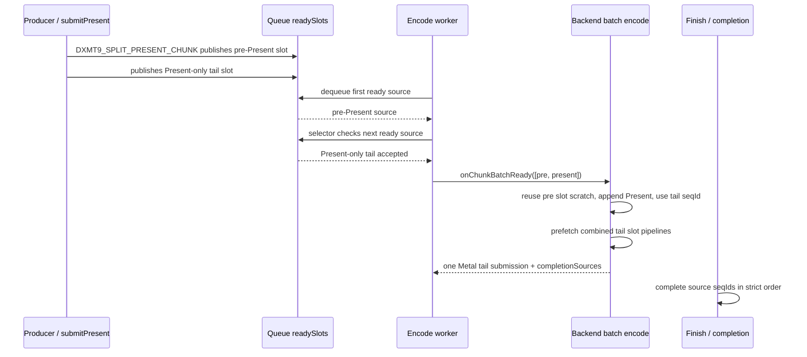

# Present-Pacing 88 - Tail-Present batch runtime carrier

> **Outdated — the knob or code path this experiment measured no longer exists in `src/`.** It cannot be re-run. Kept as history; do not cite it as current evidence.

## Question

Can the existing diagnostic present split be repaired on the encode side so it
creates a CPU-ready tail-Present surface without repeating the H74/H75
one-command-buffer-per-slot locality failure?

## Implementation

This step adds an opt-in runtime path:

- `DXMT9_ENCODE_TAIL_PRESENT_BATCH=1` switches the encode worker to the batch
  lifecycle loop.
- Batch dequeue now accepts a selector predicate. The new selector only pulls a
  second ready slot when the first source is non-present work and the second
  source is a single Present command.
- `TraditionalBackend` and `FrameGraphBackend` both implement
  `onChunkBatchReady()` for exactly that shape by reusing the pre-Present source
  slot as temporary owned scratch, appending the Present command, encoding one
  combined tail `ChunkSlot`, and expanding
  `QueueSubmissionRecord::completionSources` for both source seqIds.
- The combined tail slot must run the same slot-level PSO/pipeline prefetch as
  the normal single-source path after the Present command is appended. Without
  this, encode falls back to per-draw pipeline lookup for the whole combined
  chunk.

The default path is unchanged: with the env unset, the encode worker still calls
`runEncodeLoop()` and `backend_->onChunkReady()` once per ready slot.



## GT1 Results

Four no-gputrace GT1 runs tested the carrier together with
`DXMT9_SPLIT_PRESENT_CHUNK=1`. r1/r2 proved the mechanism and exposed the
missing-prefetch regression. r3 adds combined-slot prefetch, and r4 repeats the
candidate against a same-day baseline:

```sh
DXMT9_SPLIT_PRESENT_CHUNK=1 DXMT9_ENCODE_TAIL_PRESENT_BATCH=1 \
  scripts/tools/run_3dmark05_perf_probe.sh \
  --suffix h88-tail-present-batch-r3-prefetch \
  --no-gputrace --timeout 120 --wait-unlocked-sec 60 --no-encoder-breakdown
```

The mechanism works. The ready queue now exposes exactly the intended two-source
shape:

| Metric | `v0.0.3` baseline | H88 r2 | H88 r3 |
|---|---:|---:|---:|
| `encode_ready_depth_avg` | `1.000` | `2.000` | `2.000` |
| `encode_ready_depth_gt1_per_present` | `0.000` | `1.000` | `1.000` |
| `chunk_publish_reason_present_split_before` | `0` | `1/present` | `1/present` |
| `chunk_publish_commands_present` | `330.437/present` | `1.000/present` | `1.000/present` |
| `chunk_publish_commands_present_split_before` | `0` | `327.812/present` | `327.198/present` |

The locality shape mostly stays flat, and the broad visual smoke image does not
show the obvious post-`v0.0.3` failure modes such as black screen, transparent
weapon, texture collapse, or missing bright particle/bloom geometry. This is not
a same-frame pixel proof: r2/r3 captured `actual.png` at frame `1105` / `1108`,
while the baseline image is a different animation frame. Treat it as a broad
safety smoke, not an exact visual diff.

r2 failed on CPU encode cost:

| Metric | `v0.0.3` baseline | H88 r2 | Delta |
|---|---:|---:|---:|
| `command_buffers_per_present` | `3.999` | `3.999` | `+0.00%` |
| `passes_per_present` | `11.774` | `11.755` | `-0.16%` |
| `completion_wait_ms_per_present` | `26.890` | `25.079` | `-1.811` |
| `completion_wait_with_enqueue_ms_per_present` | `0.051` | `0.072` | `+0.021` |
| `completion_wait_without_enqueue_ms_per_present` | `26.839` | `25.007` | `-1.831` |
| `commit_chunk_replay_cpu_ms_per_present` | `8.039` | `7.998` | `-0.042` |
| `encode_chunk_cpu_ms_per_present` | `11.311` | `13.878` | `+2.567` |
| `encode_draw_cpu_ms_per_present` | `8.750` | `11.261` | `+2.510` |
| `no_enqueue_stage_encode_dequeue_to_command_buffer_commit_ms_per_present` | `12.689` | `14.362` | `+1.672` |
| `no_enqueue_wait_to_next_enqueue_ms_per_present` | `32.911` | `34.623` | `+1.711` |
| `gpu_command_buffer_time_ms_per_present` | `3.183` | `3.090` | `-0.093` |
| `encode_draw_pipeline_lookup_cpu_ms_per_present` | `0.568` | `2.985` | `+2.417` |

r1 used an extra deep copy of the pre-Present slot before combining. r2 removed
that copy by mutating the already-dequeued source slot as backend scratch, which
recovered only `0.340ms/present` of encode chunk CPU versus r1. The residual
regression is therefore not primarily the second `ChunkSlot` copy. The smoking
counter is pipeline lookup: `encode_draw_pipeline_lookup_cpu_ms_per_present`
increases by about `2.417ms/present`, which explains most of the
`encode_draw_cpu_ms_per_present` regression.

r3 confirms that missing combined-slot prefetch was the r2 regression:

| Metric | `v0.0.3` baseline | H88 r2 | H88 r3 |
|---|---:|---:|---:|
| `encode_slot_pso_prefetch_commands_per_present` | `330.437` | `0.000` | `328.198` |
| `encode_slot_pso_prefetch_cpu_ms_per_present` | `1.166` | `0.000` | `1.169` |
| `encode_draw_pipeline_lookup_cpu_ms_per_present` | `0.568` | `2.986` | `0.540` |
| `encode_chunk_cpu_ms_per_present` | `11.311` | `13.878` | `11.111` |
| `encode_draw_cpu_ms_per_present` | `8.750` | `11.261` | `8.614` |
| `no_enqueue_stage_encode_dequeue_to_command_buffer_commit_ms_per_present` | `12.689` | `14.362` | `12.408` |
| `no_enqueue_before_publish_closure_ms_per_present` | `15.831` | `15.996` | `15.210` |
| `no_enqueue_wait_to_next_enqueue_ms_per_present` | `32.911` | `34.623` | `31.990` |
| `completion_wait_ms_per_present` | `26.890` | `25.079` | `27.267` |
| `completion_wait_without_enqueue_ms_per_present` | `26.839` | `25.007` | `27.218` |
| `gpu_command_buffer_time_ms_per_present` | `3.183` | `3.090` | `3.188` |

r4 rejects H88 as the average-FPS/P4 fix. The same-day A/B keeps the intended
ready-depth and locality shape, but the serial no-enqueue cadence worsens:

| Metric | Same-day baseline r4 | H88 r4 | Delta |
|---|---:|---:|---:|
| `encode_ready_depth_avg` | `1.000` | `2.000` | `+1.000` |
| `encode_ready_depth_gt1_per_present` | `0.000` | `1.000` | `+1.000` |
| `command_buffers_per_present` | `3.999` | `3.999` | `-0.00%` |
| `passes_per_present` | `11.781` | `11.688` | `-0.79%` |
| `tile_preservation_mib` | `216,967.047` | `213,854.094` | `-1.43%` |
| `completion_wait_ms_per_present` | `26.940` | `26.693` | `-0.248` |
| `completion_wait_with_enqueue_ms_per_present` | `0.374` | `0.000` | `-0.374` |
| `completion_wait_without_enqueue_ms_per_present` | `26.566` | `26.693` | `+0.127` |
| `completion_wait_no_enqueue_share_pct` | `98.610` | `100.000` | `+1.390` |
| `commit_chunk_replay_cpu_ms_per_present` | `8.009` | `8.261` | `+0.251` |
| `encode_chunk_cpu_ms_per_present` | `11.266` | `11.467` | `+0.201` |
| `encode_draw_cpu_ms_per_present` | `8.729` | `8.910` | `+0.181` |
| `no_enqueue_before_publish_closure_ms_per_present` | `15.832` | `16.921` | `+1.089` |
| `no_enqueue_wait_to_next_enqueue_ms_per_present` | `33.043` | `34.396` | `+1.353` |
| `gpu_command_buffer_time_ms_per_present` | `5.685` | `5.401` | `-0.284` |

The r4 `actual.png` broad smoke is visually coherent in the same explosion /
particle family as the baseline, and both HUD overlays show `FPS: 11`. Because
the frames are `1111` versus `1102`, this is still only a broad visual smoke,
not a same-frame pixel proof.

## Current Decision

Accept the carrier and the combined-slot prefetch fix as the correct local
shape. H88 r3 proves that the missing-prefetch failure was the cause of the r2
encode regression, and it turns the tail-Present carrier into a small local CPU
win rather than a large encode loss.

Reject H88 as the average-FPS/P4 fix. r4 is the stronger same-day evidence: it
passes the ready-depth and locality gates but removes the small baseline overlap
sample, keeps completion wait fully no-enqueue dominated, and worsens both the
before-publish closure and wait-to-next-enqueue. The tail-Present batch carrier
is still a useful mechanism and test-covered queue contract, but the current
split+recombine implementation should stay opt-in while the average-FPS owner
returns to reducing the serial producer/replay/snapshot/encode cadence or to a
larger overlap design that improves no-enqueue closure without increasing
per-frame CPU work.

## Verification

Code-level verification for this step:

```sh
meson compile -C build-arm64-nowine
meson test -C build-arm64-nowine dxmt9-render-backend-batch-contract-spec dxmt9-queue-completion-sources-spec dxmt9-render-traditional-backend-spec dxmt9-render-framegraph-backend-spec dxmt9-verify-tla
```

Both new safety points are covered:

- rejected batch candidates remain `Pending` and stay in FIFO ready order,
- the tail-Present backend helper only accepts non-present head plus
  Present-only tail.

Runtime verification:

- `h88-tail-present-batch-r1` proved ready-depth and completion-source behavior,
  but regressed encode CPU with the extra slot copy.
- `h88-tail-present-batch-r2` removed that copy and retained the broad visual
  smoke pass, but still failed the encode CPU and no-enqueue closure gates
  because combined-slot PSO prefetch was missing.
- `h88-tail-present-batch-r3-prefetch` restores combined-slot prefetch and
  recovers the pipeline lookup path (`2.986 -> 0.540ms/present`), but keeps the
  average-FPS/P4 promotion open because total completion wait did not improve.
- `h88-tail-present-batch-r4-sameday` compares against a same-day baseline and
  rejects the FPS/P4 promotion: ready depth becomes `2.000`, but
  `no_enqueue_before_publish_closure_ms_per_present` worsens
  `15.832 -> 16.921` and `no_enqueue_wait_to_next_enqueue_ms_per_present`
  worsens `33.043 -> 34.396`.
