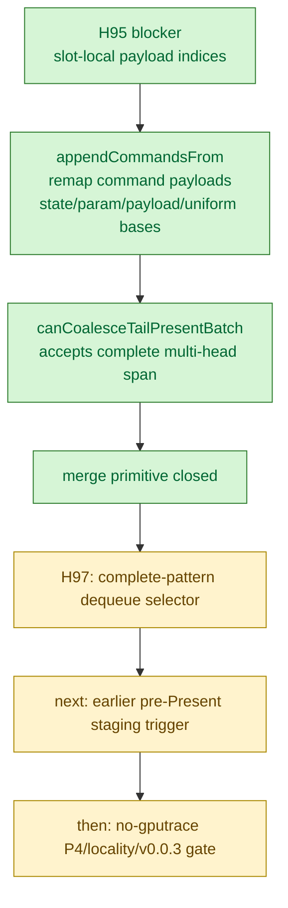

# Present Pacing / Tail-Present ChunkSlot Merge Primitive 96

> **Outdated — every artifact this leaf cites in `source:` is gone from disk.** The numbers below cannot be re-derived or re-checked. Kept as history; do not cite it as current evidence.

**Question.** Can the H95 design blocker be reduced by adding a deterministic
`ChunkSlot` merge/remap primitive before exposing any earlier pre-Present staging
knob?

**Answer.** Yes. `ChunkSlot::appendCommandsFrom()` now appends another slot's
command stream while remapping every slot-local payload index and draw payload
offset into the destination slot. `canCoalesceTailPresentBatch()` also accepts a
complete `[non-present head..., Present-only tail]` source span.

## What Closed

| Gap from H95 | Implementation |
|---|---|
| Source command payload indices are slot-local | `appendCommandsFrom()` rewrites `MetalCommandHeader::payloadIndex` per command kind using destination SoA bases |
| Draw-run records carry slot-local state, param, payload, and uniform handles | Draw state, PSO subview, param, payload arena, and uniform payload bases are remapped before append |
| Uniform records contain nested fixed/stage handles and byte offsets | Fixed, VS, and PS uniform handles are regenerated with destination indices; VS/PS byte offsets are rebased |
| Source command stream may be malformed | `canAppendCommandsFrom()` checks source payload indices, draw payload ranges, draw state storage consistency, and 32-bit append ranges before mutating |
| Tail-batch predicate was exactly two sources | `canCoalesceTailPresentBatch()` now accepts a complete multi-head span; H97 adds the matching complete-prefix queue selector |

## Test Coverage

Focused native coverage was added to
`dxmt9-render-backend-batch-contract-spec`:

- several non-present heads plus a Present-only tail are considered
  coalescable;
- any pre-tail source containing Present metadata is rejected;
- `appendCommandsFrom()` preserves draw/clear/draw/present command order;
- draw payload arena offsets and per-draw payload slices survive the merge;
- clear and present payload records survive the payload-index remap;
- draw uniform handles are rebased into the destination slot.

Verification run:

```sh
meson test -C build-arm64-nowine \
  dxmt9-render-backend-batch-contract-spec \
  dxmt9-queue-completion-sources-spec
```

Result: `2/2` passed.

## Remaining Gate

This is not a runtime P4 overlap candidate by itself. H97 follows this step by
adding the complete-prefix queue selector, so the H96 merge helper can now be
used safely for several heads plus a Present-only tail. The remaining missing
piece is not another merge primitive; it is an earlier pre-Present staging
trigger that can actually create several encode-invisible CPU-ready heads before
the tail arrives.

That staging trigger still needs an opt-in no-gputrace proof for P4 movement,
CB/pass/tile locality, and the `v0.0.3` visual gate before any `.gputrace`
budget.


