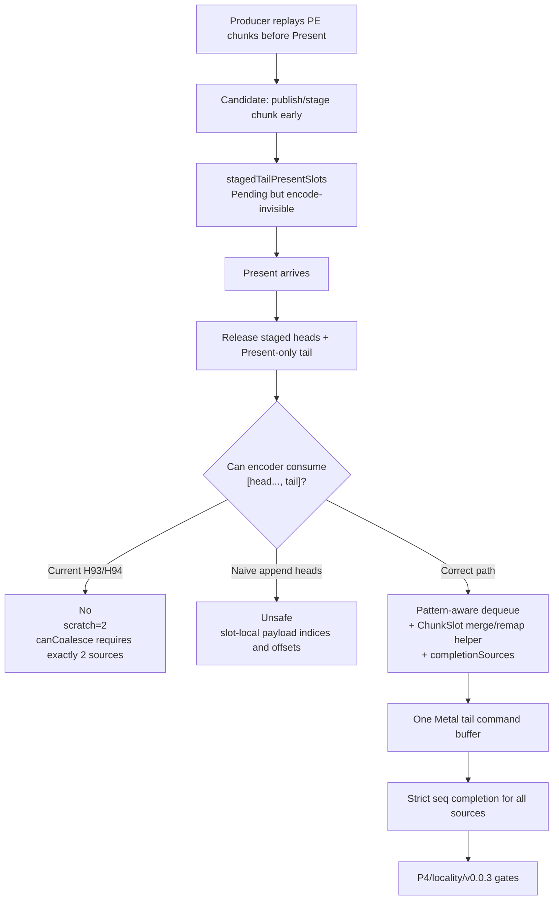

# Present Pacing / Tail-Present Multi-Head Staging Audit 95

**Question.** After H94 rejected `DXMT9_STAGE_TAIL_PRESENT_CHUNK=1` as a
runtime win, can the next P4 carrier simply stage earlier PE/replay chunks and
release several pre-Present sources before a Present-only tail?

**Answer.** Not safely with the encoder contract that existed at H95. The queue
completion carrier was already multi-source capable, but the tail-Present
encoder was still a two-source merge: one non-present head plus one Present-only
tail. Earlier pre-Present staging can produce more than one head source, and
that requires a real `ChunkSlot` merge/remap helper plus a pattern-aware dequeue
selector before any runtime knob should be trusted.

## Current Carrier Shape

| Layer | Current capability | Multi-head gap |
|---|---|---|
| Queue visibility | `stageLastReadySlot()` hides a Pending slot from encode-visible `readySlots`; `releaseStagedSlotsBeforeReadyTail()` releases staged slots before a tail | H93 only stages at `submitPresent()` and only when `stagedTailPresentSlots_` is empty |
| Completion | `QueueSubmissionRecord::completionSources` and pending completion already support strict ordered source seqIds | Usable for more than two sources once encode produces one tail command buffer |
| Batch dequeue | `runEncodeBatchLoop()` uses caller-owned scratch and append predicate | Current scratch is size 2, and the predicate only accepts a Present-only candidate after exactly one head |
| Backend | `onChunkBatchReady()` exists on Traditional and FrameGraph backends | `encodeTailPresentBatch()` accepts exactly two sources |
| Slot merge | Current tail path mutates `sources.front().slot`, appends the tail Present, and encodes that combined slot | More heads cannot be appended by raw vector concatenation because command payload indices and draw payload offsets are slot-local |

## Why A Naive Multi-Head Batch Is Unsafe

`ChunkSlot` is a set of parallel SoA vectors:

- `commandHeaders` point at payload indices local to one slot;
- `drawRunRecords` point at `drawPayloadArena` offsets local to one slot;
- clear/copy/stretch/readback/fill/depth/present records are separate payload
  vectors, also indexed locally;
- compact uniform and draw payload byte spans live in the source slot's arenas.

Therefore, concatenating `commandHeaders` from several staged head slots would
misread the second slot's payload indices as indices into the first slot's
vectors. Even a draw-only chunk needs every `DrawRunCommandRecord` payload
offset remapped after copying bytes into the combined arena.

The generic batch dequeue has another guardrail: it transitions selected slots
to `Encoding` before the backend runs. If the append predicate allowed
non-present heads while no Present-only tail was selected, `onChunkBatchReady()`
would return `nullopt` and `runEncodeBatchIteration()` would complete every
selected source inline. That would drop draw work. A multi-head selector must
only dequeue a complete `[head..., present-only tail]` pattern, or it must know
the expected released source count from the staging lane.

## Implementation Gate

The next code-facing step should not be another no-gputrace runtime run. It
should first add deterministic native coverage for a merge primitive:

1. `ChunkSlot` merge/remap helper that appends a source slot into a destination
   slot while remapping every command payload index and every draw payload byte
   offset.
2. A tail-batch selector that dequeues only a complete
   `[non-present head..., Present-only tail]` batch. The selector must not
   expose a head-only batch to the backend.
3. Unit tests for clear/draw/present command order, draw payload offsets,
   completion source ordering, and mismatched-tail rejection.
4. Only after those tests pass, add an opt-in earlier staging knob that publishes
   pre-Present chunks at replay/chunk boundaries while keeping them
   encode-invisible until the tail.

## Verdict

H94's mechanism is reusable, but its two-source tail encoder was the H95 design
blocker. A single-head early-stage variant is not enough: if any later
pre-Present work is replayed before the actual Present, the encoder either needs
multi-head merge or the final tail is no longer Present-only. Treat H95 as the
historical gate that required H96/H97 before implementing
`DXMT9_STAGE_PRE_PRESENT_*` or similar P4 run-ahead knobs.

**Follow-up.** H96 implements the slot-local merge/remap half of this gate:
`ChunkSlot::appendCommandsFrom()` plus a multi-head complete-span
`canCoalesceTailPresentBatch()` predicate. H97 implements the complete-prefix
queue selector, so head-only multi-source dequeue is no longer the blocker. The
remaining implementation blocker was the earlier staging trigger that can create
several encode-invisible pre-Present heads before the tail. H98 adds that
default-off trigger as `DXMT9_STAGE_PRE_PRESENT_COMMAND_LIMIT`; the remaining
blocker is now runtime proof: no-gputrace P4/locality movement plus the
`v0.0.3` visual gate.
