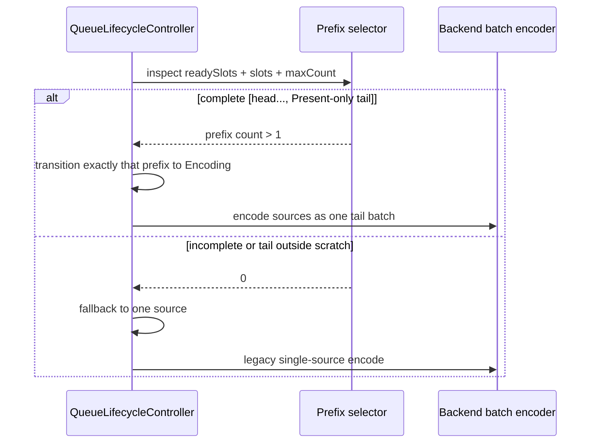
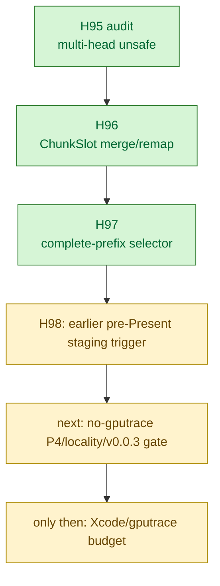

# Present Pacing / Tail-Present Complete-Prefix Selector 97

**Question.** After H96 made multi-head `ChunkSlot` merge safe, can the queue
dequeue selector prove that a complete `[head..., Present-only tail]` prefix is
available before consuming more than one ready source?

**Answer.** Yes. `QueueLifecycleController` now has a prefix-selector dequeue
primitive. The selector inspects the FIFO ready queue and the current slot span
before any state transition. If it returns a complete prefix length, those
sources move to `Encoding` together. If it returns zero, the queue falls back to
the legacy single-source dequeue. This keeps incomplete head-only batches from
reaching `onChunkBatchReady()` and being completed inline.

`render::selectTailPresentBatchPrefix()` is the first selector user. It accepts
only:

- one or more non-empty, non-present head slots;
- followed by a Present-only tail slot;
- with the tail inside caller scratch capacity.

`CommandQueue` now uses ring-sized scratch (`kCommandChunkCount`) for
`DXMT9_ENCODE_TAIL_PRESENT_BATCH=1`, so a future earlier-staging path can
release several staged heads plus the tail into one backend batch.

## Closed Gate



This closes the second H95/H96 implementation gate: multi-head tail batches now
have both a safe slot merge primitive and a safe complete-pattern dequeue
primitive.

## Test Coverage

Focused native coverage was added to:

- `dxmt9-queue-completion-sources-spec`
  - selector-provided complete prefix moves every selected source to
    `Encoding`;
  - selector rejection falls back to exactly one source and leaves later ready
    slots Pending/FIFO-visible.
- `dxmt9-render-backend-batch-contract-spec`
  - `[head, head, Present-only tail]` selects length 3;
  - tail outside scratch capacity selects 0;
  - head-only and pre-tail-present shapes select 0.

Verification run:

```sh
meson test -C build-arm64-nowine \
  dxmt9-queue-completion-sources-spec \
  dxmt9-render-backend-batch-contract-spec
```

Result: `2/2` passed.

## Remaining Gate

This is still not a P4 runtime promotion and does not justify `.gputrace`
budget by itself. Current `DXMT9_STAGE_TAIL_PRESENT_CHUNK=1` staging happens at
`submitPresent()` and can only create the historical one-head plus tail shape.
H98 follows this primitive with the first earlier pre-Present command-limit
stage trigger.

The next evidence step is a no-gputrace gate for the H98 runtime candidate:
P4 movement, CB/pass/tile locality, and `v0.0.3` visual safety.


