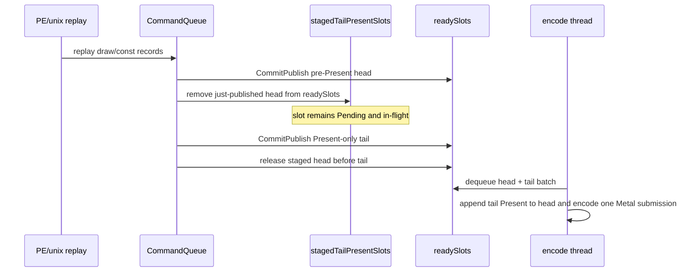

# Present Pacing 93 - Tail-Present staged carrier implementation

## Question

Can the H92 queue-private staged-source lane be introduced as a small,
default-off runtime carrier without changing the default command stream?

## Verdict

Yes, as an opt-in carrier only. `DXMT9_STAGE_TAIL_PRESENT_CHUNK=1` now publishes
the pre-Present writing slot into a Pending but encode-invisible staged lane,
then releases that staged source immediately before the Present-only tail when
the tail is ready. The carrier is active only when
`DXMT9_ENCODE_TAIL_PRESENT_BATCH=1` is also enabled.

This is **not** a promoted performance result. It is the smallest
implementation step that lets a no-gputrace run test whether H92's missing P4
overlap carrier moves the right rows while preserving locality and the
`v0.0.3` visual gate. The follow-up H94 runtime A/B reaches the batch surface
but rejects promotion; keep this knob default-off.

## Implemented Shape



The staging primitive deliberately does not add a new `ChunkSlot::State`.
Existing queue invariants already allow a `Pending` slot that is not in
`readySlots`; `readySlots` only proves encode visibility. Resource lifetime,
seqId ordering, and completion expansion still use the existing Pending →
Encoding → GPU → Free path.

## Guardrails

| Guard | Reason |
|---|---|
| Default off | Keeps production single-source encode unchanged. |
| Requires `DXMT9_ENCODE_TAIL_PRESENT_BATCH=1` | Staging without batch encode would only recreate split command buffers. |
| Requires staged queue empty | Avoids ambiguous multi-frame staging while the first carrier is proven. |
| Requires two in-flight slots of headroom | Prevents hiding the head and then blocking forever before the Present tail can be allocated. |
| Releases staged sources only when the ready tail matches | Keeps strict FIFO/seqId source ordering. |

## Tests

`dxmt9-queue-completion-sources-spec` now covers the queue primitive:

| Test | Contract |
|---|---|
| `stagedReadySlotIsHiddenUntilReadyTailRelease` | staging removes the source from encode-visible `readySlots` while leaving the slot `Pending`; release restores source-before-tail order |
| `stagedReadySlotReleaseRequiresMatchingTail` | a mismatched tail index cannot release staged sources |

## Runtime Follow-up

[[present-pacing-tail-present-staged-runtime.94]] ran the supervised
no-gputrace GT1 scout with:

```sh
DXMT9_ENCODE_TAIL_PRESENT_BATCH=1 \
DXMT9_STAGE_TAIL_PRESENT_CHUNK=1 \
scripts/tools/run_3dmark05_perf_probe.sh --no-gputrace --timeout 120 --frame-sampling
```

That result reached:

| Mechanism | Result |
|---|---:|
| `chunk_publish_reason_present_split_before` | `1,822` |
| `encode_ready_depth_avg` | `2.000` |
| `encode_ready_depth_gt1_per_present` | `1.000` |

But it failed the promotion gates:

| Gate | Required direction |
|---|---|
| `completion_wait_with_enqueue_ms_per_present` | increases from zero |
| `completion_wait_without_enqueue_ms_per_present` | decreases |
| `completion_no_enqueue_wait_to_next_enqueue_ms` | decreases |
| `encode_ready_depth_gt1_per_present` | increases |
| `command_buffers_per_present`, `passes_per_present`, tile preservation | not worse than H88/H92 locality gates |
| Visual output | passes the `v0.0.3` visual-safe anchor |

The runtime verdict is: mechanism reached, P4/locality promotion rejected. The
next work should return to serial replay/record cadence or a wider coalescing
design that stages pre-Present work before `submitPresent()` time. Only spend
Xcode `.gputrace` time after a no-gputrace candidate moves those gates.
