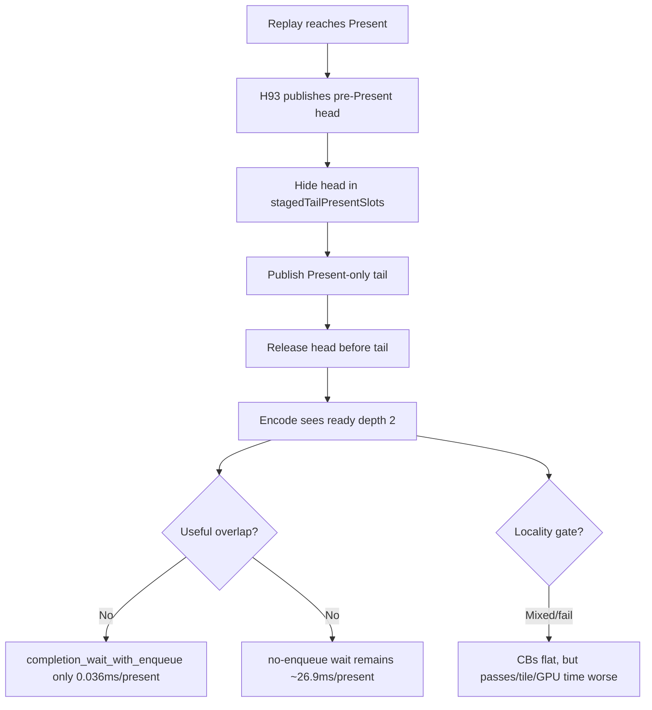

# Present Pacing 94 - Tail-Present staged carrier runtime A/B

> **Outdated — the knob or code path this experiment measured no longer exists in `src/`.** It cannot be re-run. Kept as history; do not cite it as current evidence.

## Question

Does the H93 opt-in staged tail-Present carrier create useful P4 overlap and
preserve locality on 3DMark05 GT1?

## Verdict

No. The carrier works mechanically, but it is not a promotion candidate. It
creates an encode-visible two-source tail batch (`encode_ready_depth_avg`
`1.000 -> 2.000`), but useful overlap remains effectively absent:
`completion_wait_with_enqueue_ms_per_present` is only `0.036ms`, with
`completion_wait_no_enqueue_share=99.865%`.

The A/B also fails the locality and total-wait gates. Per-present command
buffers stay flat, but render passes and tile-preservation traffic increase,
GPU command-buffer time increases, and total completion wait worsens. Both
screenshots are broad visual-smoke normal against the `v0.0.3` anchor class,
with muzzle/bloom/sparks present and no obvious skipped-pipeline or Metal-error
path (`draw_skipped_no_pipeline=0`, `gpu_command_buffer_errors=0`).

## Runs

| Run | Env | Status |
|---|---|---|
| `app-d3d9-3dmark05-h93-control-current-r1` | default current worktree | `pass` |
| `app-d3d9-3dmark05-h93-staged-tail-present-r1` | `DXMT9_ENCODE_TAIL_PRESENT_BATCH=1 DXMT9_STAGE_TAIL_PRESENT_CHUNK=1` | `pass` |

Both runs used:

```sh
scripts/tools/run_3dmark05_perf_probe.sh --no-gputrace --timeout 120 --frame-sampling --wait-unlocked-sec 120
```

## Gate Results

| Metric | Control | H93 staged | Result |
|---|---:|---:|---|
| sampled avg FPS | `16.131` | `16.645` | nominally up, but not accepted without owner gates |
| `encode_ready_depth_avg` | `1.000` | `2.000` | mechanism reached |
| `encode_ready_depth_gt1_per_present` | `0.000` | `1.000` | mechanism reached |
| `completion_wait_with_enqueue_ms_per_present` | `0.000` | `0.036` | too small |
| `completion_wait_without_enqueue_ms_per_present` | `26.234` | `26.885` | worse |
| `completion_wait_ms_per_present` | `26.234` | `26.921` | worse |
| `no_enqueue_before_publish_closure_ms_per_present` | `16.557` | `14.561` | local stage improvement |
| `no_enqueue_wait_to_next_enqueue_ms_per_present` | `35.780` | `33.104` | local stage improvement |
| `command_buffers_per_present` | `3.999` | `3.999` | flat |
| `passes_per_present` | `11.660` | `11.765` | worse |
| tile preservation | `118.965 MiB/present` | `120.411 MiB/present` | worse |
| GPU command-buffer time | `3.030ms/present` | `3.197ms/present` | worse |

The compare report records the same result in aggregate terms:
tile preservation `+5.99%`, GPU command-buffer time `+10.51%` total,
completion wait `+2.62%/present`, and no-enqueue wait `+2.48%/present`.

## Interpretation



The important design lesson is that H93 stages at `submitPresent()` time. It
therefore creates a two-source batch for the encoder, but it does not make
draw work CPU-ready earlier than the application's Present boundary. That is
why ready depth improves while the completion wait is still almost entirely
no-enqueue.

The local before-publish rows move in the desired direction, but the global P4
owner does not. Treat that as a useful measurement of the remaining target, not
as a successful overlap fix.

## Next Gate

The next overlap design must publish/stage pre-Present work before `Present`,
at a replay/chunk boundary where CPU work is already available, while keeping
those staged sources encode-invisible until the Present tail releases them as a
coalesced batch. That implies a wider carrier than H93:

- support one or more encode-invisible staged pre-Present sources before the
  tail;
- preserve strict `completionSources` ordering and resource lifetime;
- batch staged sources with the Present tail without increasing command
  buffers, render passes, or tile preservation;
- prove `completion_wait_with_enqueue` rises meaningfully or
  `completion_wait_without_enqueue` falls, then rerun the `v0.0.3` visual gate.

No `.gputrace` spend is justified from this A/B alone.
