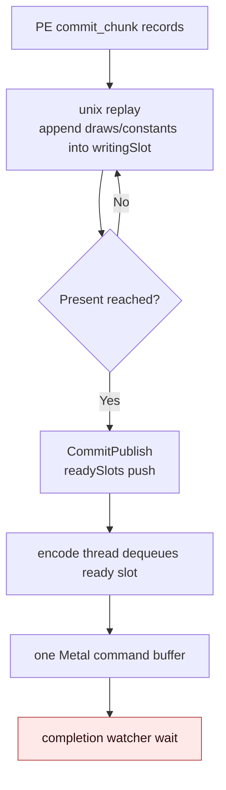
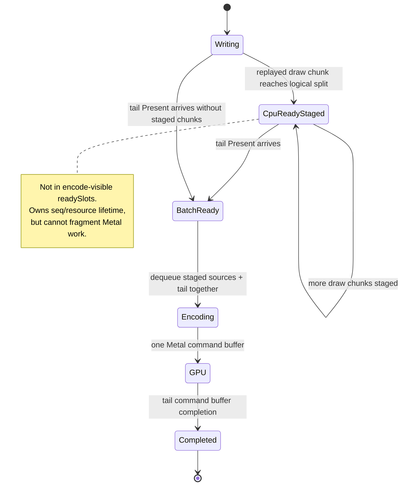
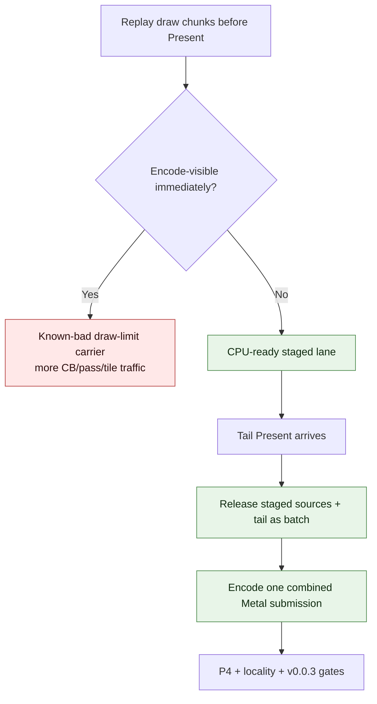

# Present Pacing 92 - Tail-Present staging needs encoder-invisible CPU-ready slots

> **Outdated — the knob or code path this experiment measured no longer exists in `src/`.** It cannot be re-run. Kept as history; do not cite it as current evidence.

## Question

After H91 rejects larger PE chunks as a simple P4 lever, is the current
tail-Present batch path close enough to become the next overlap implementation,
or is a different queue state needed?

## Verdict

The current batch carrier is only a **locality repair** for sources that are
already ready together. It is not yet a producer run-ahead mechanism.

The missing primitive is an encoder-invisible CPU-ready staging lane:
draw-bearing work must be allowed to leave the PE replay/writing-slot path
before Present, but it must not be encoded as an independent Metal command
buffer. When the tail Present arrives, the queue should release the staged
draw sources plus the Present-only tail as one batch, encode them as one Metal
submission, and expand completion through `completionSources`.

Without that staging lane, every available route falls into one of the already
rejected shapes:

| Route | What happens | Why it is not enough |
|---|---|---|
| Current default | PE chunks replay into the current writing slot; first real publish is the Present-bearing chunk | `completion_wait_with_enqueue=0`; H171/H172 still wait for the next enqueue. |
| `DXMT9_SPLIT_PRESENT_CHUNK` + `DXMT9_ENCODE_TAIL_PRESENT_BATCH` | Head and Present-only tail are published back-to-back at Present time and recombined | Preserves locality, but creates no useful run-ahead because the work was not visible earlier. |
| `DXMT9_DRAW_CHUNK_COMMAND_LIMIT` | Draw chunks publish early and become encode-visible immediately | Creates overlap by fragmenting command buffers/render passes/tile preservation; rejected by H48/H50. |

## Current Code Shape

The H171/H172 counters match this code path:

| Metric | H171 default | H172 larger PE chunks | Meaning |
|---|---:|---:|---|
| `completion_wait_with_enqueue_ms_per_present` | `0.000` | `0.000` | No useful enqueue is produced during completion wait. |
| `completion_no_enqueue_wait_to_commit_publish_p50_ms` | `38.847` | `32.106` | The first publish after no-enqueue wait is late. |
| `completion_no_enqueue_commit_chunk_entries_before_publish_p50` | `20` | `9` | Multiple replayed chunks precede the first publish. |
| `completion_no_enqueue_commit_chunk_replay_ends_before_publish_p50` | `19` | `8` | Completed chunk replay is not enough; publish is still held until Present. |
| `completion_no_enqueue_commit_chunk_inter_replay_gap_before_publish_p50_ms` | `31.888` | `25.437` | The dominant no-enqueue closure is producer cadence between replayed chunks. |

The current source confirms the ownership:

- `dxmt9c_device_commit_chunk` replays records and ends by prefetching the
  current writing slot; it does not publish draw work by itself.
- `submitPresent()` is the normal publish point. With `DXMT9_SPLIT_PRESENT_CHUNK`,
  it commits the pre-Present head and then commits a Present-only tail while
  still holding the queue lock, so the encode thread sees both only after
  Present work has arrived.
- `dequeueReadySlotBatch()` waits for `readySlots` to become non-empty and then
  immediately selects whatever is already ready. It does not wait for a future
  tail Present.
- `canAppendTailPresentBatchSource()` only accepts exactly one non-present head
  followed by one Present-only tail, and the encode loop scratch span is size
  two. This is enough for H88, not for multi-chunk CPU-ready staging.
- `encodeTailPresentBatch()` mutates the first source by appending the tail
  Present and then encodes one combined slot. Its `completionSources` carrier is
  useful and should be kept.

## Required Shape

The implementation target is therefore not "increase ready depth" by itself.
It is "increase CPU-ready backlog without increasing independent Metal
submissions."

## Implementation Options

| Option | Pros | Cons | Current verdict |
|---|---|---|---|
| Queue-private staged-source deque | True run-ahead; encode thread does not need timed waits; tail Present can release one deterministic batch | Requires a new lifecycle state/invariant, strict seqId ordering, resource lifetime review, and TLA/native tests | Best architecture candidate |
| Ready queue plus tail-gated encode hold | Smaller code surface; reuses `readySlots` | Encode thread must wait speculatively, can add latency, and still risks consuming draw work without a tail | Diagnostic only unless tightly bounded |
| Generalize current tail batch to more than two sources | Useful after staging exists | Does not create staging by itself; draw-limit sources are consumed too early unless held | Necessary helper, not sufficient |

## Next Proof Gate

A promotable candidate must pass these no-gputrace gates before another Xcode
counter spend:

| Gate | Required direction |
|---|---|
| `completion_wait_with_enqueue_ms_per_present` | increases from zero because useful work is enqueued during waits |
| `completion_wait_without_enqueue_ms_per_present` | decreases |
| `completion_no_enqueue_stage_commit_entry_to_publish_ms` | decreases |
| `completion_no_enqueue_wait_to_next_enqueue_ms` | decreases |
| `encode_ready_depth_gt1_per_present` | increases for the staged release path |
| `command_buffers_per_present`, `passes_per_present`, tile preservation | not worse than the current locality gates |
| Visual output | passes the `v0.0.3` visual-safe anchor |

Only after those pass should a `.gputrace` / Xcode counter run check GPU-time
and hidden backend-storage invariance.

