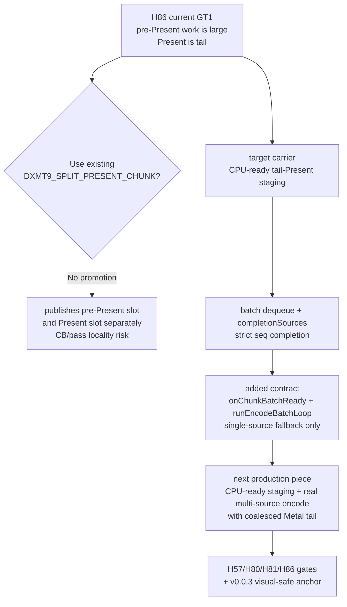

# Present-Pacing 87 - Tail-Present staging current design gate

## Question

After H86 proved that every current GT1 Present-published slot has substantial
work before a tail Present command, can the existing present split path be used
as the next P4 implementation, or does the next candidate need a different
carrier?

## Code Read

`CommandQueue::submitPresent()` has an existing diagnostic split path:
`DXMT9_SPLIT_PRESENT_CHUNK=1` commits the current writing slot with
`PresentSplitBefore`, then appends and commits a separate Present slot. That
does create a pre-Present publication point, but it also chooses a queue slot
and Metal command-buffer boundary before the encoder has a chance to preserve
the baseline render-pass / tile-locality shape.

The queue already has the lower-level completion carrier needed by a future
coalesced tail:

| Surface | Current role |
|---|---|
| `dequeueReadySlotBatch()` | moves consecutive ready slots to `Encoding` without queue heap allocation |
| `runEncodeBatchIteration()` | hands a caller-owned ready-source span to a future backend selector |
| `QueueSubmissionRecord::completionSources` | lets one tail Metal CB complete several strict-order source seqIds |
| debug invariants in `submit()` | require every carried source slot to be `Encoding` with matching seqId |

What was missing was not completion semantics but an explicit backend contract.
This pass adds:

- `IRenderBackend::onChunkBatchReady(ctx, sources)`, whose default behavior is
  conservative: empty batches return `nullopt`, single-source batches delegate
  to `onChunkReady`, and multi-source batches return `nullopt` until a backend
  implements a real coalesced encode.
- `CommandQueue::runEncodeBatchLoop(scratch, encodeBatch, onSubmitted)`, a thin
  wrapper over `QueueLifecycleController::runEncodeBatchIteration()`.

The production encode path still calls `runEncodeIteration()` and
`backend_->onChunkReady()`, so current rendering remains single-source and
byte-identical. `TraditionalBackend` and `FrameGraphBackend` still forward that
single slot to `encoders::encodeChunk()`.



## Verdict

The next P4 implementation should not promote `DXMT9_SPLIT_PRESENT_CHUNK`.
That switch remains useful as a diagnostic split/CB-shape probe, but it is not
the locality-preserving tail-Present CPU-ready design.

The required runtime implementation shape is:

1. Create CPU-ready visibility for pre-Present work without forcing a Metal
   command-buffer boundary at publish time.
2. Extend the production backend path so it can encode one or more ready
   sources into a coalesced Metal tail while preserving command order.
3. Keep the Present tail as the only drawable / present-token carrier.
4. Prove promotion with the existing gates: ready-depth increases,
   `completion_wait_with_enqueue` rises, `completion_wait_without_enqueue` and
   pre-Present residency fall, command-buffer / render-pass / tile-preservation
   shape does not regress, and the frame passes the `v0.0.3` visual-safe anchor.

## Verification

Focused checks:

```sh
meson test -C build-arm64-nowine dxmt9-render-backend-batch-contract-spec
meson test -C build-arm64-nowine dxmt9-queue-completion-sources-spec
meson test -C build-arm64-nowine dxmt9-verify-tla
git diff --check
```

All passed for this contract step.

## Next Work

The smallest safe next runtime step is not another env A/B. It is a gated
CPU-ready staging prototype that feeds `onChunkBatchReady` with more than one
ready source only when it can preserve command-buffer, render-pass, present-token,
and resource-lifetime invariants. That prototype can then consume H86's
tail-Present opportunity without repeating the H74/H75 one-CB-per-slot failure
mode.

**Related.** [present-pacing-pre-present-opportunity.86](present-pacing-pre-present-opportunity.86.md) ·
[present-pacing-batch-carrier-current.82](present-pacing-batch-carrier-current.82.md) ·
[present-pacing-run-ahead-current-code.73](present-pacing-run-ahead-current-code.73.md).
