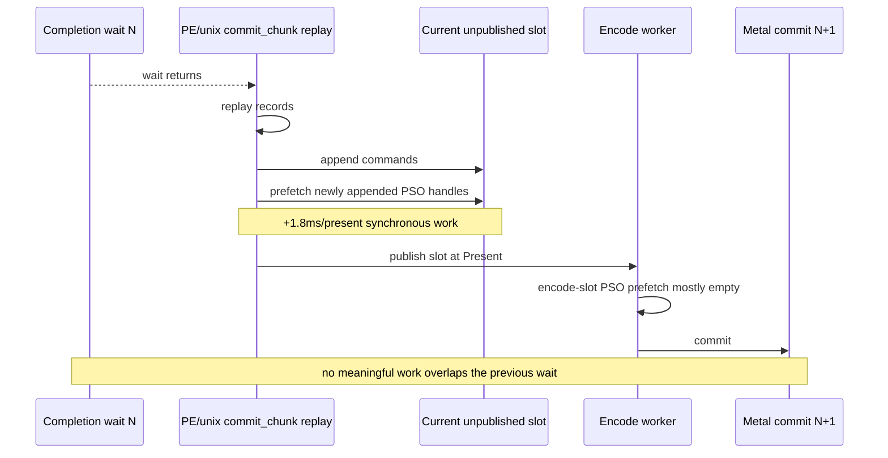

# Present Pacing 53 - Unpublished Slot PSO Prefetch Does Not Recover P4 Overlap

## Question

Can draw PSO/depth handle prefetch be pulled earlier than final Present publish
without changing Metal command-buffer or render-pass shape? The diagnostic knob
`DXMT9_PREFETCH_UNPUBLISHED_SLOT_PSO=1` runs after each unix
`commit_chunk` replay and scans only newly appended commands in the current
unpublished `ChunkSlot`.

This was meant to test a narrower P4 idea than draw-count chunk splitting:
preserve pass locality, but move some encode-slot work into the producer/replay
window.

## Verdict

No. The mechanism fires, and it almost eliminates the later
`encode_slot_pso_prefetch_cpu_ms`, but the work is not hidden under completion
wait. It moves synchronously into the pre-publish commit/replay path, reduces
the later encode-dequeue stage only modestly, does not increase completion
overlap, and slightly worsens sampled FPS.

Keep `DXMT9_PREFETCH_UNPUBLISHED_SLOT_PSO` default-off. This validates that PSO
prefetch placement matters, but rejects this synchronous unpublished-slot
placement as an average-FPS lever.

## Run

Baseline:

```sh
bash scripts/tools/run_3dmark05_perf_probe.sh \
  --suffix current-lowoverhead-continuation-r1-20260616 \
  --no-gputrace \
  --no-encoder-breakdown \
  --frame-sampling \
  --timeout 120 \
  --capture-delay-sec 45 \
  --wait-unlocked-sec 1 \
  --wait-unlocked-interval-sec 1 \
  --min-free-mb 256
```

Candidate:

```sh
DXMT9_PREFETCH_UNPUBLISHED_SLOT_PSO=1 \
bash scripts/tools/run_3dmark05_perf_probe.sh \
  --suffix unpublished-pso-prefetch-r1-20260616 \
  --no-gputrace \
  --no-encoder-breakdown \
  --frame-sampling \
  --timeout 120 \
  --capture-delay-sec 45 \
  --wait-unlocked-sec 1 \
  --wait-unlocked-interval-sec 1 \
  --min-free-mb 256
```

The candidate completed with `status=pass`, `timed_out=false`,
`returncode=0`, `capture_error=None`, `draw_skipped_no_pipeline=0`,
`gpu_command_buffer_errors=0`, `map_buffer_wait_ms=0`, and
`queue_sequence_wait_ms=0`. The captured screenshot is a normal broad GT1 scene,
but it is not same-frame with the baseline screenshot (`Frame 553` vs
`Frame 569`), so use it only as a broad non-black/non-yellow visual smoke.

## Mechanism Check

| Metric | Baseline | Candidate | Delta |
|---|---:|---:|---:|
| `encode_slot_pso_prefetch_cpu_ms_per_present` | `1.169` | `0.002` | `-1.167` |
| `unpublished_slot_pso_prefetch_cpu_ms_per_present` | `0.000` | `1.812` | `+1.812` |
| `unpublished_slot_pso_prefetch_cpu_p50_ms` | `0.000` | `0.046` | `+0.046` |
| `unpublished_slot_pso_prefetch_cpu_p95_ms` | `0.000` | `0.142` | `+0.142` |
| `prepare_slot_pso_prefetch_cpu_ms_per_present` | `0.000` | `0.000` | flat |

The diagnostic proves the cursor/seal split works: the final encode-slot copy
sees almost no remaining PSO-prefetch work. However, the new work executes on
the commit/replay path that must still form the first publish after completion.

## P4 / FPS Comparison

| Metric | Baseline | Candidate | Delta |
|---|---:|---:|---:|
| `sampled_avg_fps` | `16.666` | `16.264` | `-0.402` |
| frame CSV average FPS | `18.721` | `18.264` | `-0.457` |
| tail-600 average FPS | `24.322` | `23.633` | `-0.689` |
| `completion_wait_ms_per_present` | `29.451` | `29.312` | `-0.139` |
| `completion_wait_with_enqueue_ms_per_present` | `0.115` | `0.070` | `-0.045` |
| `completion_wait_without_enqueue_ms_per_present` | `29.336` | `29.242` | `-0.093` |
| `completion_wait_overlap_share` | `0.392%` | `0.239%` | `-0.153pp` |
| `completion_wait_no_enqueue_share` | `99.608%` | `99.761%` | `+0.153pp` |

The small total completion-wait decrease is not a P4 recovery. It comes with
less overlap, no meaningful no-enqueue reduction, and lower sampled FPS.

## Stage Shape

| Stage / shape | Baseline | Candidate | Delta |
|---|---:|---:|---:|
| `commit_chunk_replay_cpu_ms_per_present` | `8.395` | `8.031` | `-0.364` |
| `encode_chunk_cpu_ms_per_present` | `11.110` | `11.343` | `+0.233` |
| no-enqueue `commit entry -> publish`, total ms/present | `13.672` | `15.954` | `+2.282` |
| no-enqueue `encode dequeue -> command buffer commit`, total ms/present | `12.498` | `11.843` | `-0.655` |
| no-enqueue `wait -> next enqueue`, total ms/present | `30.482` | `32.098` | `+1.616` |
| no-enqueue `commit entry -> publish`, p50 | `6.576` | `4.184` | `-2.392` |
| no-enqueue `encode dequeue -> command buffer commit`, p50 | `12.469` | `11.298` | `-1.171` |
| no-enqueue `wait -> next enqueue`, p50 | `13.480` | `15.418` | `+1.938` |

The p50 sub-stage movement is mixed, but the total exposed wait-to-next-enqueue
path worsens. This is the expected failure mode for a synchronous producer-side
prefetch: it can make the later encode worker do less PSO work, but it does not
let producer or encode work run while the previous Present command buffer is
waiting.

## Locality Gate

The candidate preserves the Metal submission shape, which is the useful part of
this experiment:

| Metric | Baseline | Candidate | Delta |
|---|---:|---:|---:|
| `command_buffers_per_present` | `3.999` | `3.999` | flat |
| `passes_per_present` | `11.772` | `11.769` | flat |
| `gpu_command_buffer_time_ms_per_present` | `3.020` | `2.989` | `-0.032` |
| `draws_per_present` | `735.943` | `735.486` | flat |

So the rejection is not the draw-chunk-limit rejection repeated. This route
avoids render-pass fragmentation, but the chosen synchronous placement still
does not create useful overlap.



## Decision

Do not promote unpublished-slot PSO prefetch. Leave it as a diagnostic for
placement experiments. A production P4 design still needs one of these shapes:

- producer/replay work genuinely runs while a previous Present command buffer
  is waiting;
- encode-side preparation runs on a separate path without blocking
  `commit_chunk` publish formation;
- or logical early work is accumulated without extra Metal command buffers and
  coalesced back into the normal render-pass chain before submission.

The next FPS-facing experiment should not spend `.gputrace` on this CPU-only
placement. Use no-gputrace P4 gates first, and reserve Xcode for a candidate
that changes GPU/pass shape or a frame-local visual/perf hypothesis.
