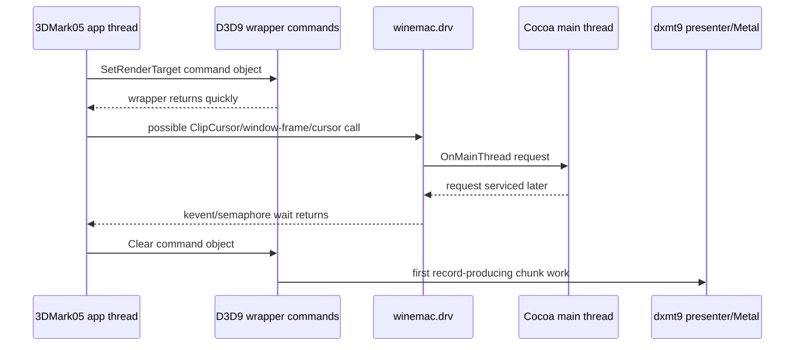
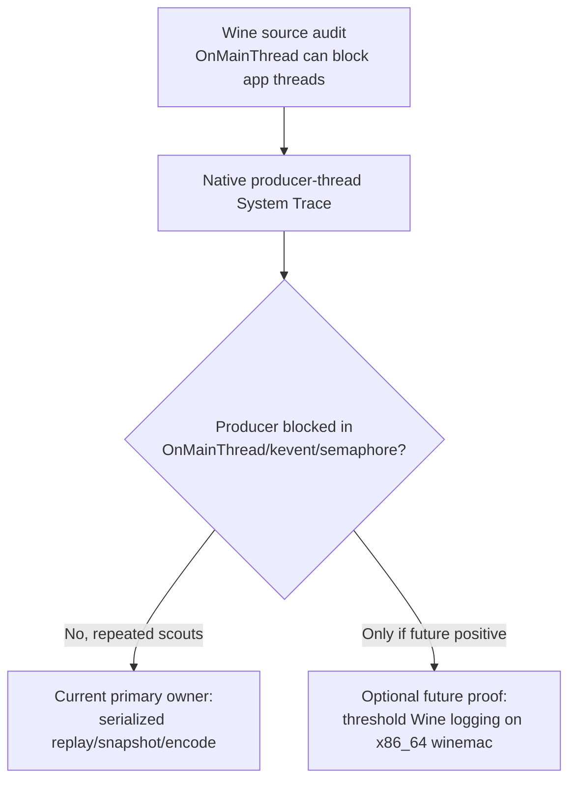

# Present Pacing 28 - winemac OnMainThread Transmission Audit

**Question.** [[present-pacing-pe-caller-stack.20]] identifies the P4 front
gate as the app-side interval between 3DMark05 command-object dispatches:
`SetRenderTarget` returns from the wrapper quickly, then the record-producing
`Clear` wrapper is dispatched about `17.4ms` later. Can Wine's macOS driver
explain that gap through synchronous main-thread marshaling?

## Source Facts

| Source | Fact | Implication |
|---|---|---|
| `cocoa_event.m::OnMainThread()` | Callers enqueue a block and wait until the main-thread block runs. Threads with a `WineEventQueue` wait in `kevent(queue->kq, NULL, 0, &kev, 1, NULL)` with timeout `NULL`; threads without one wait in `dispatch_semaphore_wait(..., DISPATCH_TIME_FOREVER)`. | A winemac getter/setter on the app thread can block for the full time the main thread takes to service Wine's request source. Runtime probes must look for both wait paths. |
| `cocoa_app.m::PerformRequest()` | The main-thread run-loop source drains the queued request blocks. | `OnMainThread()` wait time is mostly queue-to-main-thread-service delay plus block body time. These two must be measured separately. |
| `cocoa_app.m::macdrv_clip_cursor()` | `ClipCursor` reaches `OnMainThread()` and may query screens or start/stop clipping. | Fullscreen cursor confinement remains a plausible per-frame caller. |
| `cocoa_app.m::macdrv_get_cursor_position()` / `macdrv_set_cursor_position()` | Cursor get/set both reach `OnMainThread()`. | They are possible transmission paths. Keep `GetCursorPos` lower-priority than `ClipCursor`, but do not reject it before runtime data. |
| `win32u/input.c::NtUserGetCursorPos()` | The graphics driver is queried when the shared cursor timestamp is older than `100ms`. | The cache can throttle queries after cursor updates, but a stale cursor timestamp can still make steady polling fall through to `macdrv_GetCursorPos()`. |
| `cocoa_window.m::macdrv_get_cocoa_window_frame()` | Window frame reads are synchronous `OnMainThread()` calls. | Window-frame queries remain plausible if 3DMark05 or Wine's window path asks for frame state between `SetRenderTarget` and `Clear`. |
| `cocoa_window.m::macdrv_view_get_metal_layer()` | Metal layer reads are synchronous `OnMainThread()` calls. | This path is dangerous in general but not the current dxmt9 per-frame owner. |
| `dxmt9_presenter_macdrv.cpp` / `winemetal_private_api.mm` | dxmt9 acquires and retains the `CAMetalLayer` at presenter setup and does not call `macdrv_view_get_metal_layer` per frame. | Reject per-frame layer getter as the 18ms source in dxmt9. |
| `dxmt9_presenter.mm` / `winemetal_private_api.mm` | `nextDrawable` and `presentDrawable` are driven by dxmt9/winemetal, not winemac. | winemac is not the presenter. It can still serialize the app thread through main-thread AppKit/CoreAnimation work. |

## Current Interpretation

The source audit makes the transmission path plausible but not yet proven:

This would explain why:

- `Present()` itself is not the long wait ([[present-pacing-pe-present-timing.09]]);
- the next PE D3D9 call starts quickly ([[present-pacing-pe-call-cadence.10]]);
- early RT setup and child getters are not the sleeper
  ([[present-pacing-pe-clear-gate.15]], [[present-pacing-pe-wide-call-coverage.17]]);
- the stable owner appears above D3D wrapper stubs in the 3DMark05 command
  dispatcher ([[present-pacing-pe-caller-stack.20]]);
- dxmt9 boundary/latency and completed-seq perturbations do not move the gate
  ([[present-pacing-boundary-latency-ab.06]],
  [[present-pacing-completion-signal-delay.21]]).

## Caveats

Two facts are still unproven and must stay separate:

1. **Transmission call identity.** The source audit says several winemac calls
   can block through `OnMainThread()`, but it does not prove which one occurs
   inside the `SetRenderTarget` return -> `Clear` entry interval.
2. **Holder identity.** The audit does not prove that the main thread is busy
   specifically because of the previous frame's Metal present. The completion
   watcher observed Metal completion on dxmt9's completion thread; the Cocoa
   main thread may be late because of CoreAnimation/AppKit run-loop service,
   drawable/present side effects, cursor clipping, or ordinary event handling.

Therefore the strongest current wording is:

> The 18ms front gate may be a winemac `OnMainThread()` marshal that couples
> 3DMark05's app thread to Cocoa main-thread cadence. The coupling can explain
> why present/pacing knobs were ineffective, but the exact winemac call and the
> main-thread holder are not yet proven.

Do not promote the stronger wording yet:

> The previous frame's Metal present keeps the Cocoa main thread busy, and the
> next frame blocks in a winemac getter until present completion.

That is a coherent hypothesis, but the source audit only proves the
transmission mechanism. Runtime data must still identify the winemac caller and
show whether queue-to-main-thread service delay, block body time, CoreAnimation
work, cursor confinement, or ordinary AppKit event handling owns the interval.

## Runtime Feasibility Check

The local Wine checkout can guide the patch point, but the current build
artifacts cannot be dropped into the 3DMark05 runtime:

| Artifact | Observed state | Consequence |
|---|---|---|
| `/Users/dididi/workspaces/wine` | Clean source checkout at `6e073d2 Release 11.6.` | Suitable for source audit and instrumentation patch drafting. |
| `/Users/dididi/workspaces/wine-build/dlls/winemac.drv/winemac.so` | Mach-O `arm64` | Not ABI-compatible with the Rosetta/x86_64 runtime used by the current 3DMark05 harness. |
| `/Users/dididi/workspaces/wine-build-wow64/dlls/winemac.drv/winemac.so` | Mach-O `arm64` | Same limitation: PE target support does not make the unix-side driver x86_64. |
| `experiments/wine/sikarugir-cx-24.0.7/lib/wine/x86_64-unix/winemac.so` | Mach-O `x86_64` | This is the active runtime shape that must be instrumented or replaced for a real 3DMark05 proof. |

Viable gates:

1. Build an x86_64-unix `winemac.so` under Rosetta from the Wine 11.6 source
   and replace only the active runtime's driver if the ABI/export set matches.
2. Use a non-invasive `xctrace` System Trace / Time Profiler sample to catch the
   producer thread blocked in `kevent` or `dispatch_semaphore_wait` with
   `OnMainThread` frames and the Cocoa main thread's simultaneous owner. The
   prepared dxmt9 route is
   `run_3dmark05_system_trace_sidecar.sh --export-cpu-summary -- ...`, which
   emits `xctrace-cpu-thread-summary.{csv,md}` from exported `time-profile` and
   `time-sample` tables.
3. Run a short, threshold-limited Wine debug patch if an x86_64 driver is
   available. Avoid full `WINEDEBUG=+macdrv,+timestamp` as final evidence unless
   the run is short and disk-safe.

## Current Status After Native-Thread Scouts

Later System Trace sidecars make this hypothesis weaker as a broad owner. The
source audit still proves a possible transmission mechanism, but current runtime
samples repeatedly select the native producer thread and do not find
`OnMainThread`, `kevent`, or `dispatch_semaphore_wait` wait stacks on that
thread:

| Follow-up | Result | Consequence |
|---|---|---|
| [[present-pacing-native-selector-xctrace.31]] | Native `unix_commit_chunk_entry` thread selected; producer sampled running in `10427 / 10427` rows; producer wait-keyword hits `0`. | PE `thread_id` namespace mismatch is solved for this route, and the actual producer does not look blocked in winemac during the sampled window. |
| [[present-pacing-native-selector-xctrace.32]] | Default resource-shape path repeats the native selection; producer sampled running in `10439 / 10439` rows; producer wait-keyword hits `0`. | The negative signal survives the later default-on backend path. |
| [[present-pacing-systemtrace-p4-smoke.34]] | Short sidecar while `.gputrace` attach is blocked joins Metal rows and selects the producer; producer sampled running in `2519 / 2519` rows; wait hits `0`. | The System Trace fallback is viable, and it does not support a broad producer-thread wait. |
| [[present-pacing-systemtrace-p4-range.36]] | Seq-range sidecar keeps output bounded, joins `395 / 395` rows, and reports `producer-running-negative-scout` with `0` blocked rows and `0` producer wait hits. | This is the preferred blocked-gputrace P4 fallback shape. |

The open part is therefore narrower than the original source audit:

Do not read this leaf as the current dominant pacing verdict. It remains a
candidate transmission path and a patch point if future evidence shows a
specific macdrv call overlapping the `SetRenderTarget` return -> `Clear` entry
gap. Until then, the runtime evidence in [[present-pacing-systemtrace-p4-range.36]]
keeps broad winemac `OnMainThread` below P2/P3 replay, snapshot, queue-submit,
and backend encode work as the next average-FPS target.

## Next Gate

This is no longer the default next average-FPS action after the native-thread
negative scouts. Use this gate only if a future P4 run again points at a
producer-thread wait, or if an x86_64 winemac test driver is already available
and the cost of one targeted scout is low. In that case, add low-overhead
Wine-side instrumentation, not broad `WINEDEBUG`, for one 120s no-gputrace
scout:

| Instrument | Required fields | Pass condition |
|---|---|---|
| `OnMainThread` wait threshold | caller tag, app thread id, enqueue timestamp, block-start timestamp, block-end timestamp, wait ms, body ms | A threshold row overlaps the steady `SetRenderTarget` return -> `Clear` entry gap. |
| Candidate wrappers | `ClipCursor`, `macdrv_get_cursor_position`, `macdrv_set_cursor_position`, `macdrv_get_cocoa_window_frame`; keep `macdrv_view_get_metal_layer` as a negative-control tag | Exactly one dominant call class explains most steady `~17-18ms` intervals. |
| Main-thread holder split | queue-to-start ms versus block body ms | If queue-to-start dominates, the problem is main-thread servicing cadence; if body dominates, the specific macdrv call body is the owner. |
| dxmt9 PE milestone join | ordinal or timestamp alignment with `pe_present_call_return` / `pe_present_call_milestone` | The macdrv wait sits between the same ordinal's `SetRenderTarget` return and `Clear` entry. |

Use threshold logging such as `>=2ms` or `>=5ms` only. Full
`WINEDEBUG=+macdrv,+timestamp` is useful as a one-off smoke, but its volume and
overhead make it weak final evidence for the low-overhead FPS lane.

**Decision.** Source-audit hypothesis accepted as a possible P4 transmission
path, but demoted below the native-thread System Trace scouts. It supersedes
neither [[present-pacing-pe-caller-stack.20]] nor
[[present-pacing-lowoverhead-serial.24]]: those remain runtime evidence.
Promotion requires a real 3DMark05 run that joins macdrv `OnMainThread` wait
rows to the PE `SetRenderTarget` -> `Clear` gap and contradicts the later
producer-running negative scouts.

**Related.** [[present-pacing-pe-caller-stack.20]] ·
[[present-pacing-xctrace-threadstate.18]] · [[present-pacing-lowoverhead-serial.24]]
· [[present-pacing]].
