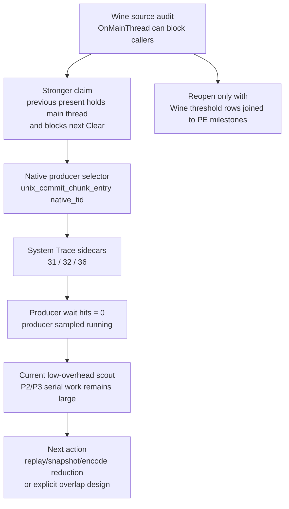

# Present Pacing 44 - winemac OnMainThread Capstone Review

**Question.** Should the Wine `OnMainThread()` audit be promoted from a
possible P4 transmission path to the confirmed reason that average GT1 FPS is
still capped?

## Verdict

No. The source audit is real, but the stronger "capstone" wording is not
supported by the current runtime evidence.

Wine's macOS driver can synchronously block a caller until the Cocoa main
thread services an `OnMainThread()` request. That is enough to keep
`ClipCursor`, cursor get/set, window-frame reads, and similar macdrv calls as
valid future patch points. It does not prove that the GT1 producer thread is
currently blocked there, and it does not prove that previous-frame Metal
presentation is the holder.

The current owner split remains:

| Lane | Current evidence | Consequence |
|---|---|---|
| `OnMainThread` transmission | Possible by Wine source audit, exact caller unproven | Keep as a targeted validation path only. |
| Producer-thread wait stack | Repeated native-selector sidecars find `0` producer wait-keyword hits, and the preferred seq-range sidecar samples the producer running in `2515 / 2515` rows | Do not treat broad winemac blocking as the primary average-FPS owner. |
| dxmt9 P2/P3 serial work | Low-overhead scout still reports `commit_chunk_replay_cpu_ms_per_present=8.074` and `encode_chunk_cpu_ms_per_present=10.902` with near-zero useful overlap | Next FPS work should reduce serialized replay/snapshot/encode or introduce a larger overlap design. |
| P4 overlap | `completion_wait_without_enqueue_ms_per_present=26.839` vs `completion_wait_with_enqueue_ms_per_present=0.210` in the current low-overhead scout | CPU wins must still pass a P4/overlap or frame-sampling gate before becoming FPS fixes. |

## Evidence Chain

The important distinction is between **mechanism existence** and **current
ownership**:

- `OnMainThread()` exists and can block. This part is accepted.
- dxmt9 does not call `macdrv_view_get_metal_layer` per frame, and
  `presentDrawable` / `nextDrawable` are driven through winemetal/dxmt9, not
  winemac. This rejects the most direct per-frame layer-getter path.
- The current sidecar route selects the native producer thread rather than a
  PE `GetCurrentThreadId()` value, avoiding the namespace mismatch from the
  earlier inconclusive run.
- The selected native producer does not show `OnMainThread`, `kevent`,
  `dispatch_semaphore_wait`, or macdrv wait-stack evidence in the decisive
  negative scouts.

## Decision Rule

Do not spend the next average-FPS iteration on broad winemac/macdrv debugging
unless one of these happens first:

| Reopen condition | Required proof |
|---|---|
| Positive producer wait stack | A current System Trace selects the native producer and reports producer wait-keyword hits overlapping the no-enqueue window. |
| Wine threshold telemetry | An x86_64 runtime `winemac.so` logs `OnMainThread` threshold rows with caller tag, queue-to-start time, body time, and timestamp alignment inside the `SetRenderTarget` return -> `Clear` entry gap. |
| P4 movement | A candidate creates meaningful `completion_wait_with_enqueue_ms` or reduces `completion_wait_without_enqueue_ms` in a visual-normal low-overhead run. |

Until one of those gates passes, the actionable path is still P2/P3: remove
serialized replay/snapshot/queue-submit/backend-encode cost and then require
P4 wait or frame-sampling movement before calling it an FPS fix.

**Decision.** Keep `OnMainThread()` as a plausible transmission mechanism and
patch point, but reject the stronger current-owner/capstone framing. The
dominant average-FPS path remains serialized P2/P3 CPU work plus missing P4
overlap.

**Related.** [present-pacing-winemac-onmainthread.28](present-pacing-winemac-onmainthread.28.md) ·
present-pacing-native-selector-xctrace.31 ·
present-pacing-native-selector-xctrace.32 ·
present-pacing-systemtrace-p4-range.36 ·
present-pacing-current-lowoverhead.43.
