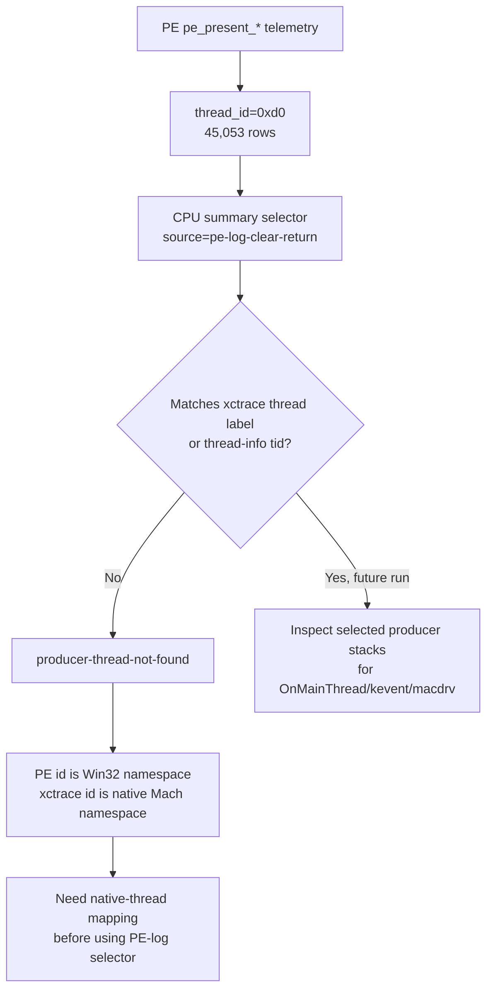

# Present-Pacing 30 - Current xctrace CPU Summary PE-Log Selector Scout

> **Outdated — every artifact this leaf cites in `source:` is gone from disk.** The numbers below cannot be re-derived or re-checked. Kept as history; do not cite it as current evidence.

## Question

Can the current-head System Trace sidecar use PE `pe_present_* thread_id=...`
rows to select the same producer thread in xctrace and validate or reject the
winemac `OnMainThread` transmission hypothesis without patching Wine?

## Run

```sh
bash scripts/tools/run_3dmark05_system_trace_sidecar.sh \
  --export-cpu-summary \
  --cpu-producer-from-pe-log \
  --record-delay-sec 75 \
  --time-limit-sec 10 \
  --min-free-mb 1800 \
  -- \
  --suffix winemac-onmainthread-xctrace-r2 \
  --no-gputrace \
  --timeout 120 \
  --frame-sampling
```

The sidecar completed normally:

| Field | Value |
|---|---:|
| `system_trace_xctrace_status` | `0` |
| `system_trace_wrapper_status` | `0` |
| Captured seq range | `1049..1212` |
| Joined encoder rows | `1528 / 1528` |
| `time-profile` rows matched to `3DMark05.exe` | `13,509` |
| `time-sample` rows matched to `3DMark05.exe` | `13,540` |
| `thread-info` rows matched to `3DMark05.exe` | `20` |

## CPU Selector Result

The PE log side produced the intended thread id signal:

| Metric | Value |
|---|---:|
| PE `pe_present_*` rows with `thread_id=...` | `45,053` |
| Unique PE thread ids | `1` |
| PE thread id | `0xd0` |
| Selector source | `pe-log-clear-return` |

But xctrace did not contain a thread label or `thread-info` `tid` matching
`0xd0`. The CPU summary verdict is therefore:

```json
{
  "status": "producer-thread-not-found",
  "producer_selection": "0xd0",
  "producer_selection_source": "pe-log-clear-return",
  "reason": "The PE log selector did not match any xctrace thread/tid. PE thread_id is a Win32 thread id; correlate it to a native Mach/pthread id before using it as an xctrace producer selector."
}
```

The top xctrace CPU rows still look like the prior broad scout:

| Thread | TID | Profile weight | Sample state | P4 wait hits |
|---|---|---:|---|---:|
| `3DMark05.exe (0x5be7f0)` | `0x5be7f0` | `10,261ms` | `Running=10267` | `0` |
| `dxmt9-encode (0x5be890)` | `0x5be890` | `2,960ms` | `Running=2965; Blocked=1` | `presentDrawable=28; CAMetalLayer=18; nextDrawable=12` |
| callback-like `3DMark05.exe` rows | `0x5be874`, `0x5be7f1`, `0x5be896` | `91/88/87ms` | mostly running | `kevent=3` total |

Do not promote this to a definitive negative `OnMainThread` result. The
selected PE producer id did not map to a native xctrace thread.

## Metal Timing Context

The same sidecar still captured a normal GPU timing window:

| Metric | Value |
|---|---:|
| Stage sum | `5275.391ms` |
| Vertex share | `94.01%` |
| Fragment share | `5.99%` |
| `rt_change` stage share | `77.50%` |
| `clear` stage share | `22.04%` |
| `needs-programmable-color-route` stage share | `52.63%` |
| `needs-programmable-textured-route` stage share | `27.58%` |

This confirms the trace window joined dxmt9 encoder labels correctly, but it
does not change the CPU selector verdict.

## Interpretation



The tooling fix was still useful: it proves the sidecar must feed
`3dmark05-direct.log` to `--producer-thread-regex-from-pe-log`, not the wrapper
stdout log. Once pointed at the actual PE log, the failure mode becomes
actionable: PE `GetCurrentThreadId()` is not an xctrace-native thread id.

## Decision

This scout is inconclusive for the `OnMainThread` owner, but accepted as a
thread-id mapping finding. The next non-invasive proof needs one of:

- unix-side/native telemetry near the `wine_unix_call` or replay entry that logs
  native Mach/pthread id for the same app thread. Current builds now provide
  this at `dxmt9c_device_commit_chunk` as `unix_commit_chunk_entry
  native_tid=0x...` when `DXMT9_PE_RECORDER_STATS=1` is enabled, and the CPU
  summary parser prefers that native id before falling back to PE
  `thread_id=0x...`;
- Wine/macdrv threshold logging on the active x86_64 driver, with native thread
  id and candidate wrapper tag;
- a robust correlation layer in the CPU summary that can map PE Win32 thread id
  to xctrace native thread id for the same run.

Until that exists, use the highest-weight xctrace producer only as a broad
negative scout, not as same-run PE producer proof.
