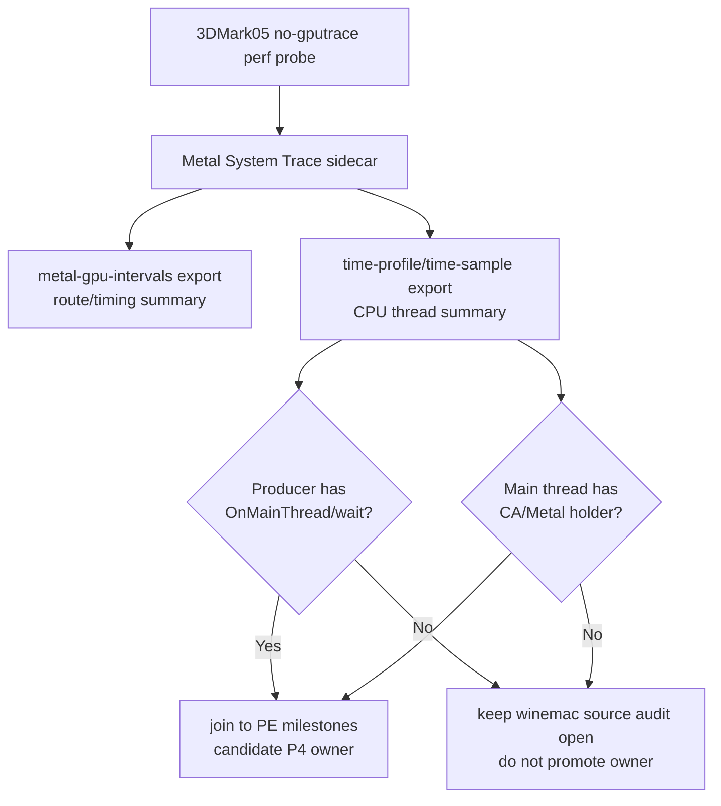

# Present-Pacing 29 - xctrace CPU Thread Summary Tooling

## Question

[present-pacing-winemac-onmainthread.28](present-pacing-winemac-onmainthread.28.md) leaves two open proof points:
which winemac call, if any, carries the `SetRenderTarget` return -> `Clear`
entry delay, and whether the Cocoa main thread is actually held by
present/CoreAnimation work. Before spending disk on another System Trace, make
the non-invasive route concrete and repeatable.

## Tooling

`summarize_xctrace_cpu_threads.py` consumes exported `time-profile` XML plus
optional `time-sample` and `thread-info` XML. It emits:

- per-thread sampled running weight from `time-profile`;
- per-thread state distribution from `time-sample`;
- xctrace `tid`, thread-info name, and main-thread flag from `thread-info`;
- top sampled frames and binaries;
- keyword hit counts/weights for `OnMainThread`, `kevent`,
  `dispatch_semaphore_wait`, macdrv cursor/window calls, `CA::Transaction`,
  `CAMetalLayer`, `presentDrawable`, and `nextDrawable`.
- a separate holder split for `CA::Transaction`, `CAMetalLayer`,
  `presentDrawable`, and `nextDrawable`, emitted as `p4_holder_keyword_hits`,
  `holder_status`, `main_thread_holder_keyword_hits`, and
  `nonproducer_holder_keyword_hits`.
- direct-log producer selection from unix-side `unix_commit_chunk_entry
  native_tid=0x...` rows when available, falling back to PE `pe_present_*
  thread_id=0x...` rows when no native id exists.
- a P4 scout verdict for the highest-weight producer thread, emitted in the
  Markdown report and optional JSON, so current-head sidecars immediately
  classify as positive, negative-scout, or inconclusive before opening the full
  CSV.
- non-producer wait-hit and holder-hit counts, so callback-thread
  `kevent`/CAMetalLayer noise is visible without being mistaken for a
  producer-thread P4 owner.

`run_3dmark05_system_trace_sidecar.sh --export-cpu-summary -- ...` now exports
required `time-profile` plus optional `time-sample` and `thread-info`, then writes
`xctrace-cpu-thread-summary.csv`, `xctrace-cpu-thread-summary.md`, and
`xctrace-cpu-thread-verdict.json` under the same trace `analysis/` directory.
If an Xcode version or template omits an optional table, the sidecar logs that
export miss and still emits a stack-only CPU verdict from `time-profile`.
On completion it also prints `system_trace_cpu_summary_verdict:` so run logs
carry the scout status without opening the Markdown.
For a deliberate validation run, pass `--require-cpu-p4-positive`; the sidecar
then fails unless the verdict status is `producer-wait-stack-positive`.
When `--cpu-producer-from-pe-log` is used, the sidecar forces
`DXMT9_PE_RECORDER_STATS=1 DXMT_LOG_LEVEL=info` into the wrapped probe and
passes the actual PE log path (`experiments/output/<run>/3dmark05-direct.log`)
to the CPU summarizer. The wrapper stdout log is not enough; it only records
the launcher plan and does not contain the full `pe_present_*` telemetry.
Current builds also log `unix_commit_chunk_entry native_tid=0x...` from the
unix/provider replay boundary under the same `DXMT9_PE_RECORDER_STATS=1`
diagnostic gate. The summarizer prefers that native id over PE
`GetCurrentThreadId()` rows because xctrace thread labels and `thread-info tid`
are native Mach/pthread ids, not Win32 ids.



## Existing Trace Smoke

The parser was run against the existing `phase43` System Trace exports without
creating a new trace:

| Metric | Value |
|---|---:|
| Matched `time-profile` rows | `20,964` |
| Matched `time-sample` rows | `20,989` |
| Producer thread `0x3b1b5c` profile weight | `15,354ms` |
| Producer thread `0x3b1b5c` `OnMainThread` / `kevent` / `dispatch_semaphore_wait` keyword hits | `0` |
| P4 scout verdict | `producer-running-negative-scout` |
| Non-producer wait keyword hits | `5` |
| `dxmt9-encode` `presentDrawable` / `CAMetalLayer` / `nextDrawable` hits | `52` / `39` / `31` |
| CAMetalLayer callback-like threads `kevent` hits | `5` total |

This is not a new owner decision because the old trace was not aligned to the
PE `SetRenderTarget` return -> `Clear` milestone rows. It does show the summary
can separate the main D3D/Wine producer from encode and callback threads, and
it reinforces the old [present-pacing-xctrace-threadstate.18](present-pacing-xctrace-threadstate.18.md) result: the
representative producer thread is sampled as running, not obviously parked in
`OnMainThread` / `kevent` / `dispatch_semaphore_wait`.

The verdict's default producer is the highest-weight thread matched by the
process regex. That is the right first scout because it avoids hand-picking a
thread, but it is not the strongest validation mode. Current PE `pe_present_*`
milestone rows carry `thread_id=0x...`; pass
`--producer-thread-regex-from-pe-log` to the summary tool or
`--cpu-producer-from-pe-log` to the sidecar to use the direct log as the
producer selector source. Newer direct logs prefer native
`unix_commit_chunk_entry native_tid=0x...`; older/direct logs without that row
fall back to the `Clear`-return PE thread id. Treat PE ids as candidate bridge
only; the first current-head scout proved PE `thread_id=0xd0` is in the Win32
namespace and does not match xctrace. If PE milestone telemetry or another
trace establishes the exact app/producer thread id, rerun the summary with
`--producer-thread-regex` or the sidecar with `--cpu-producer-thread-regex`.
When `thread-info` is available, producer selectors match both the xctrace
thread label and the exported `tid` field. This keeps the direct-log bridge honest:
when log extraction is requested but no native or PE id exists, the verdict is
`producer-thread-selector-missing`; when an extracted/explicit selector matches
no xctrace thread or `tid`, the verdict is `producer-thread-not-found`.
Neither case falls back to the highest-weight thread.
The first current-head same-run scout, [present-pacing-xctrace-cpu-summary-current.30](present-pacing-xctrace-cpu-summary-current.30.md),
hit the second case: PE `thread_id=0xd0` was present in `45,053` rows, but it
did not match xctrace's native thread labels or `thread-info` `tid` values.
Treat PE `thread_id` as a Win32-thread-id namespace; the next run should use
the new unix-side native commit-thread selector.

## Next Gate

When disk is safe for a short sidecar, run a current-head P4 scout with the
native commit-thread selector enabled:

```sh
bash scripts/tools/run_3dmark05_system_trace_sidecar.sh \
  --export-cpu-summary \
  --cpu-producer-from-pe-log \
  --record-delay-sec 75 \
  --time-limit-sec 15 \
  -- \
  --suffix winemac-onmainthread-xctrace-r3 \
  --no-gputrace \
  --timeout 120 \
  --frame-sampling
```

If a same-run native or PE log has already identified the producer thread and you do not
want automatic extraction, replace `--cpu-producer-from-pe-log` with:

```sh
  --cpu-producer-thread-regex '0x<thread-id>'
```

Pass condition for the non-invasive route:

- `xctrace-cpu-thread-summary.md` shows the producer thread with
  `OnMainThread`, `kevent`, `dispatch_semaphore_wait`, or a candidate macdrv
  wrapper stack during the trace window;
- the same run's PE milestone logs still show the steady
  `SetRenderTarget` return -> `Clear` entry gap;
- timing makes the CPU stack sample plausible for the same phase.

Failure condition:

- producer thread again has high running weight and zero relevant keyword hits;
- `P4 Scout Verdict` is `producer-running-negative-scout` for the current-head
  trace window;
- any `kevent`/CAMetalLayer hits stay on callback or encode threads only.

After a first current-head scout shows a positive stack sample, repeat with
`--require-cpu-p4-positive` to make the sidecar fail automatically if the
producer-thread `OnMainThread` evidence disappears.

**Decision.** Accepted as tooling. It does not replace x86_64 Wine threshold
telemetry, but it makes the non-invasive fallback concrete and cheap once disk
space allows a short System Trace.
