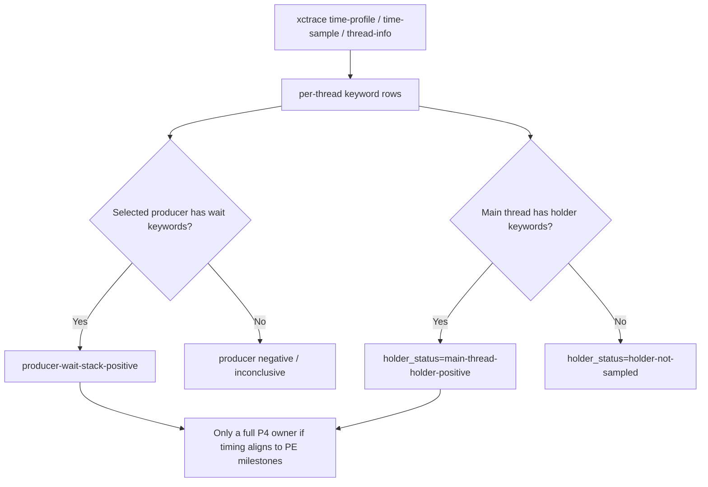

# Present-Pacing 42 - xctrace CPU Holder Summary Split

## Question

The winemac `OnMainThread()` hypothesis has two separable proof points:

1. The selected producer thread is blocked in `OnMainThread`, `kevent`,
   `dispatch_semaphore_wait`, or a candidate macdrv wrapper.
2. The Cocoa main thread has a plausible holder stack such as
   `CA::Transaction`, `CAMetalLayer`, `presentDrawable`, or `nextDrawable`.

`present-pacing-xctrace-cpu-summary-tooling.29` exposed both kinds of keyword
hits in the per-thread table, but the machine-readable verdict only named the
producer wait side. This made same-run sidecars harder to classify when
CoreAnimation samples existed on callback/main-thread-like rows but not on the
producer.

## Tooling

`summarize_xctrace_cpu_threads.py` now separates P4 producer waits from
main-thread/present holder evidence:

| Field | Meaning |
|---|---|
| `p4_wait_keyword_hits` | Producer-blocking keywords: `OnMainThread`, `kevent`, `dispatch_semaphore_wait`, candidate macdrv calls |
| `p4_holder_keyword_hits` | Holder keywords: `CA::Transaction`, `CAMetalLayer`, `presentDrawable`, `nextDrawable` |
| `holder_status` | `main-thread-holder-positive`, `holder-positive-non-main-thread`, or `holder-not-sampled` |
| `main_thread_holder_keyword_hits` | Holder hits on rows marked as main thread by `thread-info` |
| `nonproducer_holder_keyword_hits` | Holder hits not on the selected producer thread |

The Markdown report includes the same holder fields in `P4 Scout Verdict`.
Existing producer verdict statuses are unchanged, so old negative/positive
producer classifications remain comparable.
The sidecar's terminal `system_trace_cpu_summary_verdict:` line now carries
`holder_status`, `main_thread_holder_hits`, and `nonproducer_holder_hits`, and
manual `summarize_xctrace_cpu_threads.py` stdout includes per-thread
`p4_holder`, `running`, and `blocked` columns. This keeps quick, no-UI triage
aligned with the Markdown/JSON verdict instead of hiding holder evidence until
the analysis files are opened.

## Decision

Accepted as tooling. This does not resurrect winemac as the current owner by
itself; recent sidecars still point back to serialized P2/P3 replay/snapshot
and backend encode work. It makes the next short System Trace sidecar stricter:
a positive winemac result should show both selected-producer wait evidence and
a plausible holder row, or explicitly explain why only one side was sampled.

## Verification

- `python3 -m pytest tests/scripts/test_summarize_xctrace_cpu_threads.py -q`
- `python3 -m pytest tests/scripts/test_3dmark05_probe_scripts.py -q -k cpu_summary`
- `git diff --check -- scripts/tools/summarize_xctrace_cpu_threads.py tests/scripts/test_summarize_xctrace_cpu_threads.py docs/perfomance/present-pacing/index.md docs/perfomance/present-pacing/present-pacing-xctrace-holder-summary.42.md`

**Related.** [present-pacing-xctrace-cpu-summary-tooling.29](present-pacing-xctrace-cpu-summary-tooling.29.md) ·
[present-pacing-winemac-onmainthread.28](present-pacing-winemac-onmainthread.28.md) ·
[present-pacing-systemtrace-p4-range.36](present-pacing-systemtrace-p4-range.36.md) · [present-pacing](index.md).
