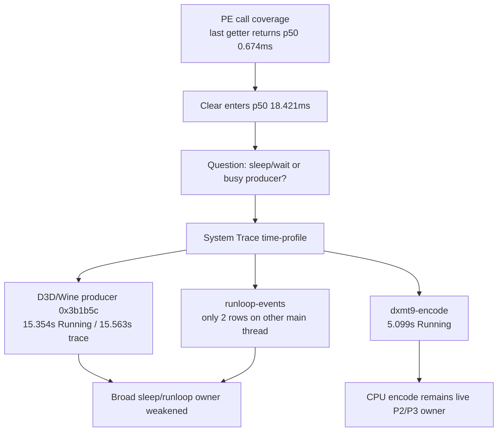
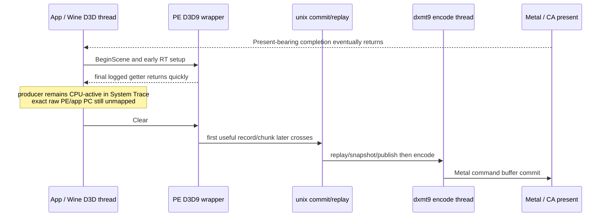

# Present-Pacing 18 - Xcode System Trace CPU Thread State

## Question

After [[present-pacing-pe-wide-call-coverage.17]], the exposed front gap is no
longer inside a meaningful PE D3D9 entry point: the final logged child getter
returns at p50 `0.674ms`, then `Clear` enters at p50 `18.421ms`.

One remaining explanation is a broad app/Wine sleep: the producer could be
waiting in a runloop, macdrv event wait, or display/present callback until Metal
completion makes the next frame legal. The available `Metal System Trace`
sidecar was re-exported to inspect CPU/thread tables before adding more PE
D3D9 entry coverage.

## Exported Tables

The trace table of contents includes CPU and scheduling-adjacent schemas in
addition to GPU rows:

| Schema | Rows | Role |
|---|---:|---|
| `time-profile` | `39,283` | sampled running CPU stacks |
| `time-sample` | `42,604` | kperf samples with thread state |
| `runloop-events` | `120,975` | CFRunLoop intervals |
| `thread-info` | `3,083` | PID/TID/thread metadata |
| `os-signpost` | `4,937` | CAMetalLayer/CoreAnimation signposts |
| `ca-client-present-request` | `200` | present request timeline |
| `ca-client-presented-handler` | `200` | presented-handler timeline |
| `metal-application-command-buffer-submissions` | `800` | Metal submission timeline |
| `metal-command-buffer-completed` | `1,200` | Metal completion timeline |

The export required local cleanup first because the volume had only `116MiB`
free. Only ignored, unrelated `traces/sfiv-*` trace bundles were removed.

`process-info` was also exported to confirm PID `97983` is `3DMark05.exe`.
`dyld-library-load` and `os-log` were exportable but contain `0` rows in this
sidecar, so they cannot map the raw PE/app PCs.

## Result

The trace covers `15.563s` of sampled CPU time (`00:00.355` to `00:15.918`).
Within that interval, the main D3D/Wine unix-call producer thread is not
globally asleep:

| Thread | Running sample weight | Dominant evidence |
|---|---:|---|
| `3DMark05.exe (0x3b1b5c)` | `15,354ms` | raw PE/app frames, `mach_continuous_time`, `dxmt9p_buffer_lock`, and unix `commit_chunk`/pipeline-cache stacks |
| `dxmt9-encode (0x3b1c00)` | `5,099ms` | `encodeChunk`, `encodeDraw`, `pushDebugGroup`, timer/counter calls |
| CAMetalLayer submit callback threads `0x3b1b5f`, `0x3b1bf3`, `0x3b1b5e` | `476ms` combined | `IOGPUCommandQueueSubmitCommandBuffers`, CAMetalLayer/IOGPU callback work |
| `dxmt9-completion` | `11ms` running samples | mostly condition-variable wait / `waitUntilCompleted` samples |

CoreAnimation and Metal timing in the same trace has the expected present-paced
shape:

| Metric | p50 | p95 | Max |
|---|---:|---:|---:|
| CA present-request gap | `74.398ms` | `98.436ms` | `118.158ms` |
| CA request -> next presented handler | `33.637ms` | `42.348ms` | `48.881ms` |
| Metal command-buffer submit gap | `5.715ms` | `71.117ms` | `91.119ms` |
| Metal submission duration | `5.721ms` | `12.707ms` | `32.382ms` |
| submission -> next command-buffer completion | `14.397ms` | `24.164ms` | `30.747ms` |

`runloop-events` does not support a runloop-sleep owner for the producer. It
contains only two `3DMark05.exe` rows, both on a different `Main Thread
(0x3b1b5a)` around `14.674s`; it does not show the D3D/Wine producer thread
spending the trace in a CFRunLoop wait.

The dominant producer-thread top frames are still not fully symbolicated:

| Top frame | Samples | Binary |
|---|---:|---|
| `0x20072a19d` | `863` | `?` |
| `0x20072a1bd` | `507` | `?` |
| `0x7ff8a5d37d5d` | `303` | `?` |
| `0x7ff8a5d37c51` | `279` | `?` |
| `0x7ff8a5715359` | `264` | `?` |

Across the first five stack frames of producer samples, `?` accounts for
`23,739` frame occurrences and `winemetal.so` accounts for `12,678`. That
looks like a mix of PE/Wine/unwind-unresolved frames plus unix `winemetal.so`
work, not a clean macOS wait stack.

## Interpretation

This does **not** prove the exact PC responsible for the current
`SetRenderTarget` return -> `Clear` entry gap, because this older System Trace
does not contain the PE `Clear`/getter milestone markers. It does reject the
broadest version of the sleep hypothesis: during a representative GT1 System
Trace, the D3D/Wine producer thread is sampled as running for nearly the entire
capture, not sitting in an obvious runloop/macdrv sleep.

The better current model is:

Next proof should map the raw PE/app frames on thread `0x3b1b5c` or align a new
System Trace with PE milestone logs. That can be done by adding a lightweight
PE/Wine PC-map diagnostic, or by running a new System Trace sidecar after adding
signpost/log markers that share a time base with `pe_present_call_return` and
`pe_present_call_milestone`. More D3D9 descriptor/getter coverage is not the
right next step.
