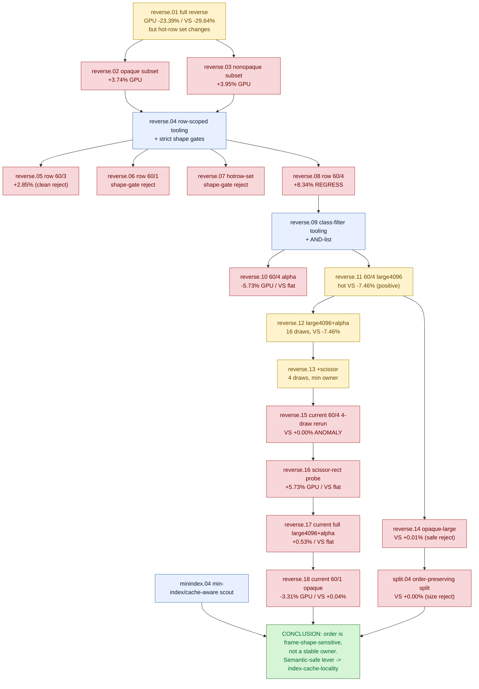

# Primitive-Reorder Diagnostics — does index/primitive ORDER own the hidden VS-write bucket? - Historical Log

> Full historical detail moved from the former top-level `primitive-reorder-diagnostics.md` overview.
> Keep [overview](overview.md) current and compact; append long-running chronology,
> rejected paths, and detailed synthesis here only when it is not already captured in
> one-experiment leaf documents.

---

# Primitive-Reorder Diagnostics — does index/primitive ORDER own the hidden VS-write bucket?

> Part of the 3DMark05 GT1 GPU-bottleneck investigation. Root map: [overview-3dmark05-gt1](../overview-3dmark05-gt1.md).

## Scope & question

This domain owns the family of **diagnostic primitive/triangle reorder probes**
that test whether index/primitive *order* (not vertex expansion, not draw count)
is the first-order owner of the hidden "VS Buffer Device Memory Bytes Written"
bucket. It spans three subcategories: `reverse.*` (this file's leaves — full and
scoped reverse-triangle-order probes), `split.*` (order-preserving bounded
large-draw splits — see primitive-reorder-diagnostics-split.04), and
`minindex.*` (min-index / cache-aware reorder scouts — see
primitive-reorder-diagnostics-minindex.04). The central conclusion: order
*can* move the hidden bucket, but every apparent win was frame-shape-sensitive
and almost all were rejected. The lasting value was motivating the
semantic-safe, cached index-cache-locality path in [index-cache-locality](../index-cache-locality/index.md).

## Hypotheses & verdicts

| # | Hypothesis | Verdict | Evidence |
|---|-----------|---------|----------|
| H1 | Reversing all indexed triangle order reduces VS write | classifier only (frame-shape contaminated) | primitive-reorder-diagnostics-reverse.01 |
| H2 | Correctness-preserving opaque-only reverse reproduces the win | rejected | primitive-reorder-diagnostics-reverse.02 |
| H3 | Nonopaque/blended rows own the full-reverse win | rejected | primitive-reorder-diagnostics-reverse.03 |
| H4 | Reversing a single hot row (`60/3`/`60/1`/`60/4`) reduces VS write | rejected | primitive-reorder-diagnostics-reverse.05, primitive-reorder-diagnostics-reverse.06, primitive-reorder-diagnostics-reverse.08 |
| H5 | Reversing the whole hot-row set reduces VS write | rejected (shape drift) | primitive-reorder-diagnostics-reverse.07 |
| H6 | The `60/4` alpha-blend subset owns the order signal | rejected | primitive-reorder-diagnostics-reverse.10 |
| H7 | The `60/4 large4096` subset owns the order signal | positive classifier, not production-safe | primitive-reorder-diagnostics-reverse.11 |
| H8 | A 16/4-draw `large4096+alpha(+scissor)` intersection owns it | historical positive, later non-reproducing | primitive-reorder-diagnostics-reverse.12, primitive-reorder-diagnostics-reverse.13 |
| H9 | The production-safe opaque-large reorder reproduces H7 | rejected | primitive-reorder-diagnostics-reverse.14 |
| H10 | Order-preserving large-draw split owns it (size, not order) | rejected | primitive-reorder-diagnostics-split.04 |
| H11 | The historical 4-draw win is stable on current HEAD | rejected (anomaly) | primitive-reorder-diagnostics-reverse.15 |
| H12 | Scissor rectangle/tile coverage owns the historical win | rejected | primitive-reorder-diagnostics-reverse.16 |
| H13 | The full 16-draw / `60/1` opaque reverse reproduces on current HEAD | rejected | primitive-reorder-diagnostics-reverse.17, primitive-reorder-diagnostics-reverse.18 |
| H14 | Order is the *stable* owner of the hidden bucket | rejected — it is frame-shape-sensitive; semantic-safe lever lives in [index-cache-locality](../index-cache-locality/index.md) | whole domain |

## Verification methods

- **`--probe-reverse-indexed-triangles`** (`DXMT9_PROBE_REVERSE_INDEXED_TRIANGLES`)
  — replaces each triangle-list IB with a transient IB whose triangle order is
  reversed, winding preserved; indexed path stays active (`draw_expanded_indexed=0`).
- **`--probe-reverse-opaque-indexed-triangles` / `--probe-reverse-nonopaque-indexed-triangles`**
  — restrict to opaque-depth-write vs visibility-sensitive eligibility.
- **Row/row-set selectors** (`DXMT9_PROBE_REVERSE_INDEXED_TRIANGLES_ROW` /
  `_ROWS`, primitive-reorder-diagnostics-reverse.04) — scope to one or more
  `RenderPass[seq=...,enc=...]` rows.
- **Class / class-list selectors** (`DXMT9_PROBE_REVERSE_INDEXED_TRIANGLES_CLASS`
  / `_CLASSES`, primitive-reorder-diagnostics-reverse.09) — gate by material
  state (`opaque-depth-write|nonopaque|depth-read|alpha-blend|scissor|textured|large4096`)
  and AND-list intersections.
- **Strict same-frame shape gates** (mandatory): `--require-top-row-key-match`,
  `--max-top-draw-call-delta-ratio 0.05`, `--max-top-vertex-count-delta-ratio 0.05`,
  `--max-top-triangle-delta-ratio 0.05`. These reject any run whose hot-row set or
  submitted geometry drifts >5% — the test that distinguished classifier from proof.
- **Xcode joined gates**: `--require-xcode-counter-coverage`,
  `--require-dxmt-join-coverage`, `--require-top-pso-attribution`,
  `--min-top-pso-samples-per-draw`, `--min-top-dxmt-joined-fraction` —
  authoritative VS-write ownership comes from the Xcode/dxmt joined summary, not
  run-level `gpu_command_buffer_time_ms` (which misled the nonopaque probe).
- `--measure-index-reuse` for cache64/reuse context; `3dmark05-perf-indexed-probe-draws.csv`
  draw-sample artifact for exact applied-draw state.

## Experiment dependency graph



## Results synthesis

**Settled.** Every reverse-order probe that passed strict same-frame shape gates
either left the hidden VS-buffer-write bucket flat or regressed it: single rows
`60/3`/`60/4` (primitive-reorder-diagnostics-reverse.05,
primitive-reorder-diagnostics-reverse.08), the `60/4` alpha subset
(primitive-reorder-diagnostics-reverse.10), the production-safe opaque-large
set (primitive-reorder-diagnostics-reverse.14), and the order-preserving
split (primitive-reorder-diagnostics-split.04). The large *aggregate* "wins"
from full reverse (primitive-reorder-diagnostics-reverse.01) and the hot-row
set (primitive-reorder-diagnostics-reverse.07) were rejected once the shape
gates exposed that they describe a *different, lighter submitted frame* (changed
hot-row membership, fewer vertices, less tile coverage/overdraw) rather than a
legal optimization.

The most seductive result — the 4-draw `large4096 + alpha + scissor` probe that
moved the whole-frame bucket by `-7.46%` while mutating only 4 of 253 draws
(primitive-reorder-diagnostics-reverse.13) — failed to reproduce on current
HEAD (primitive-reorder-diagnostics-reverse.15). A draw-sample diff showed
identical draw membership/state and only a drifting scissor rectangle, and a
direct rectangle-normalization probe (primitive-reorder-diagnostics-reverse.16)
left the bucket flat. The full 16-draw alpha and `60/1` opaque reruns
(primitive-reorder-diagnostics-reverse.17, primitive-reorder-diagnostics-reverse.18)
removed the last support for promoting the anomaly. **The key lesson: reverse-order
"wins" were visibility / tile-coverage / hot-row-shape artifacts of a particular
captured frame, not a stable per-row property.** The owner is hidden Apple
vertex/tiler/parameter (TVB) backend storage scaling with VS invocations ×
per-vertex VSOut bytes ([hidden-backend-storage](../hidden-backend-storage/index.md)), which sits below
source-visible VSOut width.

**Still open / handed off.** The screen-blend order-independence observation
(primitive-reorder-diagnostics-reverse.09, primitive-reorder-diagnostics-reverse.13)
was the one durable yield: it seeded the cached, predicate-gated, semantic-safe
index-cache-locality optimization in [index-cache-locality](../index-cache-locality/index.md), where post-transform
cache locality reduces *VS invocations* legally (the one accepted production win)
rather than perturbing primitive order destructively. The remaining direction
the reruns point to is backend state-shape / row-shape reproduction, not tighter
order predicates.

## How to run
Every experiment here is a 3DMark05 GT1 run via the standard wrapper. These reorder
probes keep the indexed path active; capture a `.gputrace` with the reverse/sort
flag and mandatory same-frame shape gates, then read VS-write ownership from the
joined Xcode/dxmt summary:

```sh
bash scripts/tools/run_3dmark05_perf_probe.sh --suffix reverse-opaque --frame 60 \
  --probe-reverse-opaque-indexed-triangles --timeout 420
# scoped forms: --probe-reverse-indexed-triangles-rows / -classes,
#   --probe-sort-indexed-triangles-by-min-index, --measure-index-reuse for context

bash scripts/tools/finalize_3dmark05_perf_probe.sh --suffix reverse-opaque --frame 60 \
  --baseline-joined traces/<baseline>/analysis/frame60-xcode-dxmt-joined-summary.csv \
  --require-top-row-key-match --max-top-draw-call-delta-ratio 0.05 \
  --max-top-vertex-count-delta-ratio 0.05 --max-top-triangle-delta-ratio 0.05 \
  --require-xcode-counter-coverage --require-dxmt-join-coverage --require-top-pso-attribution
```

The exact per-experiment flags (row/class selectors) live in each leaf's
`**Method.**` field. See `agents/rules/environment_variables.rules.md` for env-var
meanings and `agents/rules/metal_debugging.rules.md` for the full workflow.

## Cross-references

- [index-cache-locality](../index-cache-locality/index.md) — the semantic-safe lever this domain motivated; the
  one accepted production win (opaque-depth cache locality) and the screen-blend
  cache predicate descend from these probes.
- [index-reuse-measurement](../index-reuse-measurement/index.md) — cache64/reuse model and per-encoder state-class
  attribution that scoped these row/material probes.
- [hidden-backend-storage](../hidden-backend-storage/index.md) — the TVB owner every reverse probe failed to remove;
  confirms order moves backend storage but is not the root.
- [tvb-mechanism-proof](../tvb-mechanism-proof/index.md) — the row-local TVB mechanism proof gate that supersedes
  reorder classifiers as the ownership test.
- [mini-replay-bisection](../mini-replay-bisection/index.md) — replay/payload-capture discipline behind the
  draw-sample and same-frame comparisons.
- [backend-shape-classifiers](../backend-shape-classifiers/index.md) — sibling state-ownership tests (scissor/alpha/depth)
  the reruns hand off to.
- [overview-3dmark05-gt1](../overview-3dmark05-gt1.md) — root priority DAG and ceiling.

## Root 3DMark05 Map Detail Migration - 2026-07-08

Detail migrated from the former long-form root [3DMark05 overview](../overview-3dmark05-gt1.md) so that `primitive-reorder-diagnostics` owns its detailed synthesis while the root overview stays cross-domain only.

### From What is settled vs open

- Primitive/triangle reorder as a *stable* lever — apparent wins were
  frame-shape/tile-coverage artifacts that did not reproduce on HEAD. [primitive-reorder-diagnostics](index.md)
