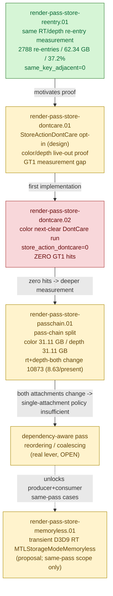

# Render-Pass Store — the P1 GPU-memory (tile preservation) track

> Part of the 3DMark05 GT1 GPU-bottleneck investigation. Root map: [[overview-3dmark05-gt1]].

## Scope & question

This domain owns the **P1 GPU-memory track**: the repeated tile Store/Load
preservation caused by re-entering the same render target / depth attachment after
an intervening different pass. It covers the run-level measurement of that
re-entry budget, the `StoreActionDontCare` live-out proofs that *should* avoid the
stores, and the pass-chain split that explains why those cheap proofs do not fire
on GT1. The central GT1 cost owner is still the P0 hidden vertex-stage/TVB write
bucket ([[hidden-backend-storage]]); this track is large in absolute GPU-memory
terms (~62 GB tile preservation) but secondary in the priority DAG, and its only
real lever — dependency-aware pass reordering/coalescing — is still **open**.

## Hypotheses & verdicts

| # | Hypothesis | Verdict | Evidence |
|---|-----------|---------|----------|
| H1 | Same RT/depth re-entry is a measurable, large fraction of the tile preservation budget | **accepted (real, actionable)** | [[render-pass-store-reentry.01]] |
| H2 | Re-entry is an immediate duplicate-reopen bug (`same_key_adjacent`) | rejected (`same_key_adjacent=0`) | [[render-pass-store-reentry.01]] |
| H3 | A color/depth live-out `StoreActionDontCare` proof can discard re-entry stores | model representable, GT1 gap | [[render-pass-store-dontcare.01]] |
| H4 | The conservative color next-clear DontCare proof fires on GT1 | **rejected** (`render_pass_store_action_dontcare=0`; re-entry is preserve-before-load) | [[render-pass-store-dontcare.02]] |
| H5 | The re-entry budget is dominated by one attachment (single-attachment DontCare would suffice) | rejected (split ~50/50 color/depth) | [[render-pass-store-passchain.01]] |
| H6 | Dependency-aware pass reordering/coalescing is the real lever (most switches change BOTH RT and depth) | **OPEN** | [[render-pass-store-passchain.01]] |
| H7 | Transient D3D9 intermediate RTs can be allocated as `MTLStorageModeMemoryless` to skip device RAM entirely | **OPEN (proposal)** — landing surface narrow without H6 coalesce; same-pass scope only | [[render-pass-store-memoryless.01]] |

## Verification methods

- **`DXMT9_AGGRESSIVE_COLOR_DONTCARE=1`** — opt-in color store proof: return
  dead-at-end `DontCare` when the color handle does not reappear in the rest of
  the chunk and no Present is seen. Default stays conservative (only next-clear can
  DontCare-store color).
- **`DXMT9_AGGRESSIVE_DEPTH_DONTCARE`** — companion depth-side aggressive
  DontCare-store proof.
- **`render_pass_*` counters** — `render_pass_same_key_adjacent`,
  `render_pass_same_key_reentry`, `render_pass_same_key_reentry_preservation_bytes`
  (and its `_color_`/`_depth_` split), `render_pass_tile_preservation_bytes`,
  `render_pass_store_action_dontcare`, `render_pass_color_proof_*`, and the
  transition classifiers `render_pass_transition_rt_change_same_depth` /
  `_same_rt_depth_change` / `_rt_depth_change`. These prove whether a DontCare
  proof actually fires and how the re-entry budget splits across attachments.
- **`tests/native/backend/render_pass_actions_spec.cpp`** — covers the color
  next-clear allow case plus the draw-target, texture-sample, and present blocking
  cases that gate the DontCare proof.

## Experiment dependency graph



## Results synthesis

**Settled.** Same RT/depth re-entry is a real, measurable, large slice of the
GPU-memory budget: [[render-pass-store-reentry.01]] found `2788` same-key
re-entries (~2.21/present) owning `62.34 GB`, ~37.2% of the `167.73 GB` estimated
tile preservation budget, while `render_pass_same_key_adjacent=0` rules out a
trivial immediate-reopen bug. The cheap fix family — `StoreActionDontCare` proofs
([[render-pass-store-dontcare.01]]) — is correct and tested but does **not** fire
on GT1: [[render-pass-store-dontcare.02]] reported
`render_pass_store_action_dontcare=0` because the re-entry is
preservation-**before-load**, not preservation-before-clear (contents are later
Loaded, not discarded). The pass-chain split [[render-pass-store-passchain.01]]
then showed the budget is ~50/50 color/depth (`31.11 GB` each) and that the
dominant transition (`render_pass_transition_rt_depth_change=10873`, ~8.63/present)
changes **both** RT and depth, while same-RT/depth-change is `0` — so no
single-attachment store policy can cover GT1.

**Open.** The real lever is a **dependency-aware pass reordering/coalescing**
design: decide whether intervening passes are independent enough to batch same-key
work together, or prove a broader live-out discard with concrete read/use
evidence. That work is unstarted. A companion proposal,
[[render-pass-store-memoryless.01]], records the
`MTLStorageModeMemoryless` opportunity for transient D3D9 intermediate RTs;
its landing surface is narrow until coalesce makes producer+consumer share a
Metal render pass, so it is recorded as an OPEN proposal that multiplies any
coalesce win rather than a standalone lever. Per the [[overview-3dmark05-gt1]]
priority DAG, this entire P1 GPU-memory track remains secondary to the P0
hidden-backend write bucket ([[hidden-backend-storage]]); the cheap, safe
render-pass wins were already shown not to move the GT1 bottleneck.

## How to run
Every experiment here is a 3DMark05 GT1 run via the standard wrapper. Enable the
aggressive DontCare-store proof env var, capture a `.gputrace`, then confirm the
DontCare counters fired and the tile-preservation budget dropped:

```sh
DXMT9_AGGRESSIVE_COLOR_DONTCARE=1 \
bash scripts/tools/run_3dmark05_perf_probe.sh --suffix color-dontcare --frame 60 \
  --aggressive-color-dontcare --timeout 420
# depth-side companion: DXMT9_AGGRESSIVE_DEPTH_DONTCARE=1 / --aggressive-depth-dontcare

bash scripts/tools/finalize_3dmark05_perf_probe.sh --suffix color-dontcare --frame 60 \
  --baseline-output experiments/output/<baseline>/result.json \
  --require-color-dontcare-increase --require-tile-preservation-decrease
```

The exact per-experiment flags live in each leaf's `**Method.**` field. See
`agents/rules/environment_variables.rules.md` for env-var meanings and
`agents/rules/metal_debugging.rules.md` for the full workflow.

## Cross-references
- [[overview-3dmark05-gt1]] — root priority DAG; this is the P1 GPU-memory track, secondary to the P0 hidden-backend bucket.
- [[hidden-backend-storage]] — the P0 owner (hidden vertex-stage/TVB write) that dominates GT1 ahead of this track.
- [[const-upload]] — the CPU-side upload-traffic sibling that, like the DontCare proofs here, moves bytes but not the GT1 GPU bottleneck.
- [[baselines]] — frame120 reference where `rt=0x30000460000000c,depth=0x300000100000001` re-entry costs 24.643 ms / 73.32% of the frame.
