# Render-Pass Store — the P1 GPU-memory (tile preservation) track

> Part of the 3DMark05 GT1 GPU-bottleneck investigation. Root map: [[overview-3dmark05-gt1]].

## Scope & question

This domain owns the **P1 GPU-memory track**: the repeated tile Store/Load
preservation caused by re-entering the same render target / depth attachment after
an intervening different pass. It covers the run-level measurement of that
re-entry budget, the `StoreActionDontCare` live-out proofs that *should* avoid the
stores, and the pass-chain split that explains why those cheap proofs do not fire
on GT1. The central GT1 cost owner is still the P0 hidden vertex-stage/TVB write
bucket ([[hidden-backend-storage]]); this track is large in absolute GPU-memory
terms (~62 GB tile preservation) but secondary in the priority DAG, and its only
real lever — dependency-aware pass reordering/coalescing — is still **open**.

## Hypotheses & verdicts

| # | Hypothesis | Verdict | Evidence |
|---|-----------|---------|----------|
| H1 | Same RT/depth re-entry is a measurable, large fraction of the tile preservation budget | **accepted (real, actionable)** | [[render-pass-store-reentry.01]] |
| H2 | Re-entry is an immediate duplicate-reopen bug (`same_key_adjacent`) | rejected (`same_key_adjacent=0`) | [[render-pass-store-reentry.01]] |
| H3 | A color/depth live-out `StoreActionDontCare` proof can discard re-entry stores | model representable, GT1 gap | [[render-pass-store-dontcare.01]] |
| H4 | The conservative color next-clear DontCare proof fires on GT1 | **rejected** (`render_pass_store_action_dontcare=0`; re-entry is preserve-before-load) | [[render-pass-store-dontcare.02]] |
| H5 | The re-entry budget is dominated by one attachment (single-attachment DontCare would suffice) | rejected (split ~50/50 color/depth) | [[render-pass-store-passchain.01]] |
| H6 | Dependency-aware pass reordering/coalescing is the real lever (most switches change BOTH RT and depth) | **OPEN** — the modern-renderer Frame Graph DAG (RAW+WAR+WAW edges) now makes the candidate/safety judgment machine-decidable per frame; the device-gated coalesce-execution + byte-equal/preservation proof is still owed | [[render-pass-store-passchain.01]], [[render-pass-store-coalesce.01]] |
| H7 | Transient D3D9 intermediate RTs can be allocated as `MTLStorageModeMemoryless` to skip device RAM entirely | **OPEN (proposal)** — landing surface narrow without H6 coalesce; same-pass scope only | [[render-pass-store-memoryless.01]] |
| H8 | Same-key re-entry is a short ping-pong pattern rather than a long dependency chain | accepted-counter-sample (`distance_1=90.35-90.77%`; one-hop shape is `100%` RT+depth-both-changed) | [[render-pass-store-reentry-distance.01]] |
| H9 | One-hop ping-pong is exact-handle random, but depth-pair/true B->A encoder-path stable | accepted-counter-sample (`B 0x...001 -> A 0x...004 @ 2->3` owns `45.57GB`) | [[render-pass-store-reentry-distance.01]] |
| H10 | Top one-hop ping-pong is blocked by direct attachment-as-texture reads between B and A | rejected-counter-sample (`3561/3561` raw top rows have `B reads A=none`, `A reads B=none`) | [[render-pass-store-reentry-distance.01]] |
| H11 | Top one-hop ping-pong is kept live by present/clear/helper ops | rejected-counter-sample (`3569/3569` raw top rows are `BlockDrawTarget` + `BlockDrawDepth`, not present/clear/helper) | [[render-pass-store-reentry-distance.01]] |
| H12 | Top one-hop ping-pong is blocked by distant live-out reuse rather than immediate target reuse | rejected-counter-sample (dominant top patterns report `B next touch=color/depth 1`, `A next touch=color/depth 1`) | [[render-pass-store-reentry-distance.01]] |
| H13 | The immediate ping-pong is role-random and needs a global scheduler | rejected-counter-sample (encoder join shows stable role pairs: textured-depth-read <-> opaque-depth-write and screen-blend-depth-read <-> opaque-depth-write) | [[render-pass-store-reentry-distance.01]] |
| H14 | The stable role ping-pong also has stable pass-action shape | accepted-counter-sample (depth-read side is `color/depth Load+Store`; opaque depth-write side is `color/depth Clear+Store`) | [[render-pass-store-reentry-distance.01]] |

## Verification methods

- **`DXMT9_AGGRESSIVE_COLOR_DONTCARE=1`** — opt-in color store proof: return
  dead-at-end `DontCare` when the color handle does not reappear in the rest of
  the chunk and no Present is seen. Default stays conservative (only next-clear can
  DontCare-store color).
- **`DXMT9_AGGRESSIVE_DEPTH_DONTCARE`** — companion depth-side aggressive
  DontCare-store proof.
- **`render_pass_*` counters** — `render_pass_same_key_adjacent`,
  `render_pass_same_key_reentry`, `render_pass_same_key_reentry_preservation_bytes`
  (and its `_color_`/`_depth_` split), `render_pass_same_key_reentry_distance_*`,
  `render_pass_tile_preservation_bytes`, `render_pass_store_action_dontcare`,
  `render_pass_color_proof_*`, and the transition classifiers
  `render_pass_transition_rt_change_same_depth` / `_same_rt_depth_change` /
  `_rt_depth_change`. These prove whether a DontCare proof actually fires, how
  the re-entry budget splits across attachments, and whether the pass-chain shape
  is local enough for coalescing.
- **`tests/native/backend/render_pass_actions_spec.cpp`** — covers the color
  next-clear allow case plus the draw-target, texture-sample, and present blocking
  cases that gate the DontCare proof.
- **`DXMT9_PERF_ENCODER_BREAKDOWN=1` + `DXMT9_PERF_RENDER_PASS_REENTRY_TOP=N`**
  — encoder lines include `color_attachment_count`, `color0_*`, `depth_*`, and
  `stencil_*` load/store/clear fields plus Load/Store preservation bytes. The
  summary joins these into the same-key re-entry role table as `B pass action`
  and `A pass action`, so the hot role-pair ping-pong can be split by actual
  Load/Store/Clear shape.

## Experiment dependency graph

```mermaid
flowchart TD
  Reentry["render-pass-store-reentry.01\nsame RT/depth re-entry measurement\n2788 re-entries / 62.34 GB / 37.2%\nsame_key_adjacent=0"]
  DesignDC["render-pass-store-dontcare.01\nStoreActionDontCare opt-in (design)\ncolor/depth live-out proof\nGT1 measurement gap"]
  ColorNC["render-pass-store-dontcare.02\ncolor next-clear DontCare run\nstore_action_dontcare=0\nZERO GT1 hits"]
  PassChain["render-pass-store-passchain.01\npass-chain split\ncolor 31.11 GB / depth 31.11 GB\nrt+depth-both change 10873 (8.63/present)"]
  ReentryDistance["render-pass-store-reentry-distance.01\nsame-key re-entry distance\n90.35-90.77% is A->B->A\none-hop is 100% RT+depth changed"]
  ReentryPattern["top pair pattern\nexact RT handles rotate\nstable depth pair 0x...001 <-> 0x...004\ntrue B->A path 2->3 owns 45.57GB"]
  ReentryDeps["dependency bits\nB reads A = none\nA reads B = none\n3561/3561 raw top rows"]
  ReentryLive["store proof bits\nBlockDrawTarget + BlockDrawDepth\n3569/3569 raw top rows"]
  ReentryTouch["touch-distance bits\nmain patterns: B/A color+depth next touch=1"]
  ReentryRole["encoder role join\ntextured/screen depth-read <->\nopaque depth-write"]
  PassActionShape["per-encoder pass action shape\nread side: color/depth Load+Store\nopaque side: color/depth Clear+Store"]
  Coalesce["dependency-aware pass\nreordering / coalescing\n(real lever, OPEN)"]
  Memoryless["render-pass-store-memoryless.01\ntransient D3D9 RT MTLStorageModeMemoryless\n(proposal; same-pass scope only)"]
  LiveOut["role-aware immediate\nordering proof\n(next blocker)"]

  Reentry -->|"motivates proof"| DesignDC
  DesignDC -->|"first implementation"| ColorNC
  ColorNC -->|"zero hits -> deeper measurement"| PassChain
  PassChain -->|"both attachments change ->\nsingle-attachment policy insufficient"| ReentryDistance
  ReentryDistance -->|"mostly one-hop ->\nlocal ping-pong target"| ReentryPattern
  ReentryPattern -->|"classify direct texture dependencies"| ReentryDeps
  ReentryDeps -->|"no direct texture reads ->\nclassify store proof"| ReentryLive
  ReentryLive -->|"present/clear/helper rejected ->\nmeasure first target touch"| ReentryTouch
  ReentryTouch -->|"immediate target reuse ->\njoin pass roles"| ReentryRole
  ReentryRole -->|"stable role ping-pong ->\nactual pass action"| PassActionShape
  PassActionShape -->|"Load+Store vs Clear+Store\npreserves D3D9 ordering?"| LiveOut
  LiveOut --> Coalesce
  Coalesce -.unlocks producer+consumer\nsame-pass cases.-> Memoryless

  classDef accepted fill:#d6f5d6,stroke:#2b7a2b,color:#063
  classDef rejected fill:#f8d7da,stroke:#a33,color:#600
  classDef open fill:#fff3cd,stroke:#a80,color:#640
  class Reentry accepted
  class ColorNC rejected
  class ReentryDistance,ReentryPattern,ReentryDeps,ReentryLive,ReentryTouch,ReentryRole accepted
  class DesignDC,PassChain,PassActionShape,Coalesce,Memoryless,LiveOut open
```



## Results synthesis

**Settled.** Same RT/depth re-entry is a real, measurable, large slice of the
GPU-memory budget: [[render-pass-store-reentry.01]] found `2788` same-key
re-entries (~2.21/present) owning `62.34 GB`, ~37.2% of the `167.73 GB` estimated
tile preservation budget, while `render_pass_same_key_adjacent=0` rules out a
trivial immediate-reopen bug. The cheap fix family — `StoreActionDontCare` proofs
([[render-pass-store-dontcare.01]]) — is correct and tested but does **not** fire
on GT1: [[render-pass-store-dontcare.02]] reported
`render_pass_store_action_dontcare=0` because the re-entry is
preservation-**before-load**, not preservation-before-clear (contents are later
Loaded, not discarded). The pass-chain split [[render-pass-store-passchain.01]]
then showed the budget is ~50/50 color/depth (`31.11 GB` each) and that the
dominant transition (`render_pass_transition_rt_depth_change=10873`, ~8.63/present)
changes **both** RT and depth, while same-RT/depth-change is `0` — so no
single-attachment store policy can cover GT1. The current distance run
[[render-pass-store-reentry-distance.01]] further narrows the remaining shape:
same-key re-entry is not a long chain, because `3407 / 3771` to
`3580 / 3944` re-entries (`90.35-90.77%`) are distance-1 `A -> B -> A`
ping-pong and the rest are distance `5..8`. The shape follow-up shows the
one-hop owner is `100%` RT+depth-both-changed (`3580` counts,
`85,232,451,584` preservation bytes), not same-color, same-depth, or
sample-count-only churn. The corrected top-pair diagnostic then shows exact
color RT handles rotate, so the reusable pattern is depth/true `B->A` encoder
based: `B depth 0x...001 -> A depth 0x...004` at `2->3` owns `45.57 GB`,
while the reverse direction is split across `1->2` (`21.13 GB`) and `3->4`
(`13.16 GB`). The dependency follow-up then rejects the direct texture-read
blocker for the top rows: all raw diagnostic rows (`3561 / 3561`) report
`B reads A = none` and `A reads B = none`. The live-out proof follow-up rejects
present/clear/helper ownership for the same top shape: all raw diagnostic rows
(`3569 / 3569`) report `color=BlockDrawTarget` and `depth=BlockDrawDepth` for
both `B` and reopened `A`.
The touch-distance follow-up then turns "later target reuse" into an immediate
ordering fact for the dominant patterns: `B 0x...001 -> A 0x...004 @ 2->3`
reports `B next touch=color=1; depth=1` and `A next touch=color=1; depth=1`
over `536` rows / `35.97 GB`; the reverse `1->2` and `3->4` paths report the
same distance-1 target reuse over `1,522` and `1,050` rows. That rejects distant
live-out as the explanation for the top ping-pong rows.
The encoder-role join makes the local sequence concrete rather than random:
byte share is led by `textured-depth-read-opaque -> opaque-depth-write-untextured`
(`510` events, `34.23 GB`, `42.48%` of the distance-1 preservation bytes),
followed by `opaque-depth-write-untextured -> screen-blend-depth-read`
(`1,672` events, `21.04 GB`, `26.11%`) and
`opaque-depth-write-untextured -> textured-depth-read-opaque` (`900` events,
`11.32 GB`, `14.05%`). All three dominant role pairs have
`B next touch=color=1; depth=1` and `A next touch=color=1; depth=1`, so the
practical coalesce target is a local alternation between opaque depth-writing
geometry passes and textured/screen-blend depth-read passes.
The pass-action follow-up keeps the same run-level shape and fills the missing
action column: `textured-depth-read-opaque -> opaque-depth-write-untextured`
is `Load+Store` on both color/depth followed by `Clear+Store` on both
color/depth (`517` events, `34.70 GB`, `42.78%`); the reverse opaque-to-depth-read
directions are `Clear+Store -> Load+Store` (`1,674` screen-blend events,
`21.06 GB`, `25.97%`; `903` textured-depth-read events, `11.36 GB`, `14.01%`).

**Open.** The real lever is a **dependency-aware pass reordering/coalescing**
design: decide whether the one-hop intervening pass is independent enough to keep
the original same-key pass open, move the intervening work, or prove a broader
live-out discard with concrete read/use evidence. Because the one-hop case
changes both RT and depth, this is not a cheap attachment-store tweak; it needs
real dependency proof for a complete intervening offscreen pass. The current
dependency bits remove one blocker: the intervening pass is not directly
sampling the previous pass attachments, and the reopened pass is not sampling
the intervening attachments. The store-proof bits remove another blocker family:
present, clear, and helper ops are not the owner of the sampled top rows. The
remaining proof has to classify the role-aware immediate draw-target/depth-target
ordering for those `1->2`, `2->3`, and `3->4` paths, and decide whether a local
`A1, B, A2 -> A1, A2, B` reorder is legal when `B` or `A2` is an opaque
depth-writing pass versus a textured/screen-blend depth-read pass. The latest
action-shape counter gate says this is specifically a `Load+Store` depth-read
side alternating with a `Clear+Store` opaque depth-writing side. That rejects a
simple "store immediately before clear" reading for the dominant role pairs and
pushes the design toward an explicit ordering/dependency proof for moving
Load+Store depth-read work around Clear+Store opaque work. A
companion proposal,
[[render-pass-store-memoryless.01]], records the
`MTLStorageModeMemoryless` opportunity for transient D3D9 intermediate RTs;
its landing surface is narrow until coalesce makes producer+consumer share a
Metal render pass, so it is recorded as an OPEN proposal that multiplies any
coalesce win rather than a standalone lever. Per the [[overview-3dmark05-gt1]]
priority DAG, this entire P1 GPU-memory track remains secondary to the P0
hidden-backend write bucket ([[hidden-backend-storage]]); the cheap, safe
render-pass wins were already shown not to move the GT1 bottleneck.

## How to run
Every experiment here is a 3DMark05 GT1 run via the standard wrapper. Enable the
aggressive DontCare-store proof env var, capture a `.gputrace`, then confirm the
DontCare counters fired and the tile-preservation budget dropped:

```sh
DXMT9_AGGRESSIVE_COLOR_DONTCARE=1 \
bash scripts/tools/run_3dmark05_perf_probe.sh --suffix color-dontcare --frame 60 \
  --aggressive-color-dontcare --timeout 420
# depth-side companion: DXMT9_AGGRESSIVE_DEPTH_DONTCARE=1 / --aggressive-depth-dontcare

bash scripts/tools/finalize_3dmark05_perf_probe.sh --suffix color-dontcare --frame 60 \
  --baseline-output experiments/output/<baseline>/result.json \
  --require-color-dontcare-increase --require-tile-preservation-decrease
```

The exact per-experiment flags live in each leaf's `**Method.**` field. See
`agents/rules/environment_variables.rules.md` for env-var meanings and
`agents/rules/metal_debugging.rules.md` for the full workflow.

## Cross-references
- [[overview-3dmark05-gt1]] — root priority DAG; this is the P1 GPU-memory track, secondary to the P0 hidden-backend bucket.
- [[hidden-backend-storage]] — the P0 owner (hidden vertex-stage/TVB write) that dominates GT1 ahead of this track.
- [[const-upload]] — the CPU-side upload-traffic sibling that, like the DontCare proofs here, moves bytes but not the GT1 GPU bottleneck.
- [[baselines]] — frame120 reference where `rt=0x30000460000000c,depth=0x300000100000001` re-entry costs 24.643 ms / 73.32% of the frame.
- [[render-pass-store-coalesce.01]] — the `specs/d3d9-renderer/` Frame Graph DAG + WAR/WAW edges operationalize the H6 re-entry coalesce (candidate/ordering/no-intervening-writer safety) machine-decidably on real GT1 frames (frame50 `P0→P2` WAW on color+depth); coalesce execution is device-gated.
