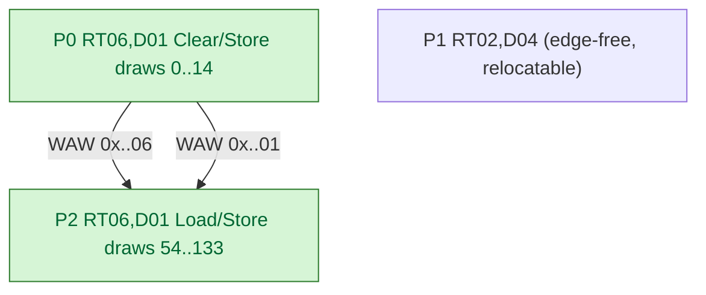

# DAG WAR/WAW Edges Make the H6 Re-entry Coalesce Machine-Decidable (frame50)

**Question / hypothesis.** [[render-pass-store-passchain.01]] left H6
(*dependency-aware pass reordering/coalescing is the real lever*) **OPEN**, and
[[render-pass-store-reentry-distance.01]] characterized the dominant re-entry by
hand (H8 distance-1 RT+depth-both-changed; H14 opaque-depth-write `Clear+Store`
↔ depth-read `Load+Store`). The `specs/d3d9-renderer/` modern-renderer Frame
Graph now builds a per-chunk DAG and (R-BACK-32.9) a complete hazard-edge set
(RAW + WAR + WAW). **Does the DAG represent the same-RT/depth re-entry as a
machine-decidable, structurally-safe coalesce candidate on real GT1 frames — i.e.
operationalize H6 — without hand analysis?**

**Method.** Ran 3DMark05 GT1 on the **default `traditional` render path** (no
`render_mode` switch — the DAG observe/export is backend-agnostic, R-BACK-39.7)
with `DXMT9_RENDERER_DUMP_DAG` over a frame window
(`traces/app-d3d9-3dmark05-dagcheck-trad/analysis/dag/`, `status: pass`), then
read the pre-opt/post-opt DAG JSON for frame50 (chunk50). The DAG is a pure
observation side-channel; the Metal encode stays byte-identical
(`encoders::encodeChunk`). Before the WAR/WAW work the same frame reported
`edges=0` (RAW-only could not see write→write re-entry).

**Result.** frame50 = 10 passes / 39 resources / **6 edges**. The dominant
re-entry pair:

| Pass | color | depth | load/store (color · depth) | draws | role (H14) |
|---|---|---|---|---|---|
| P0 | `0x..a00000006` | `0x..100000001` | `Clear/Store` · `Clear/Store` | 0..14 | opaque depth-write |
| P1 | `0x..aa0000002` | `0x..100000004` | `Clear/Store` · `Clear/Store` | 14..54 | other target (intervening) |
| P2 | `0x..a00000006` | `0x..100000001` | `Load/Store` · `Load/Store` | 54..133 | depth-read re-entry |

Edges arriving at the re-entry pass P2: **`P0→P2` on color `0x..06` AND
`P0→P2` on depth `0x..01`** — both attachments' re-entry now surface as WAW
edges (matching H5's ~50/50 color/depth budget). The full 6-edge set shows the
only edges on those two handles are the single `P0→P2` pair, and **P1 is
edge-free** (no edge touches it).

This is a textbook H8/H14 instance, and the DAG makes the H6 coalesce decision
mechanical:

- **Candidate**: P0 and P2 share the same `AttachmentSet` (color `0x..06` +
  depth `0x..01`) → passcoalesce pair candidate.
- **Ordering**: the `P0→P2` WAW edges forbid reordering P2 before P0.
- **Safety (no intervening writer)**: the *only* edges on `0x..06`/`0x..01` are
  `P0→P2`, so nothing writes those attachments between P0 and P2 → P2's `Load`
  reads exactly P0's `Store` → merging preserves contents.
- **Relocatability**: P1 is edge-free → passcoalesce `reaches()` classifies it
  `Before`/`After` → freely moved out of the pair.
- **Saving**: the eliminable work is the color+depth `Store→Load` round-trip,
  encoded in the `Clear/Store` (P0) ↔ `Load/Store` (P2) actions — coalescing
  P0+P2 keeps both attachments in tile memory across the merged pass.

**Why this matters beyond "an edge appeared.** With `edges=0` (RAW-only),
passcoalesce had *no information* about the intervening pass and would have
merged on default classification — correct here only by accident, and **unsafe in
general** (a P1 that wrote `0x..06` would have been missed). The complete
RAW+WAR+WAW model makes the judgment **sound**: such a P1 would now produce
`P0→P1`/`P1→P2` edges and be classified `Blocked`. frame50 is a true-positive
either way; the gain is soundness.

**Limits (honest).** (1) The WAW edge is the candidate/ordering/no-intervening-
writer signal, **not** the saving itself — the eliminable round-trip lives in the
load/store actions; byte savings need the preservation-bytes counter. (2) The
builder records the attachment `Load` as a write, so the re-entry is a WAW (not a
RAW); ordering is enforced identically. (3) **Byte-equal proof of an actual
coalesce is the device-gated frontier** — production encode still goes through
`encodeChunk`, so passcoalesce changes only the observed/exported DAG, not the
Metal stream, until `fg_linearizer::executeLinearization` drives the encode. (4)
Per-chunk only (R-BACK-32.1); cross-chunk re-entry is invisible.

**Verdict.** Accepted as tooling/characterization. The Frame Graph DAG +
RAW/WAR/WAW edges turn H6 from a hand-characterized pattern into a per-frame,
machine-decidable, structurally-safe coalesce candidate: candidate identity,
ordering, no-intervening-writer safety, and the eliminable round-trip are all
read directly from the dump. Executing the coalesce in the Metal stream and
proving byte-equal output + measuring the preservation-byte saving remain the
device-gated next step ([[render-pass-store-coalesce.02]]).

**Related.** [[render-pass-store]] · [[render-pass-store-passchain.01]] (H6) ·
[[render-pass-store-reentry-distance.01]] (H8/H14) ·
[[render-pass-store-memoryless.01]] (H7, coupled to H6) ·
[[overview-3dmark05-gt1]].
