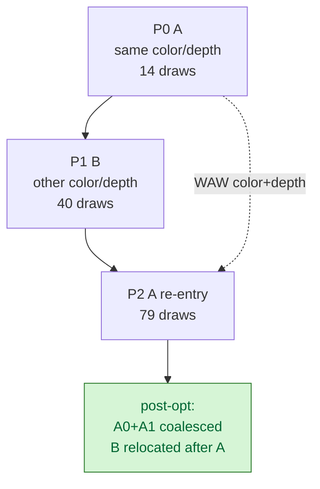

# Current Frame60 DAG Refresh Keeps H6 Coalesce Candidate Alive

> **Outdated — every artifact this leaf cites in `source:` is gone from disk.** The numbers below cannot be re-derived or re-checked. Kept as history; do not cite it as current evidence.

**Question / hypothesis.** After the latest CPU copy-policy and indexed-path
cleanup work, does the framegraph sidecar still see the same local
`A -> B -> A` same-attachment re-entry that [render-pass-store-coalesce.04](render-pass-store-coalesce.04.md)
classified as the real P1 pass-store lever?

**Method.**

```sh
bash scripts/tools/run_3dmark05_perf_probe.sh \
  --suffix framegraph-dag-passcoalesce-r1-20260614 \
  --frame 60 \
  --no-gputrace \
  --timeout 120 \
  --dump-framegraph-dag \
  --framegraph-dag-frame 60 \
  --framegraph-dag-frame-radius 2 \
  --framegraph-dag-formats json,mermaid \
  --framegraph-dag-optimize passcoalesce
```

The run is a DAG sidecar, not a low-overhead FPS sample:
`DXMT9_PERF_ENCODER_BREAKDOWN=1` and DAG dumping are active. It
timeout-finalized with `status=pass`, `present_encoded=1800`, and a normal
machine-gun muzzle-flash frame.

**Run-level preservation shape.**

| Counter | Value |
|---|---:|
| `render_pass_tile_preservation_bytes` | `211.286 GiB` |
| `render_pass_same_key_reentry_preservation_bytes` | `85.918 GiB` (`40.66%`) |
| color / depth re-entry preservation | `42.959 / 42.959 GiB` |
| distance-1 RT+depth re-entry preservation | `81.430 GiB` (`38.54%`) |
| distance-1 same-key re-entries | `3,690 / 4,073` |
| `framegraph_dag_dumps_written` | `5` |
| `framegraph_passes_built` | `50` |
| `framegraph_passes_coalesced` | `5` |

**DAG result.**

| Window | Pre-opt | Post-opt |
|---|---:|---:|
| files | `5` | `5` |
| passes per frame | `10` | `9` |
| render passes per frame | `9` | `8` |
| same-attachment re-entry pairs | `5` | `0` |
| safe-relocatable candidates | `5` | `0` |

Frame60 pre-opt has the same local shape as the older coalesce runs:

| Pass | Draw range | Attachment shape | Role |
|---|---:|---|---|
| P0 | `0..13` | color `0x300000d00000007`, depth `0x300000100000001` | A producer |
| P1 | `14..53` | color `0x300000d00000006`, depth `0x300000100000004` | intervening B |
| P2 | `54..132` | color `0x300000d00000007`, depth `0x300000100000001` | A re-entry |

The pre-opt candidate reports `P0 -> P2`, distance `1`, color+depth direct
edge resources, no intervening same-attachment accesses, and no intervening
edge count. The post-opt DAG moves the edge-free intervening pass after the
coalesced A work: P0 becomes draw range `0..92`, and P1 becomes `93..132`.



**Verdict.** Accepted as a structural refresh. The current code state still has
the H6 local passcoalesce opportunity, and the analysis optimizer still removes
all frame58..62 same-attachment pairs from the exported post-opt DAG.

**Limit.** This does not prove a production FPS or Xcode counter win. The
Metal stream still uses the traditional order; post-opt only changes the
exported DAG snapshot and `framegraph_*` observe counters. Promotion still
requires a device-gated executor, byte-equal output, and gputrace/Xcode
counter evidence.

**Related.** [render-pass-store](index.md) · [render-pass-store-coalesce.04](render-pass-store-coalesce.04.md) ·
[render-pass-store-coalesce.02](render-pass-store-coalesce.02.md) · [hidden-backend-storage](../hidden-backend-storage/index.md) ·
[present-pacing](../present-pacing/index.md).
