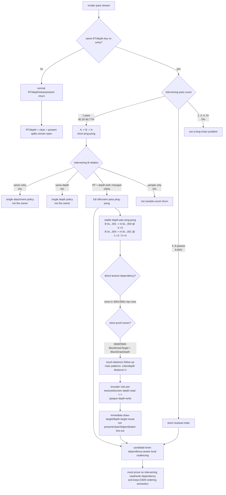

# Same-Key Re-entry Distance Distribution

**Question / hypothesis.** The previous re-entry measurements proved that same
RT/depth pairs are reopened after intervening passes, but not whether this is a
long dependency chain or a short ping-pong pattern. Which distance class owns the
same-key re-entry budget?

**Method.** Added per-frame distance buckets for every same-key re-entry:
`render_pass_same_key_reentry_distance_1`, `_2`, `_3_4`, `_5_8`, `_9_16`, and
`_17_plus`. A distance of `1` means the same attachment key reappears after one
intervening pass: `A -> B -> A`. Validation run:
`experiments/output/app-d3d9-3dmark05-pass-reentry-distance-noenc-r1/`.

Then added distance-1 shape buckets to classify the intervening `B` pass against
the reopened `A` key: same color, same depth, RT+depth both changed, or
sample-count-only. Shape validation run:
`experiments/output/app-d3d9-3dmark05-pass-reentry-shape-noenc-r1/`.

Finally added an opt-in `DXMT9_PERF_RENDER_PASS_REENTRY_TOP=8` diagnostic that
emits bounded `[dxmt9-perf-render-pass-reentry ...]` rows per Present. The
summary keeps the raw CSV and aggregates rows inside the same counter window as
the last `[dxmt9-perf]` snapshot (`last_seq <= present_encoded`). The first
top-pair run only recorded the reopened `A` encoder span, which made the
reported `3->3` / `2->4` paths ambiguous. The corrected follow-up records the
actual intervening `B` pass seq/encoder and reports true `B->A` paths:
`experiments/output/app-d3d9-3dmark05-pass-reentry-btop-pairs-noenc-r1/`.

The latest follow-up keeps the same top diagnostic but delays row recording
until the reopened `A` pass ends. That lets the tracker aggregate texture reads
for the full `B` pass and the full reopened `A` pass, then classify whether
`B` samples the previous `A` attachment or `A` samples the intervening `B`
attachment:
`experiments/output/app-d3d9-3dmark05-pass-reentry-deps-noenc-r1/`.

The latest run adds the per-pass color/depth store proof for both `B` and the
reopened `A`, so the same top rows can show which live-out/order condition keeps
their stores conservative:
`experiments/output/app-d3d9-3dmark05-pass-reentry-liveout-noenc-r1/`.

The touch-distance follow-up extends the same top diagnostic with the first
future command distance that caused each color/depth proof. This distinguishes a
vague later live-out from an immediate target reuse. Validation run:
`experiments/output/app-d3d9-3dmark05-pass-reentry-touch-distance-noenc-r1/`.
The summary now also joins the re-entry CSV against
`3dmark05-perf-encoders.csv` on `seq/encoder` and `last_b_seq/last_b_encoder`,
so the same rows can be classified by encoder role without adding another
runtime counter.
The parser/summary path now also understands per-encoder pass action fields
(`color0_*`, `depth_*`, `stencil_*`, and preservation bytes). This specific run
predates those fields, so the regenerated role-pair table reports pass action as
`unknown`; the next encoder-breakdown run is needed to split these role pairs by
actual Load/Store/Clear shape.

The pass-action follow-up then ran the same probe with encoder breakdown and
`DXMT9_PERF_RENDER_PASS_REENTRY_TOP=12`:
`experiments/output/app-d3d9-3dmark05-pass-action-reentry-no-gputrace-r1/`.
It timeout-finalized at the watchdog and synthesized `partial-log` summary data,
so it is still a counter/encoder-breakdown sample rather than Xcode GPU
ownership proof. It produced `3487` raw re-entry rows, `3430` counter-window rows,
`19929` encoder rows, and populated pass action shapes for the role-pair join.

A smaller no-encoder follow-up verified the actual log/CSV row format for
`prior_a_seq`, `prior_a_encoder`, and `prior_a_pass`:
`experiments/output/app-d3d9-3dmark05-pass-reentry-prior-a-noenc-r1/`. After
raw-log cleanup the summary regenerates as `partial-summary` from the saved
CSV, with `2875` raw re-entry rows, `2758` counter-window rows, and
`present_encoded=1440`. Because that run intentionally disabled encoder
breakdown, it only proves the A1/B/A2 row fields are emitted and preserved; a
full encoder-breakdown rerun is still required to join A1/B/A2 roles and pass
actions.

The older distance/shape/deps/live-out runs were no-gputrace counter smokes; the
new action-shape run is no-gputrace but includes encoder breakdown. None of
these runs should be treated as an Xcode GPU-counter proof.

**Result.**

| Counter | Value | Reading |
|---|---:|---|
| `present_encoded` | `1,680` | full timeout-finalized run shape |
| `draw_calls` | `1,236,247` | comparable GT1-class workload |
| `render_pass_begin` | `19,749` | pass churn remains high |
| `render_split_rt_change` | `13,162` | dominant split reason |
| `render_split_clear` | `4,914` | clear split reason |
| `render_split_present` | `1,673` | present split reason |
| `render_split_hazard` | `0` | hazard is not the split owner |
| `render_pass_tile_preservation_bytes` | `211,229,233,152` | ~120.00 MiB/present |
| `render_pass_same_key_reentry` | `3,771` | ~2.24 re-entries/present |
| `render_pass_same_key_reentry_preservation_bytes` | `84,691,386,368` | ~48.08 MiB/present |

Distance distribution:

| Distance bucket | Value | Share of re-entry |
|---|---:|---:|
| `distance_1` | `3,407` | `90.35%` |
| `distance_2` | `0` | `0.00%` |
| `distance_3_4` | `0` | `0.00%` |
| `distance_5_8` | `364` | `9.65%` |
| `distance_9_16` | `0` | `0.00%` |
| `distance_17_plus` | `0` | `0.00%` |

Shape follow-up:

| Counter | Value | Reading |
|---|---:|---|
| `present_encoded` | `1,740` | comparable timeout-finalized run shape |
| `render_pass_same_key_reentry` | `3,944` | ~2.27 re-entries/present |
| `render_pass_same_key_reentry_distance_1` | `3,580` | `90.77%` of re-entry |
| `render_pass_same_key_reentry_distance_5_8` | `364` | `9.23%` residual |
| `render_pass_same_key_reentry_distance_1_rt_depth_change` | `3,580` | `100.00%` of distance-1 |
| `render_pass_same_key_reentry_distance_1_rt_depth_change_preservation_bytes` | `85,232,451,584` | all one-hop preservation bytes |
| `render_pass_same_key_reentry_distance_1_same_color` | `0` | no same-color/different-depth ping-pong |
| `render_pass_same_key_reentry_distance_1_same_depth` | `0` | no different-color/same-depth ping-pong |
| `render_pass_same_key_reentry_distance_1_sample_change` | `0` | no sample-count-only ping-pong |

Top dependency / live-out follow-up:

| B depth | A depth | B->A encoder path | Count | Preservation bytes | Bytes/event | B reads A | A reads B | B store proof | A store proof | Frames |
|---|---|---|---:|---:|---:|---|---|---|---|---:|
| `0x300000100000001` | `0x300000100000004` | `2->3` | `679` | `45,566,918,656` | `67,108,864` | `none` | `none` | `color=BlockDrawTarget; depth=BlockDrawDepth` | `color=BlockDrawTarget; depth=BlockDrawDepth` | `679` |
| `0x300000100000004` | `0x300000100000001` | `1->2` | `1,679` | `21,126,709,248` | `12,582,912` | `none` | `none` | `color=BlockDrawTarget; depth=BlockDrawDepth` | `color=BlockDrawTarget; depth=BlockDrawDepth` | `1,679` |
| `0x300000100000004` | `0x300000100000001` | `3->4` | `1,046` | `13,161,725,952` | `12,582,912` | `none` | `none` | `color=BlockDrawTarget; depth=BlockDrawDepth` | `color=BlockDrawTarget; depth=BlockDrawDepth` | `1,046` |

Touch-distance follow-up:

| B depth | A depth | B->A encoder path | Count | Preservation bytes | Bytes/event | B next touch | A next touch | Reading |
|---|---|---|---:|---:|---:|---|---|---|
| `0x300000100000001` | `0x300000100000004` | `2->3` | `536` | `35,970,351,104` | `67,108,864` | `color=1; depth=1` | `color=1; depth=1` | immediate reuse on both sides |
| `0x300000100000004` | `0x300000100000001` | `1->2` | `1,522` | `19,151,192,064` | `12,582,912` | `color=1; depth=1` | `color=1; depth=1` | immediate reuse on both sides |
| `0x300000100000004` | `0x300000100000001` | `3->4` | `1,050` | `13,212,057,600` | `12,582,912` | `color=1; depth=1` | `color=1; depth=1` | immediate reuse on both sides |

Encoder-role join follow-up:

| B role | A role | Count | Preservation bytes | Byte share | Avg B draws | Avg A draws | Reading |
|---|---|---:|---:|---:|---:|---:|---|
| `textured-depth-read-opaque` | `opaque-depth-write-untextured` | `510` | `34,225,520,640` | `42.48%` | `6.755` | `206.025` | small textured/depth-read pass immediately followed by large opaque depth-write pass |
| `opaque-depth-write-untextured` | `screen-blend-depth-read` | `1,672` | `21,038,628,864` | `26.11%` | `196.340` | `207.227` | large opaque depth-write pass immediately followed by large screen-blend/depth-read pass |
| `opaque-depth-write-untextured` | `textured-depth-read-opaque` | `900` | `11,324,620,800` | `14.05%` | `202.594` | `10.648` | large opaque depth-write pass immediately followed by small textured/depth-read pass |

Pass-action role join follow-up:

| B role | A role | B pass action | A pass action | Count | Preservation bytes | Byte share | Reading |
|---|---|---|---|---:|---:|---:|---|
| `textured-depth-read-opaque` | `opaque-depth-write-untextured` | `c0=load/store; d=load/store` | `c0=clear/store; d=clear/store` | `517` | `34,695,282,688` | `42.78%` | depth-read pass is preserved by Load+Store on both color/depth, then an opaque depth-write pass clears and stores both attachments |
| `opaque-depth-write-untextured` | `screen-blend-depth-read` | `c0=clear/store; d=clear/store` | `c0=load/store; d=load/store` | `1,674` | `21,063,794,688` | `25.97%` | opaque depth-write clear/store pass is followed by large screen-blend depth-read load/store pass |
| `opaque-depth-write-untextured` | `textured-depth-read-opaque` | `c0=clear/store; d=clear/store` | `c0=load/store; d=load/store` | `903` | `11,362,369,536` | `14.01%` | opaque depth-write clear/store pass is followed by small textured depth-read load/store pass |

The action-shape run's run-level values stayed in family:
`present_encoded=1680`, `draw_calls=1,231,191`, `render_pass_begin=19,720`,
`render_split_rt_change=13,165`, `render_split_clear=4,882`,
`render_split_present=1,673`, `render_split_hazard=0`,
`render_pass_tile_preservation_bytes=211,899,740,160`,
`render_pass_same_key_reentry=3,787`, `distance_1=3,430` (`90.57%`), and
`render_pass_same_key_reentry_distance_1_rt_depth_change=3,430` (`100%` of
distance-1). It also keeps correctness/perf coupling quiet for skipped/error
paths: `draw_skipped_no_pipeline=0`, `gpu_command_buffer_errors=0`,
`hazard_bloom_false_positive=100,690`, `hazard_exact=0`,
`map_buffer_wait_ms=0`, and `queue_sequence_wait_ms=0`.

The same run keeps the run-level shape stable:
`present_encoded=1680`, `render_pass_same_key_reentry=3771`,
`distance_1=3418` (`90.64%`), `distance_5_8=353`,
`render_pass_same_key_reentry_distance_1_rt_depth_change=3418`, and
`render_pass_tile_preservation_bytes=211,064,471,552`.

The exact RT handles rotate, so exact A/B pairs have low counts. The stable
signal is the depth-pair direction plus bytes/event and true `B->A` encoder
path: one-hop ping-pong repeatedly switches between depth handles `0x...001`
and `0x...004`, with rotating color RTs.

The dependency bits are a separate result. All raw top rows in
`pass-reentry-deps-noenc-r1` are `0,0,0,0` for
`b_reads_a_color,b_reads_a_depth,a_reads_b_color,a_reads_b_depth`
(`3561 / 3561` rows). Inside those render passes, the intervening `B` pass does
not texture-sample the previous `A` attachments, and the reopened `A` pass does
not texture-sample the intervening `B` attachments. This does **not** by itself
prove that reordering/coalescing is legal: it only removes the direct
attachment-as-texture dependency blocker. Live-out ordering, clears, present
source ownership, later draw-target reuse, and helper ops still need proof.
The live-out proof run narrows that list: every raw top row reports
`0,0,0,0,4,5,4,5` for
`b_reads_a_color,b_reads_a_depth,a_reads_b_color,a_reads_b_depth,a_color_proof,a_depth_proof,b_color_proof,b_depth_proof`
(`3569 / 3569` rows). Numeric proof values `4` and `5` are
`BlockDrawTarget` and `BlockDrawDepth`. The touch-distance run then makes this
stronger: the dominant top patterns are not merely live at some later point.
Their `BlockDrawTarget` / `BlockDrawDepth` first-touch distance is `1` on both
color and depth for both `B` and reopened `A`. Therefore the current blocker is
not a present source, clear, helper op, direct texture read, or distant
live-out. The top ping-pong targets become draw targets again immediately.
The encoder-role join then rejects "role-random scheduler problem" as the next
explanation. The dominant byte owner is a stable local alternation between
textured/screen-blend depth-read passes and opaque untextured depth-writing
passes. That does not make reordering safe, but it sharply narrows the next
proof to whether those role pairs can be kept in one producer/consumer chain or
locally reordered without changing depth-test, blend, and load/clear semantics.
The pass-action follow-up makes the load/clear side explicit: the depth-read
side is consistently `Load+Store` on both color and depth, while the opaque
depth-writing side is consistently `Clear+Store` on both color and depth. A
coalescer therefore cannot be framed as "skip a redundant store before an
immediate clear" for the dominant role pairs. It has to prove that reordering
`Load+Store` depth-read work around `Clear+Store` opaque work preserves D3D9
depth/blend semantics and any later texture use.

**Interpretation.** The re-entry problem is not a broad long-distance scheduling
issue. It is dominated by very short attachment ping-pong. The shape follow-up
rules out the easiest local cases: distance-1 is not same-color/different-depth,
not different-color/same-depth, and not sample-count churn. It is `100%`
RT+depth-both-changed. That makes the next design question more concrete and
harder: can a local dependency-aware coalescer keep `A` open across a completely
different offscreen `B`, or legally move the `B` work, without changing loads,
clears, presentation order, or later texture/depth reads?

The top-pair diagnostic makes that dependency question less abstract. Exact RT
handles rotate, but the large owner is a stable depth-pair ping-pong. In actual
intervening-pass order, `B depth 0x...001 -> A depth 0x...004` at encoder path
`2->3` owns `45.57 GB` of sampled one-hop preservation bytes. The reverse
direction, `B depth 0x...004 -> A depth 0x...001`, is split across `1->2`
(`21.13 GB`) and `3->4` (`13.16 GB`). The dependency follow-up then shows these
top one-hop paths are not blocked by direct texture sampling between adjacent
passes: `B reads A = none` and `A reads B = none`. The live-out follow-up says
the store proof is uniformly `BlockDrawTarget` / `BlockDrawDepth` for both
sides. The touch-distance follow-up now says the dominant patterns hit those
draw-target/depth-target blockers at distance `1`, so the pass stream is closer
to a strict alternating producer pattern than a distant live-out problem. The
encoder-role join says the strict alternating pattern is mostly
textured/screen-blend depth-read work against opaque untextured depth-write work.
The next proof should therefore classify draw-state and clear/load compatibility
for the immediate sequence and whether a local `A1, B, A2 -> A1, A2, B` reorder
can preserve command order semantics for those role pairs.

The cheap DontCare path is still rejected for GT1: color store DontCare remains
`0`, color proof blocks are dominated by `draw_target` and `present`, and the
same-key preservation is preserve-before-load. The new distance split does not
make store discard safe by itself. It only says that if coalescing is attempted,
the first target should be the `A -> B -> A` cases, not a global pass scheduler.

**Verdict.** Accepted as a counter sample. Same-key re-entry is still a large P1
GPU-memory budget, and `~90%` of it is one-hop. The one-hop owner is not a
single-attachment churn bug: it is RT+depth-both-changed ping-pong. The next
render-pass-store experiment should classify immediate draw-target/depth-target
ordering on the actual `B->A` role pairs, then decide whether a local coalesce
or a memoryless/transient chain can be made correctness-preserving. The corrected
top-pair run refines "actual pairs" into "rotating RTs under a stable depth-pair
/ true `B->A` encoder-path pattern"; the dependency run says direct attachment
texture reads are not the blocker; the live-out run says later draw-target/depth
target reuse is the blocker; the touch-distance run says that reuse is usually
immediate; the encoder-role join says the useful selector is role-pair class,
not exact handle identity. Exact handle counts are not the useful selector.

**Related.** [[render-pass-store]] · [[render-pass-store-reentry.01]] ·
[[render-pass-store-passchain.01]] · [[render-pass-store-dontcare.02]] ·
[[baselines-frame60.03]]
