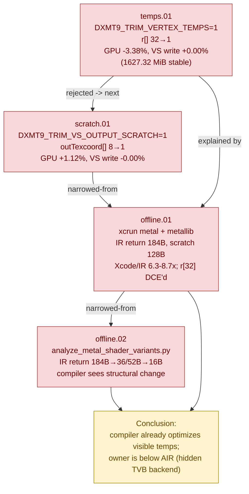

# Shader Codegen — translated-VS temp/scratch trim and offline Metal compiler inspection

> Part of the 3DMark05 GT1 GPU-bottleneck investigation. Root map: [[overview-3dmark05-gt1]].

## Scope & question

This domain attacks the hidden `VS Buffer Device Memory Bytes Written` bucket
from the **translated-shader codegen** angle: does the conservative shape of
dxmt9's translated vertex shaders (the 32-slot `float4 r[]` temp array, the
8-slot `outTexcoord[]` output scratch, the wide `VSOut` return struct) inflate
the bucket? It pairs runtime A/B trims with offline Apple Metal compiler/IR
inspection (`xcrun metal`, metallib, objdump) to separate source-visible MSL
shape from what the compiler and backend actually emit. The unanimous result:
codegen-visible shape is **not** the owner — the bucket lives below the
AIR-visible shape.

## Hypotheses & verdicts

| # | Hypothesis | Verdict | Evidence |
|---|-----------|---------|----------|
| H1 | The conservative `float4 r[32]` translated temp array inflates the VS write bucket | rejected | [[shader-codegen-temps.01]] |
| H2 | The conservative `float4 outTexcoord[8]` output scratch inflates the bucket | rejected | [[shader-codegen-scratch.01]] |
| H3 | Compiler-visible IR (return + scratch) is large enough to own the bucket | rejected | [[shader-codegen-offline.01]] |
| H4 | The Metal compiler cannot see VSOut structural reductions, so source width is the lever | rejected | [[shader-codegen-offline.02]] |

## Verification methods

- **`DXMT9_TRIM_VERTEX_TEMPS=1`** — sizes `r[]` from observed max temp index;
  proves the source-visible temp array is decoupled from the Xcode VS-write
  counter. Exposed via `run_3dmark05_perf_probe.sh --trim-vertex-temps`.
- **`DXMT9_TRIM_VS_OUTPUT_SCRATCH=1`** — sizes `outTexcoord[]` from emitted
  texcoord usage; proves the output scratch is decoupled too. Exposed via
  `--trim-vs-output-scratch`. Both flags are in the shader source debug-env key
  so the PSO/source cache cannot serve a stale source across the A/B.
- **`xcrun metal` + metallib offline compile** (`analyze_metal_shader_codegen.py`)
  — compiles the matched top MSL with Apple's toolchain and summarizes IR return
  / local scratch without leaving `.air`/`.metallib`; proves the compiler already
  DCEs `r[32]` and quantifies the Xcode/IR ratio.
- **AIR objdump** (`xcrun metal -frecord-sources -gline-tables-only -c` +
  `xcrun metal-objdump`) — proves the top VS functions have zero AIR
  allocas/stores (`readonly` attr), ruling out frontend AIR-level spills.
- **`analyze_metal_shader_variants.py`** — offline structural-variant classifier
  (original / live-vsout / position-only); proves the compiler does see VSOut
  reductions (`184B → 36/52B → 16B`) even though runtime trims did not move the
  bucket. Offline-only; does not replace a runtime counter A/B.
- Finalizer gates that enforced rejection:
  `--require-top-vs-buffer-write-decrease`,
  `--require-top-unexplained-buffer-write-decrease`,
  `--max-top-unexplained-buffer-write-ratio 0.50`.

## Experiment dependency graph



## Results synthesis

Every codegen-side lever was tried and rejected. The runtime trims
([[shader-codegen-temps.01]], [[shader-codegen-scratch.01]]) demonstrably changed
the generated MSL (`r[32]→r[1]`, `outTexcoord[8]→outTexcoord[1]`) yet left
`top_vs_buffer_write_mib` flat at ~`1627.3 MiB` with
`top_unexplained_buffer_write_ratio = 1.000`; the only movement was uncorrelated
GPU-time noise (`-3.38%` then `+1.12%`). Offline compilation
([[shader-codegen-offline.01]]) then explained *why*: the Apple compiler already
DCEs the large `r[32]` array, leaving a single `128B` scratch and a `184B` IR
return — and the AIR objdump shows zero stores/allocas in the top VS functions.
The measured Xcode VS write is `6.3x`–`8.7x` larger than that IR return
(`1151–1603 B/invocation` vs `184 B`), so the visible/AIR shape simply cannot
account for the bucket. The variant study ([[shader-codegen-offline.02]])
confirmed the compiler *does* honour structural VSOut reductions
(`184B → 36/52B → 16B`), which closes the last "maybe the compiler can't see it"
escape: the bucket is below source-visible VSOut return width.

Settled: source-visible temp width, output scratch, IR return/scratch, and
AIR-level spills are all rejected as the first-order owner. Open within this
domain: nothing further on the codegen axis is expected to move the counter — the
investigation hands off to hidden-backend storage. The next useful lever is a
legal Metal pipeline/backend shape that changes hidden vertex/tiler/parameter
storage, or a reduction in submitted indexed primitive work (VS invocations).

## How to run
Every experiment here is a 3DMark05 GT1 run via the standard wrapper for the
runtime A/B, plus offline `xcrun metal` analysis of the dumped MSL. Capture with a
VS temp/scratch trim flag and `--dump-shaders`, then finalize and inspect the IR:

```sh
bash scripts/tools/run_3dmark05_perf_probe.sh --suffix vs-trim --frame 60 \
  --trim-vertex-temps --dump-shaders --timeout 420
# also: --trim-vs-output-scratch

bash scripts/tools/finalize_3dmark05_perf_probe.sh --suffix vs-trim --frame 60 \
  --baseline-joined traces/<baseline>/analysis/frame60-xcode-dxmt-joined-summary.csv \
  --require-shader-dump-matches --require-top-vs-buffer-write-decrease \
  --max-top-unexplained-buffer-write-ratio 0.50

# Offline IR/scratch analysis of the matched top MSL (no runtime needed):
python3 scripts/tools/analyze_metal_shader_codegen.py \
  traces/<run>/analysis/frame60-shader-dump-summary.csv \
  --shader-dir traces/<run>/analysis/shaders/msl \
  --output traces/<run>/analysis/frame60-codegen.md \
  --csv-output traces/<run>/analysis/frame60-codegen.csv
```

The exact per-experiment flags live in each leaf's `**Method.**` field. See
`agents/rules/environment_variables.rules.md` for env-var meanings and
`agents/rules/metal_debugging.rules.md` for the full workflow.

## Cross-references

- [[hidden-backend-storage]] — the surviving owner: hidden Apple GPU
  vertex-stage / tiler / parameter (TVB) backend storage that the IR return is
  `6–9x` too small to explain.
- [[vsout-layout]] — the runtime VSOut-width trim probes (`DXMT9_TRIM_UNUSED_VARYINGS`,
  point-size, position-only, half-VSOut) that this domain's offline variants
  correspond to; both reject visible varying width as the owner.
- [[overview-3dmark05-gt1]] — root priority DAG and central finding.
