# Snapshot Cache — D3D9 frontend draw-state snapshot/rebuild CPU bottleneck

> Part of the 3DMark05 GT1 GPU-bottleneck investigation. Root map: [[overview-3dmark05-gt1]].

## Scope & question

This domain owns the **D3D9 importer-side draw-state snapshot/rebuild** cost.
It started as the single largest CPU consumer in GT1 (~21s per no-gputrace run),
but after the accepted snapshot hash work it is no longer the top current CPU
bucket: [[snapshot-cache-snapshot.09]] reports
`d3d9_snapshot_draw_submission_cpu_ms=7196.881` over `1740` presents, while
backend `encode_draw_cpu_ms` is `17711.215`.
It covers the `CachedBaseDrawState` instrumentation, the hot-state/uniform
invalidation split, the miss-reason classification (which found stream/IB handle
churn dominates), the binding-agnostic snapshot that tripled hit rate but exposed a
PSO-prefetch/texture mismatch, and the layout-stride fix that made PSO prefetch
functional again. It is a **CPU track**, distinct from the GPU "hidden VS buffer
write" owner ([[hidden-backend-storage]]).

## Hypotheses & verdicts

| # | Hypothesis | Verdict | Evidence |
|---|-----------|---------|----------|
| H1 | Snapshot rebuild is a first-class CPU bottleneck; the base cache serves zero hits | confirmed (model) | [[snapshot-cache-snapshot.01]] |
| H2 | Splitting hot-state vs uniform-only invalidation lifts hits and cuts CPU | partial / inconclusive (hits 0→126k, CPU −3% only) | [[snapshot-cache-snapshot.02]] |
| H3 | Remaining misses are dominated by stream/IB handle churn | confirmed (model) | [[snapshot-cache-snapshot.03]] |
| H4 | A binding-agnostic snapshot (stream/IB carried in override) raises hit rate | accepted hit-rate (16.5%→46.3%) but regresses pipeline-lookup CPU | [[snapshot-cache-binding.01]] |
| H5 | Preserving extra-stream stride in the layout restores usable PSO prefetch | accepted | [[snapshot-cache-prefetch.01]] |
| H6 | Fixing the snapshot/prefetch path reduces the GPU bottleneck | rejected (GPU owner unchanged; CPU/pacing waits remain) | [[snapshot-cache-prefetch.01]] |
| H7 | Snapshot submission CPU is owned by copy/override work after cache reuse | rejected; cache lookup itself owns 94.08% | [[snapshot-cache-snapshot.04]] |
| H8 | Reusing uniform component hashes removes duplicated cache-lookup hashing | accepted CPU win; snapshot CPU/present -39.21%, lookup/present -41.73% | [[snapshot-cache-snapshot.05]] |
| H9 | Same-value D3D9 state setters are causing avoidable snapshot invalidation | rejected; temporary no-op counters were all `0` | [[snapshot-cache-snapshot.06]] |
| H10 | Remaining uniform payload build cost is large state copy / FFP construction | rejected; `hashDrawUniformPayload()` owns ~85.75% of combined parent build | [[snapshot-cache-snapshot.07]] |
| H11 | Shader-usage/range-aware uniform payload hashing can remove the full payload hash cost | accepted CPU win; hash/build `11.322us→2.590us`, parent build `13.204us→4.372us` | [[snapshot-cache-snapshot.08]] |
| H12 | Non-bytecode/FFP shaders can avoid programmable constant full fallback | accepted CPU win; PS full fallback `84,380→0`, hash/build `2.590us→2.082us` | [[snapshot-cache-snapshot.09]] |
| H13 | Cache-hit uniform refresh can reuse non-constant payload fields and hashes | accepted CPU win; uniform refresh `2014.263ms→814.507ms`, snapshot submission `7622.807ms→6495.069ms`, FPS flat | [[snapshot-cache-snapshot.10]] |
| H14 | Current lookup residual belongs to the queued draw-submission batch lane, not direct/no-index ambiguity | accepted attribution; batch hit+miss `5692.001ms` matches lookup parent `5892.464ms`, direct miss `1283.032ms` is separate draw-run caller work | [[snapshot-cache-snapshot.11]] |
| H15 | Batch miss is dominated by uniform-build and hot-build, not shader-layout rebuild | accepted attribution; batch miss `4756.913ms` splits into uniform build `2083.529ms`, hot build `1774.774ms`, shader layout `607.942ms` | [[snapshot-cache-snapshot.12]] |
| H16 | Batch miss uniform-build is dominated by hashing, not copy or FFP construction | accepted attribution; batch uniform build `2175.433ms` splits into hash `1413.471ms` (`64.97%`), VS constant hash `490.107ms`, non-constant hash `677.447ms`; VS full fallback remains indexed-float (`73,676` calls) | [[snapshot-cache-snapshot.13]] |
| H17 | Batch miss non-constant hashes can be reused when non-constant uniform generation is unchanged | accepted CPU win; reuse hits `376,949 / 418,143` (`90.15%`), non-constant hash `677.447ms→73.490ms`, batch uniform build `2175.433ms→1591.208ms`, FPS flat | [[snapshot-cache-snapshot.14]] |
| H18 | Batch miss hot-build is dominated by repeated flat state-set materialization | accepted attribution; render-state `FlatStateSet` build `1202.861ms` owns the split, ahead of key build `485.840ms`, sampler `213.765ms`, and TSS `204.392ms` | [[snapshot-cache-snapshot.15]] |
| H19 | Batch miss flat-state sets can be reused by exact dirty generation | accepted CPU win; render/TSS/sampler flat reuse hit rates `90.12%` / `99.36%` / `79.93%`, hot-build `1.444→0.684ms/present`, snapshot submission `4.255→3.469ms/present`, FPS flat/noisy | [[snapshot-cache-snapshot.16]] |
| H20 | Same-generation/lane draws can also elide adjacent uniform snapshots | rejected for GT1; state elision fires `411,758` times, but uniform elision fires `0` times because `uniformGeneration` changes across those groups | [[snapshot-cache-snapshot.17]] |
| H21 | VS indexed-float fallback can safely hash full float constants but prefix int/bool tails | rejected as next target; safe tail reduction is real but only `20.720MB` / `5.47%` of batch VS-constant hash bytes | [[snapshot-cache-snapshot.18]] |

## Verification methods

- `d3d9_draw_state_cache_hits` / `_misses` / `_hit_with_index` / `_miss_with_index`
  / `_hit_no_index` / `_miss_no_index` / `_uniform_refreshes` — proves whether the
  base draw-state cache serves any hit and whether the indexed path is the misser.
- `d3d9_draw_state_cache_direct_{hits,misses}` plus the direct
  `{hit,miss}_{with,no}_index` split, and
  `d3d9_draw_state_cache_batch_{hits,misses}` — separates legacy/direct
  `cachedBaseDrawState()` callers from the draw-submission batch
  `cachedBaseDrawStateForSubmissionBatch()` lane. This removes the older
  ambiguity where binding-agnostic batch lookups and no-index direct lookups both
  landed in `_hit_no_index` / `_miss_no_index`.
- `d3d9_snapshot_draw_submission_cpu_ms` (+ `_max/_p50/_p95/_p99`) — the direct CPU
  proof that snapshot rebuild churn moved.
- `d3d9_snapshot_cache_lookup_cpu_ms`, `_uniform_copy_cpu_ms`,
  `_state_copy_cpu_ms`, `_debug_snapshot_cpu_ms`,
  `_binding_override_cpu_ms` — attribution for
  `snapshotDrawSubmissionFromCurrentState()` after binding-packet CPU work is
  no longer the local owner.
- `d3d9_snapshot_binding_override_stream_scans` / `_stream_records` /
  `_index_records` — proves whether the per-draw 16-stream scan is actually
  large enough to matter.
- `d3d9_snapshot_cache_hit_cpu_ms`, `_miss_cpu_ms`,
  `_direct_hit_cpu_ms`, `_direct_miss_cpu_ms`, `_batch_hit_cpu_ms`,
  `_batch_miss_cpu_ms`,
  `_uniform_refresh_cpu_ms`, `_uniform_build_cpu_ms`,
  `_uniform_hash_cpu_ms`, `_miss_uniform_build_cpu_ms`,
  `_miss_hot_build_cpu_ms`, plus
  `_direct_miss_{shader_layout,uniform_build,hot_build}_cpu_ms` and
  `_batch_miss_{shader_layout,uniform_build,hot_build}_cpu_ms` — splits
  `cachedBaseDrawState*()` lookup into hit/miss rebuild, then separates direct
  vs draw-submission batch ownership and miss-child ownership so a current
  no-gputrace run can identify whether the remaining lookup cost belongs to
  ordinary direct draws or the chunk-replay batch path.
- `d3d9_snapshot_uniform_build_{vs,ps}_const_hash_full_{no_usage,unknown,unknown_bytecode,unknown_non_bytecode,indexed_float,indexed_int,indexed_bool}`
  — classifies why usage-aware constant hashing had to fall back to full
  constant snapshots; this split proved the residual PS full fallback was
  non-bytecode/FFP, not bytecode scanner failure.
- `d3d9_snapshot_*_vs_const_hash_full_indexed_float_{min_safe_bytes,potential_saved_bytes}`
  — estimates the correctness-preserving sub-case where an indexed-float shader
  still needs the full float register file but can keep int/bool constant tails
  usage-prefix bounded. Use this as an opportunity counter only; the current GT1
  sample reports a small tail (`272B` per call), not a next large CPU lever.
- `d3d9_snapshot_cache_batch_miss_uniform_build_*` — repeats the uniform-build
  component timers and fallback counters only while the batch-miss
  `makeDrawUniformPayloadFromState()` call is active. This prevents the
  direct-miss and uniform-refresh paths from hiding the local owner.
- `d3d9_snapshot_cache_batch_miss_uniform_nonconst_hash_reuse_{hits,misses}` —
  proves whether the generation-gated batch miss path reused cached
  non-constant component hashes or had to rehash them.
- `d3d9_snapshot_cache_batch_miss_hot_build_*` — splits the batch-miss
  `makeFlatDrawStateRecordFromState()` child into zero-init, key build,
  binding/tail copies, and render/TSS/sampler `FlatStateSet` materialization.
  This is an attribution-only nested-timer split; use sibling ranking rather
  than exact closed-sum percentages.
- `d3d9_snapshot_uniform_{materialized,elided}{,_bytes}` — proves whether the
  opt-in same-generation/lane path could skip `DrawUniformPayload`
  materialization. In GT1 this closes as a no-opportunity target: state copy
  elision fires, uniform copy elision does not.
- `d3d9_draw_state_cache_miss_after_{draw_packet,stream,index_buffer,texture,shader,fvf_vdecl}`
  — classifies which state delta caused each remaining miss (stream/IB dominate).
- `commit_chunk_draw_delta_stream_handle` / `_ib_handle` — confirms real handle
  churn (not packet-mask noise) backing the miss pattern.
- `encode_draw_pso_prefetch_handle_available` / `_used` /
  `_bypass_binding_override` / `_binding_override_compatible` / `_incompatible` —
  proves the binding-override PSO prefetch is functional (available == used,
  bypass == 0) without the stream-less-layout texture regression.
- `encode_draw_pipeline_lookup_cpu_ms`, `encode_draw_stream_bind_cpu_ms`,
  `completion_wait_ms` — track the residual open CPU/pacing costs.
- Native: `drawRunSubmissionStatesCompatibleForBatch()` +
  `dxmt9-dod-replay-observer-spec` assert stream/IB + uniform changes stay
  batch-compatible while a texture change splits compatibility.

## Experiment dependency graph

```mermaid
flowchart TD
  classDef accepted fill:#d6f5d6,stroke:#2b7a2b,color:#063
  classDef rejected fill:#f8d7da,stroke:#a33,color:#600
  classDef open fill:#fff3cd,stroke:#a80,color:#640

  S1["snapshot.01\nno-gputrace probe\nhits=0, misses=760.9k\nsnapshot CPU 21.6s"]:::open
  S2["snapshot.02\ncache split\nhits 0→126k, CPU −3%"]:::open
  S3["snapshot.03\nmiss-reason\nstream 99.39% / IB 97.69%"]:::open
  B1["binding.01\nbinding-agnostic snapshot\nhit 16.5%→46.3%\nprefetch/texture regression"]:::rejected
  P1["prefetch.01\nlayout-stride fix\nprefetch available==used\nbypass=0"]:::accepted
  S4["snapshot.04\nsubphase split\nlookup=18.1s / 94.08%\ncopy+override small"]:::accepted
  S5["snapshot.05\ncomponent-hash reuse\nsnapshot/present 13.60→8.27ms\nlookup/present 12.81→7.46ms"]:::accepted
  S6["snapshot.06\nstate-set no-op guard\nall no-op counters=0\nno mechanism movement"]:::rejected
  S7["snapshot.07\npayload build split\nhash=9.75s / 11.32us per call\n~85.75% of parent"]:::accepted
  S8["snapshot.08\nusage-aware payload hash\nhash/build 11.32→2.59us\nparent/build 13.20→4.37us"]:::accepted
  S9["snapshot.09\nFFP known-zero usage\nPS full fallback 84k→0\nhash/build 2.59→2.08us"]:::accepted
  S10["snapshot.10\nuniform-refresh fast path\nrefresh 2014→815ms\nsnapshot CPU -14.8%"]:::accepted
  S11["snapshot.11\ndirect vs batch split\nbatch miss 4.73s\nlookup owner confirmed"]:::accepted
  S12["snapshot.12\nbatch miss child split\nuniform 2.08s\nhot 1.77s"]:::accepted
  S13["snapshot.13\nbatch uniform split\nhash 1.41s / 65%\nnonconst + VS indexed"]:::accepted
  S14["snapshot.14\nnonconst hash reuse\nreuse 90.15%\nnonconst 677→73ms"]:::accepted
  S15["snapshot.15\nhot-build split\nrender-state set 1.20s\nkey 0.49s"]:::accepted
  S16["snapshot.16\nflat-state reuse\nhot-build/present -52.6%\nsnapshot/present -18.5%"]:::accepted
  S17["snapshot.17\nuniform N-1 elision\nstate elides 411k\nuniform elides 0"]:::rejected
  S18["snapshot.18\nVS indexed-float shape\nsafe tail only 20.7MB\nreject next target"]:::rejected

  S1 -->|"hits=0 → split"| S2
  S2 -->|"−3% only → classify"| S3
  S3 -->|"stream/IB owner → carry as override"| B1
  B1 -->|"prefetch bypass regression → key by override layout"| P1
  P1 -->|"snapshot still 19s → split parent"| S4
  S4 -->|"lookup owner → split/reuse hash"| S5
  S5 -->|"could redundant setters invalidate state?"| S6
  S6 -->|"no-op rejected → split payload build"| S7
  S7 -->|"full hash owner → narrow by shader usage"| S8
  S8 -->|"full fallback remains → split reason"| S9
  S9 -->|"refresh path still hashes nonconst"| S10
  S10 -->|"lookup residual caller ambiguity"| S11
  S11 -->|"which batch miss child?"| S12
  S12 -->|"which uniform child?"| S13
  S13 -->|"generation-gated reuse"| S14
  S14 -->|"hot-build remains open"| S15
  S15 -->|"flat-state generations"| S16
  S16 -->|"try adjacent uniform reuse"| S17
  S17 -->|"measure indexed-float tail"| S18
  S18 -.->|"fps proof still open"| OPEN["open CPU tracks\nraw-run state N-1,\ndirect-construct / interned state,\ncompletion_wait"]:::open
```



## Results synthesis

Settled historically: the D3D9 draw-state snapshot rebuild began as the dominant
CPU cost in GT1 (~21s/run, larger than queue submit or backend encode). The base
cache started at
**zero hits** because const upload and especially **stream/IB handle churn**
invalidated the whole hot state every draw — the miss-reason counters pinned this
on stream (99.39%) and IB (97.69%) deltas, backed by ~1.04M stream and ~0.75M IB
real handle changes. The hot-state/uniform split lifted hits off zero but only cut
CPU ~3%; the binding-agnostic snapshot (stream/IB moved into `DrawBindingOverride`)
tripled hit rate to ~46% and fixed draw-run batch compatibility, but bypassing the
stream-less prefetched PSO handle spiked pipeline-lookup CPU to ~6.7s. The
layout-stride fix preserved the extra-stream stride so the prefetched handle is
override-compatible again — prefetch counters now show available == used,
bypass == 0, correct textures.

Open: this is a CPU/correctness recovery, **not** a GPU win. Under the
layout-stride frame50 replay the GPU owner is unchanged (`34.379ms`, top-3 VS
buffer write `1627.287MiB`) — that bucket belongs to [[hidden-backend-storage]].
Snapshot CPU (`19251.620ms`) and the pacing `completion_wait_ms`
(`28413.664ms`) remain open CPU tracks for future work.

The next snapshot split rejects copy/override work as the owner:
`snapshotDrawSubmissionFromCurrentState()` spends `19222.686ms` total, and
`d3d9_snapshot_cache_lookup_cpu_ms=18084.874ms` (`94.08%`) inside the
`cachedBaseDrawState*()` lookup path. State copy (`629.133ms`), uniform copy
(`199.085ms`), debug snapshot (`35.157ms`), and binding override (`41.702ms`)
are secondary. The binding-override loop still scans 16 streams per
draw-submission record, but it costs only `41.702ms`; the next implementation
target is splitting or redesigning the cache lookup itself.

The first implementation against that lookup owner reuses uniform component
hashes instead of hashing the same payload fields again. Because the watchdog
run reached `1620` presents versus `1440` in the lookup-split baseline, the
result is read normalized: snapshot CPU drops `13.603ms→8.269ms` per present
and cache lookup drops `12.807ms→7.463ms` per present. The duplicate uniform
hash bucket falls from `11.205us` to `0.080us` per refresh, while payload build
itself remains around `12.4us` per refresh/miss. This is an accepted CPU win,
but GPU time and completion wait per present stay flat; it is not yet a
fixed-workload fps proof.

The follow-up same-value D3D9 state-set guard was rejected. Temporary counters
for render state, texture, FVF/vdecl, shader, RT/depth, viewport/scissor,
TSS/sampler, FFP state, and clip plane all stayed at `0`, and normalized
snapshot CPU was flat (`8.269ms→8.299ms` per present). The state-set no-op
guard code is therefore not retained; the remaining target is actual uniform
payload construction or another named CPU bucket, not broad D3D9 setter skips.

The payload-construction split then names the owner inside that remaining
bucket: `makeDrawUniformPayloadFromState()` ran `861,377` times and the first
`hashDrawUniformPayload()` pass consumed `9752.759ms` (`11.322us` per call),
about `85.75%` of the combined parent payload-build bucket. VS/PS constant copy
is only `307.353ms` total, and all FFP/texture/clip construction counters are
sub-millisecond-per-thousand-call scale. At that point the next implementation
target was a narrower payload hash policy or range/usage hash; correctness had
to stay protected by the existing payload equality check, while collision
behavior needed a new no-gputrace A/B gate.

That range/usage hash is now accepted as a CPU win. Production snapshot callers
pass the current shader layout into `makeDrawUniformPayloadFromState()`, so
known non-indexed shaders hash only the used VS/PS constant ranges while
unknown/indexed usage falls back to full hashing. Full payload equality still
guards interning. Against the payload-split baseline, the run processed more
presents before watchdog (`1560→1740`), so it is read normalized:
`d3d9_snapshot_uniform_build_hash_cpu_ms` drops `9752.759ms→2479.248ms`,
or `11.322us→2.590us` per build, and combined parent payload build drops
`13.204us→4.372us` per build. Collision telemetry is acceptable for this run
(`hash_collisions=23,224`, `2.43%` of builds; `0.411` bucket probes/build;
`linear_hits=0`). `encode_draw_cpu_ms`, GPU CB time, and completion wait stay
flat per present, so this closes the local snapshot hash bet but not the
vsync-on fps proof.

The fallback-reason split then shows the remaining PS full fallback was not a
bytecode scanner failure. `no_usage` stayed `0`, bytecode unknown stayed `0`,
and the reason2 run attributed all PS full fallback (`82,864` calls) plus a
small VS slice (`13,488` calls) to non-bytecode/FFP usage being treated as
unknown. Treating non-bytecode shaders as known-zero for programmable
`VsConsts`/`PsConsts` removes that axis: same-present A/B versus
[[snapshot-cache-snapshot.08]] drops the hot hash pass
`2.590us→2.082us` per build, parent payload build `4.372us→3.863us`, and PS
full fallback `84,380→0`. The remaining full fallback is VS indexed-float
(`119,430` calls), which is correctness-bound until a separate indexed-constant
proof exists. `encode_draw_cpu_ms`, GPU CB time, and `completion_wait_ms` remain
flat/noisy per present, so this is still a CPU/hash cleanup rather than a
vsync-on fps proof.

The uniform-refresh fast path then accepts a narrower component-reuse win.
Cache-hit refreshes caused by shader-constant uploads do not need to rebuild
matrix/material/light/texture-transform/clip fields or rehash their components.
Retaining those non-constant component hashes inside `CachedBaseDrawState` drops
`d3d9_snapshot_cache_uniform_refresh_cpu_ms` `2014.263ms→814.507ms`,
`d3d9_snapshot_uniform_build_nonconst_hash_cpu_ms` `1431.001ms→783.573ms`, and
total snapshot submission CPU `7622.807ms→6495.069ms` over the same `1680`
presents. `sampled_avg_fps` stays flat (`15.717→15.752`), and GPU time /
completion wait stay noisy, so this is another local CPU win rather than a
run-level fps proof.

The direct-vs-batch split then resolves the current lookup-parent ambiguity.
In [[snapshot-cache-snapshot.11]], the new batch timers account for almost all
of `d3d9_snapshot_cache_lookup_cpu_ms`: `batch_hit + batch_miss =
5692.001ms` versus lookup `5892.464ms`. The direct path still has real work
(`direct_miss=1283.032ms`, mostly indexed direct/draw-run callers), but it is
not the owner of the queued snapshot parent. The next snapshot implementation
should therefore target the batch miss lane, not generic no-index direct lookup
or more carrier-copy cleanup.

The batch-miss child split then names the local implementation target.
[[snapshot-cache-snapshot.12]] reports batch miss `4756.913ms`: uniform build
`2083.529ms`, hot build `1774.774ms`, and shader layout only `607.942ms`.
This rejects shader-layout micro-optimization as the first snapshot lever. The
next snapshot work should split or reduce batch uniform-build and batch hot-build
work, with the VS indexed-float fallback still requiring a correctness proof
before narrowing.

The batch-miss uniform-build split then rejects payload copy and FFP
construction as the local uniform owner. [[snapshot-cache-snapshot.13]] reports
batch uniform build `2175.433ms`, of which hash work is `1413.471ms`
(`64.97%`). The two largest named hash children are non-constant hash
(`677.447ms`) and VS constant hash (`490.107ms`); the VS full fallback remains
entirely indexed-float (`73,676` calls, `366.471MB` hashed). The next uniform
work should therefore target component-hash reuse or a correctness proof for a
narrower indexed-float subset, not another copy/FFP micro-optimization.

The generation-gated non-constant hash reuse then accepts that component-hash
target as a local CPU win. [[snapshot-cache-snapshot.14]] adds a
`drawUniformNonConstantGeneration_` and reuses cached non-constant component
hashes on batch misses when Transform/Light/Material/Clip/RenderState-class
state has not changed. The GT1 scout reports reuse on `376,949 / 418,143`
batch uniform builds (`90.15%`), dropping non-constant hash
`677.447ms→73.490ms`, total hash `1413.471ms→807.075ms`, and batch uniform build
`2175.433ms→1591.208ms`. The final frame stays visually normal. Average FPS,
GPU command-buffer time, and completion wait remain flat/noisy, so this closes
the non-constant hash child but not the frame-rate owner.

The batch-miss hot-build split then names the remaining local hot-state owner.
[[snapshot-cache-snapshot.15]] is an attribution run with nested timer overhead,
but sibling ranking is clear: render-state `FlatStateSet` materialization
(`1202.861ms`) dominates hot-build, followed by key construction (`485.840ms`),
sampler `FlatStateSet` (`213.765ms`), and TSS `FlatStateSet` (`204.392ms`).
Binding/tail copies are small. Because most batch misses are caused by
stream/IB/texture/shader/FVF churn, repeatedly rebuilding unchanged render and
sampler/TSS flat sets is avoidable component work.

Generation-gated flat-state reuse then accepts that hot-build target as a CPU
win. [[snapshot-cache-snapshot.16]] stores exact dirty generations for render,
TSS, and sampler flat-state classes, then reuses unchanged sets across batch
misses. GT1 hit rates are high enough to matter: render `90.12%`, TSS `99.36%`,
sampler `79.93%`. Hot-build drops `1.444→0.684ms/present`, render-state set
materialization `0.691→0.089ms/present`, and total snapshot submission
`4.255→3.469ms/present`. The final frame stays visually normal. Average FPS,
GPU command-buffer time, and completion wait remain flat/noisy, so this closes
the flat-state child but not the frame-rate owner.

The adjacent uniform payload copy-elision probe then rejects the obvious next
N-1 carrier target for GT1. [[snapshot-cache-snapshot.17]] enables
`DXMT9_DRAWRUN_GROUP_BY_GEN_LANE=1` and stamps `uniformGeneration` so a
non-front submission could reuse the previous `DrawUniformHandle` when both
state generation/lane and uniform generation match. State elision fires
`411,758` times and removes `4.21GB` of state-copy materialization, but uniform
elision fires `0` times. `d3d9_snapshot_uniform_copy_cpu_ms` stays flat
(`245.388→247.167ms`) and `submit_draw_run_batch_append_uniform_cpu_ms` stays
flat (`850.245→853.835ms`). Therefore GT1's same-state batches still change
uniform generation, and adjacent uniform snapshot reuse is not a live
optimization target.

The VS indexed-float shape probe then closes the remaining uniform-hash fallback
as the next large snapshot target. [[snapshot-cache-snapshot.18]] proves the
safe sub-case exists: all batch full fallback is `indexedFloat`, while
`indexedInt` and `indexedBool` stay `0`, so a future hash could keep the full
float register file and only hash the used int/bool prefix. The measured tail is
small, though: `20.720MB` over the batch-miss path, `272B` per call, and
`5.47%` of batch VS-constant hash bytes. That is a possible micro-cleanup if the
uniform hash code is being touched anyway, not the next GT1 FPS lever.

Current priority after [[snapshot-cache-snapshot.18]]: snapshot rebuild remains
worth tracking, but it is still behind backend encode and completion wait as an
average-FPS owner. Further snapshot work should target proved larger copy-policy
children only: raw-run / generation-lane state N-1 materialization,
direct construction into queue-owned storage, or interned compact draw-state
storage. Do not pursue adjacent uniform snapshot reuse for GT1 without a new
non-zero `d3d9_snapshot_uniform_elided` counter sample, and do not promote VS
indexed-float partial hashing as a standalone optimization. Average-FPS proof
still needs movement in the pacing/overlap lane or a larger end-to-end CPU
reduction.

## How to run
Every experiment here is a 3DMark05 GT1 run via the standard wrapper. This is a
CPU draw-state-cache domain, so the canonical run is a cheap `--no-gputrace` A/B
with perf counters on, judged by run-level CPU/cache gates against a baseline:

```sh
DXMT_PERF_COUNTERS=1 \
bash scripts/tools/run_3dmark05_perf_probe.sh --suffix snapshot --frame 60 \
  --no-gputrace --timeout 120

bash scripts/tools/finalize_3dmark05_perf_probe.sh --suffix snapshot --frame 60 \
  --baseline-output experiments/output/<baseline>/result.json \
  --require-binding-overrides-present --require-draw-run-records-increase \
  --require-encode-draw-cpu-decrease
```

The relevant counters (`d3d9_draw_state_cache_*`,
`d3d9_snapshot_draw_submission_cpu_ms`, `encode_draw_*_cpu_ms`) live in
`result.json`. The exact per-experiment flags live in each leaf's `**Method.**`
field. See `agents/rules/environment_variables.rules.md` for env-var meanings and
`agents/rules/metal_debugging.rules.md` for the full workflow.

## Cross-references

- [[state-churn-encode]] — stream/IB handle churn, draw-run batching, and the
  `DrawBindingOverride` mechanism this domain reuses for snapshot reuse.
- [[index-cache-locality]] — the indexed draw path that owns nearly all snapshot
  misses; the one accepted GPU win lives there.
- [[const-upload]] — VS/PS const uploads that drove the uniform-only invalidation
  branch and the const passthrough/break counters.
- [[hidden-backend-storage]] — the GPU bottleneck owner that this CPU work does
  *not* move.
- [[overview-3dmark05-gt1]] — root priority DAG / synthesis.
- [[overview]] — CPU-side counter design doc backing these counters.
