# Snapshot Cache — D3D9 frontend draw-state snapshot/rebuild CPU bottleneck

> Part of the 3DMark05 GT1 GPU-bottleneck investigation. Root map: [overview-3dmark05-gt1](overview-3dmark05-gt1.md).

## Scope & question

This domain owns the **D3D9 importer-side draw-state snapshot/rebuild** cost.
It started as the single largest CPU consumer in GT1 (~21s per no-gputrace run),
but after the accepted snapshot hash work it is no longer the top current CPU
bucket: [snapshot-cache-snapshot.09](snapshot-cache/snapshot-cache-snapshot.09.md) reports
`d3d9_snapshot_draw_submission_cpu_ms=7196.881` over `1740` presents, while
backend `encode_draw_cpu_ms` is `17711.215`.
It covers the `CachedBaseDrawState` instrumentation, the hot-state/uniform
invalidation split, the miss-reason classification (which found stream/IB handle
churn dominates), the binding-agnostic snapshot that tripled hit rate but exposed a
PSO-prefetch/texture mismatch, and the layout-stride fix that made PSO prefetch
functional again. It is a **CPU track**, distinct from the GPU "hidden VS buffer
write" owner ([hidden-backend-storage](hidden-backend-storage.md)).

## Hypotheses & verdicts

| # | Hypothesis | Verdict | Evidence |
|---|-----------|---------|----------|
| H1 | Snapshot rebuild is a first-class CPU bottleneck; the base cache serves zero hits | confirmed (model) | [snapshot-cache-snapshot.01](snapshot-cache/snapshot-cache-snapshot.01.md) |
| H2 | Splitting hot-state vs uniform-only invalidation lifts hits and cuts CPU | partial / inconclusive (hits 0→126k, CPU −3% only) | [snapshot-cache-snapshot.02](snapshot-cache/snapshot-cache-snapshot.02.md) |
| H3 | Remaining misses are dominated by stream/IB handle churn | confirmed (model) | [snapshot-cache-snapshot.03](snapshot-cache/snapshot-cache-snapshot.03.md) |
| H4 | A binding-agnostic snapshot (stream/IB carried in override) raises hit rate | accepted hit-rate (16.5%→46.3%) but regresses pipeline-lookup CPU | [snapshot-cache-binding.01](snapshot-cache/snapshot-cache-binding.01.md) |
| H5 | Preserving extra-stream stride in the layout restores usable PSO prefetch | accepted | [snapshot-cache-prefetch.01](snapshot-cache/snapshot-cache-prefetch.01.md) |
| H6 | Fixing the snapshot/prefetch path reduces the GPU bottleneck | rejected (GPU owner unchanged; CPU/pacing waits remain) | [snapshot-cache-prefetch.01](snapshot-cache/snapshot-cache-prefetch.01.md) |
| H7 | Snapshot submission CPU is owned by copy/override work after cache reuse | rejected; cache lookup itself owns 94.08% | [snapshot-cache-snapshot.04](snapshot-cache/snapshot-cache-snapshot.04.md) |
| H8 | Reusing uniform component hashes removes duplicated cache-lookup hashing | accepted CPU win; snapshot CPU/present -39.21%, lookup/present -41.73% | [snapshot-cache-snapshot.05](snapshot-cache/snapshot-cache-snapshot.05.md) |
| H9 | Same-value D3D9 state setters are causing avoidable snapshot invalidation | rejected; temporary no-op counters were all `0` | [snapshot-cache-snapshot.06](snapshot-cache/snapshot-cache-snapshot.06.md) |
| H10 | Remaining uniform payload build cost is large state copy / FFP construction | rejected; `hashDrawUniformPayload()` owns ~85.75% of combined parent build | [snapshot-cache-snapshot.07](snapshot-cache/snapshot-cache-snapshot.07.md) |
| H11 | Shader-usage/range-aware uniform payload hashing can remove the full payload hash cost | accepted CPU win; hash/build `11.322us→2.590us`, parent build `13.204us→4.372us` | [snapshot-cache-snapshot.08](snapshot-cache/snapshot-cache-snapshot.08.md) |
| H12 | Non-bytecode/FFP shaders can avoid programmable constant full fallback | accepted CPU win; PS full fallback `84,380→0`, hash/build `2.590us→2.082us` | [snapshot-cache-snapshot.09](snapshot-cache/snapshot-cache-snapshot.09.md) |
| H13 | Cache-hit uniform refresh can reuse non-constant payload fields and hashes | accepted CPU win; uniform refresh `2014.263ms→814.507ms`, snapshot submission `7622.807ms→6495.069ms`, FPS flat | [snapshot-cache-snapshot.10](snapshot-cache/snapshot-cache-snapshot.10.md) |
| H14 | Current lookup residual belongs to the queued draw-submission batch lane, not direct/no-index ambiguity | accepted attribution; batch hit+miss `5692.001ms` matches lookup parent `5892.464ms`, direct miss `1283.032ms` is separate draw-run caller work | [snapshot-cache-snapshot.11](snapshot-cache/snapshot-cache-snapshot.11.md) |
| H15 | Batch miss is dominated by uniform-build and hot-build, not shader-layout rebuild | accepted attribution; batch miss `4756.913ms` splits into uniform build `2083.529ms`, hot build `1774.774ms`, shader layout `607.942ms` | [snapshot-cache-snapshot.12](snapshot-cache/snapshot-cache-snapshot.12.md) |
| H16 | Batch miss uniform-build is dominated by hashing, not copy or FFP construction | accepted attribution; batch uniform build `2175.433ms` splits into hash `1413.471ms` (`64.97%`), VS constant hash `490.107ms`, non-constant hash `677.447ms`; VS full fallback remains indexed-float (`73,676` calls) | [snapshot-cache-snapshot.13](snapshot-cache/snapshot-cache-snapshot.13.md) |
| H17 | Batch miss non-constant hashes can be reused when non-constant uniform generation is unchanged | accepted CPU win; reuse hits `376,949 / 418,143` (`90.15%`), non-constant hash `677.447ms→73.490ms`, batch uniform build `2175.433ms→1591.208ms`, FPS flat | [snapshot-cache-snapshot.14](snapshot-cache/snapshot-cache-snapshot.14.md) |
| H18 | Batch miss hot-build is dominated by repeated flat state-set materialization | accepted attribution; render-state `FlatStateSet` build `1202.861ms` owns the split, ahead of key build `485.840ms`, sampler `213.765ms`, and TSS `204.392ms` | [snapshot-cache-snapshot.15](snapshot-cache/snapshot-cache-snapshot.15.md) |
| H19 | Batch miss flat-state sets can be reused by exact dirty generation | accepted CPU win; render/TSS/sampler flat reuse hit rates `90.12%` / `99.36%` / `79.93%`, hot-build `1.444→0.684ms/present`, snapshot submission `4.255→3.469ms/present`, FPS flat/noisy | [snapshot-cache-snapshot.16](snapshot-cache/snapshot-cache-snapshot.16.md) |
| H20 | Same-generation/lane draws can also elide adjacent uniform snapshots | rejected for GT1; state elision fires `411,758` times, but uniform elision fires `0` times because `uniformGeneration` changes across those groups | [snapshot-cache-snapshot.17](snapshot-cache/snapshot-cache-snapshot.17.md) |
| H21 | VS indexed-float fallback can safely hash full float constants but prefix int/bool tails | rejected as next target; safe tail reduction is real but only `20.720MB` / `5.47%` of batch VS-constant hash bytes | [snapshot-cache-snapshot.18](snapshot-cache/snapshot-cache-snapshot.18.md) |
| H22 | Batch-miss shader layout can be reused for reason-mask-safe misses | accepted micro-win; compatible rebuilds are `154,985 / 380,288` (`40.75%`), but the safe default subset is only `7,565 / 390,712` (`1.94%`), cutting shader-layout rebuild `0.3715→0.3386ms/present` | [snapshot-cache-snapshot.19](snapshot-cache/snapshot-cache-snapshot.19.md) |
| H23 | Adjacent uniform snapshot elision is blocked only by the same-state/lane safety gate | rejected; same-`uniformGeneration` adjacent submissions are `0`, including the different-state/lane opportunity bucket | [snapshot-cache-snapshot.20](snapshot-cache/snapshot-cache-snapshot.20.md) |
| H24 | Current stream/IB miss-reason counts mean binding churn still owns binding-agnostic snapshot misses | rejected-current-owner; pure binding invalidation already avoids stable-generation bumps | [snapshot-cache-snapshot.21](snapshot-cache/snapshot-cache-snapshot.21.md) |
| H25 | Redundant shader constant records should not invalidate the uniform cache | accepted cleanup but rejected as current owner; native gate passes, GT1 still has `0` adjacent uniform-generation reuse | [snapshot-cache-snapshot.22](snapshot-cache/snapshot-cache-snapshot.22.md) |
| H26 | After Stage 2b direct-cbuf, the remaining P2/P3 snapshot owner is batch-miss uniform/hot construction | accepted current attribution; direct-cbuf run leaves `d3d9_snapshot_cache_lookup_cpu_ms=2.859ms/present`, with batch miss `2.162ms/present`, uniform build `0.883ms/present`, and hot build `0.707ms/present` | [snapshot-cache-snapshot.23](snapshot-cache/snapshot-cache-snapshot.23.md) |
| H27 | Batch-miss reason buckets are needed before choosing the next snapshot rewrite | accepted classification; texture is present in `75%` of batch misses and is the largest single bucket, but mixed rows are mostly `shader+FVF/VDecl` (`80.117%`) with `texture+shader+FVF/VDecl` at `42.761%`, so the target is co-churn/interner, not texture-only | [snapshot-cache-snapshot.24](snapshot-cache/snapshot-cache-snapshot.24.md) |
| H28 | Batch misses can often reuse the whole cached uniform payload after layout-safe misses | accepted cleanup, rejected next owner; the gate removes only `4,752` batch-miss uniform builds (`-1.13%`) and lookup falls `2.850 -> 2.843ms/present`, so batch-miss count/churn and hot-state storage remain larger targets | [snapshot-cache-snapshot.25](snapshot-cache/snapshot-cache-snapshot.25.md) |
| H29 | Current summaries should rank replay, queue-submission, snapshot, and batch-miss owners together | accepted tooling/current attribution; low-overhead and direct-cbuf continuation runs both show replay `~8.3ms/present`, queue submission `~4.1-4.2ms/present`, snapshot `~3.4-3.5ms/present`, lookup `~2.8-2.9ms/present`, and batch miss `~2.1ms/present`, so direct-cbuf does not move the remaining P2/P3 owner | [snapshot-cache-snapshot.26](snapshot-cache/snapshot-cache-snapshot.26.md) |
| H30 | Batch misses should reuse non-constant uniform payload fields when only shader constants changed | accepted CPU win, FPS flat; keeping cached FFP/non-constant fields and refreshing only VS/PS constants cuts batch-miss uniform build `0.871 -> 0.596ms/present`, lookup `2.925 -> 2.655ms/present`, and queue submission `4.209 -> 3.975ms/present`, while sampled FPS stays `16.666 -> 16.662` | [snapshot-cache-snapshot.27](snapshot-cache/snapshot-cache-snapshot.27.md) |
| H31 | Batch misses should refresh `cache.hot` in place instead of constructing a fresh `FlatDrawStateRecord` | accepted CPU win, FPS noisy; in-place refresh drops hot-build zero-init to `0`, hot build `0.729 -> 0.571ms/present`, lookup `2.655 -> 2.468ms/present`, and queue submission `3.975 -> 3.796ms/present`, while sampled FPS is only noisy/slightly up `16.662 -> 16.807` | [snapshot-cache-snapshot.28](snapshot-cache/snapshot-cache-snapshot.28.md) |
| H32 | Compact uniform stage storage may preserve only semantic used counts while the Metal-visible constant ABI needs struct-prefix bytes | accepted correctness bug; `v0.0.3` is the last visual-safe tag, and post-tag compact uniform storage could zero float/int prefix values before int/bool uploads, matching red-light/weapon transparency artifacts. Fix: keep float-only compact, but preserve the required ABI prefix when int or bool constants are stored | [snapshot-cache-visual.01](snapshot-cache/snapshot-cache-visual.01.md) |
| H33 | Recent semantic-key recurrence on batch misses is high enough to justify a small multi-entry/interner cache | rejected; opt-in probe finds only `8,172 / 419,703` hits (`1.95%`) in the previous-eight miss keys, so a small recent-key cache cannot move the `~2ms/present` batch-miss owner | [snapshot-cache-snapshot.29](snapshot-cache/snapshot-cache-snapshot.29.md) |
| H34 | A latest black-geometry / transparent-weapon report proves a new hard performance wall | rejected as a wall; accepted as current visual gate. Prefix-native tests pass, H169 rejects full-cbuf as the owner for the sampled black-foreground window, and H172 shows that same broad dark-foreground class also exists in `v0.0.3`. A separate weapon/lighting artifact still needs same-frame or draw-local proof before it redirects the performance plan | [snapshot-cache-visual.02](snapshot-cache/snapshot-cache-visual.02.md) |
| H35 | The current `f880..960` object-window sample reproduces the close-up weapon/lighting artifact | rejected for this window; current HEAD renders coherent rifle geometry, sparks, bloom, and muzzle flashes with clean no-skip/no-error counters. The close-up artifact remains a separate target requiring its own capture range before demoting perf evidence | [snapshot-cache-visual.03](snapshot-cache/snapshot-cache-visual.03.md) |
| H36 | A wider current `100..1000:100` internal capture reproduces the red-light / weapon artifact | rejected for this window; current HEAD renders coherent red corridor, wide firefight, `f900` object, and `f1000` close-up frames with `draw_skipped_no_pipeline=0`, `gpu_command_buffer_errors=0`, and `sampled_avg_fps=16.457`. The run remains P4/no-enqueue shaped, so performance work should continue under the `v0.0.3` visual gate | [snapshot-cache-visual.04](snapshot-cache/snapshot-cache-visual.04.md) |
| H37 | A denser current `1..291:10` red-corridor capture reproduces the reported close-up transparent weapon / black-vertex artifact | target-window miss; the run captures red-corridor and wide-transition frames with coherent dark foreground geometry, `draw_skipped_no_pipeline=0`, `gpu_command_buffer_errors=0`, and `sampled_avg_fps=16.100`, but it does not match the reported close-up camera window. Treat this as continued need for same-window capture, not a wall or closure | [snapshot-cache-visual.05](snapshot-cache/snapshot-cache-visual.05.md) |
| H38 | Same-generation draw-submission state-copy elision directly causes the latest transparent-weapon / black-vertex report | rejected for the sampled effects-heavy window; `DXMT9_DISABLE_DRAW_SUBMISSION_STATE_ELISION=1` forces `d3d9_snapshot_state_elided=0`, while the default path elides `411,532` states / `4.211GiB`, and both screenshots render coherent bloom, sparks, geometry, and lighting. Keep the knob as an exact-window diagnostic, but do not demote P4 work based on state elision alone | [snapshot-cache-visual.06](snapshot-cache/snapshot-cache-visual.06.md) |

## Verification methods

- `d3d9_draw_state_cache_hits` / `_misses` / `_hit_with_index` / `_miss_with_index`
  / `_hit_no_index` / `_miss_no_index` / `_uniform_refreshes` — proves whether the
  base draw-state cache serves any hit and whether the indexed path is the misser.
- `d3d9_draw_state_cache_direct_{hits,misses}` plus the direct
  `{hit,miss}_{with,no}_index` split, and
  `d3d9_draw_state_cache_batch_{hits,misses}` — separates legacy/direct
  `cachedBaseDrawState()` callers from the draw-submission batch
  `cachedBaseDrawStateForSubmissionBatch()` lane. This removes the older
  ambiguity where binding-agnostic batch lookups and no-index direct lookups both
  landed in `_hit_no_index` / `_miss_no_index`.
- `d3d9_draw_state_cache_batch_miss_reason_{unknown,binding_only,single_render_state,single_texture,single_fvf_vdecl,single_shader,single_rt_depth,single_viewport_scissor,single_tss_sampler,single_ffp_clip,single_broad,mixed_2,mixed_3,mixed_4plus}`
  — classifies only `cachedBaseDrawStateForSubmissionBatch()` misses into
  exclusive grouped buckets. Binding-only ignores draw-packet, stream, and index
  deltas because those do not bump the stable generation; the single/mixed
  buckets tell whether the current batch-miss residual is one clear D3D9 state
  family or broad state churn.
- `d3d9_draw_state_cache_batch_miss_reason_has_{render_state,texture,fvf_vdecl,shader,rt_depth,viewport_scissor,tss_sampler,ffp_clip,broad}`
  — membership counters for the same batch-miss reason mask. Subtracting the
  matching `single_*` bucket gives the mixed-row membership for a category,
  which is the proof gate before turning a large single-family bucket into a
  narrow implementation target.
- `d3d9_snapshot_cache_batch_miss_semantic_reuse_probe_{samples,hits,misses,hit_distance_*}`
  — opt-in exact semantic-key recurrence probe for the binding-agnostic batch
  cache miss path. With `DXMT9_PERF_BATCH_MISS_SEMANTIC_REUSE_PROBE=1`, each
  miss compares the cleared `FlatDrawStateKey` against the previous eight miss
  keys and records whether a multi-entry/interner cache could have found a
  recent equivalent state. Treat this as opportunity sizing only; it adds
  key hash/equality work and should be used in no-gputrace CPU scouts, not
  normal FPS baselines.
- `d3d9_snapshot_draw_submission_cpu_ms` (+ `_max/_p50/_p95/_p99`) — the direct CPU
  proof that snapshot rebuild churn moved.
- `d3d9_snapshot_cache_lookup_cpu_ms`, `_uniform_copy_cpu_ms`,
  `_state_copy_cpu_ms`, `_debug_snapshot_cpu_ms`,
  `_binding_override_cpu_ms` — attribution for
  `snapshotDrawSubmissionFromCurrentState()` after binding-packet CPU work is
  no longer the local owner.
- `d3d9_snapshot_binding_override_stream_scans` / `_stream_records` /
  `_index_records` — proves whether the per-draw 16-stream scan is actually
  large enough to matter.
- `d3d9_snapshot_cache_hit_cpu_ms`, `_miss_cpu_ms`,
  `_direct_hit_cpu_ms`, `_direct_miss_cpu_ms`, `_batch_hit_cpu_ms`,
  `_batch_miss_cpu_ms`,
  `_uniform_refresh_cpu_ms`, `_uniform_build_cpu_ms`,
  `_uniform_hash_cpu_ms`, `_miss_uniform_build_cpu_ms`,
  `_miss_hot_build_cpu_ms`, plus
  `_direct_miss_{shader_layout,uniform_build,hot_build}_cpu_ms` and
  `_batch_miss_{shader_layout,uniform_build,hot_build}_cpu_ms` — splits
  `cachedBaseDrawState*()` lookup into hit/miss rebuild, then separates direct
  vs draw-submission batch ownership and miss-child ownership so a current
  no-gputrace run can identify whether the remaining lookup cost belongs to
  ordinary direct draws or the chunk-replay batch path.
- `d3d9_snapshot_uniform_build_{vs,ps}_const_hash_full_{no_usage,unknown,unknown_bytecode,unknown_non_bytecode,indexed_float,indexed_int,indexed_bool}`
  — classifies why usage-aware constant hashing had to fall back to full
  constant snapshots; this split proved the residual PS full fallback was
  non-bytecode/FFP, not bytecode scanner failure.
- `d3d9_snapshot_*_vs_const_hash_full_indexed_float_{min_safe_bytes,potential_saved_bytes}`
  — estimates the correctness-preserving sub-case where an indexed-float shader
  still needs the full float register file but can keep int/bool constant tails
  usage-prefix bounded. Use this as an opportunity counter only; the current GT1
  sample reports a small tail (`272B` per call), not a next large CPU lever.
- `d3d9_snapshot_cache_batch_miss_shader_layout_compatible_{hits,misses}` and
  `_reuse_{hits,misses}` — separate the broad post-build compatibility ceiling
  from the conservative reason-mask-safe default reuse. The current GT1 sample
  shows many compatible rebuilds but only a small safe subset, so this is a
  micro-cleanup counter rather than a major target.
- `d3d9_snapshot_cache_batch_miss_uniform_build_*` — repeats the uniform-build
  component timers and fallback counters only while the batch-miss
  `makeDrawUniformPayloadFromState()` call is active. This prevents the
  direct-miss and uniform-refresh paths from hiding the local owner.
- The `Replay / Snapshot CPU Derived` block in
  `summarize_3dmark05_perf.py` ranks replay, queue draw-submission, snapshot,
  cache lookup, batch hit/miss, pending flush, draw-batch submit, and
  batch-miss child timers together. Use it after direct-cbuf or backend-encode
  candidates to verify whether the exposed owner moved or simply returned to
  queued snapshot/cache work.
- `d3d9_snapshot_cache_batch_miss_uniform_nonconst_hash_reuse_{hits,misses}` —
  proves whether the generation-gated batch miss path reused cached
  non-constant component hashes or had to rehash them. After
  [snapshot-cache-snapshot.27](snapshot-cache/snapshot-cache-snapshot.27.md), this also gates the non-constant payload-field
  reuse path: a hit means the cache can keep FFP matrix/material/light,
  texture-transform, and clip-plane payload fields and refresh only shader
  constants.
- `d3d9_snapshot_cache_batch_miss_hot_build_*` — splits the batch-miss
  `makeFlatDrawStateRecordFromState()` child into zero-init, key build,
  binding/tail copies, and render/TSS/sampler `FlatStateSet` materialization.
  This is an attribution-only nested-timer split; use sibling ranking rather
  than exact closed-sum percentages. After [snapshot-cache-snapshot.28](snapshot-cache/snapshot-cache-snapshot.28.md), the
  batch cache path refreshes `cache.hot` in place and preserves reusable
  render/TSS/sampler flat-state fields, so zero-init and reusable flat-state
  copy should remain low.
- `d3d9_snapshot_uniform_{materialized,elided}{,_bytes}` — proves whether the
  opt-in same-generation/lane path could skip `DrawUniformPayload`
  materialization. In GT1 this closes as a no-opportunity target: state copy
  elision fires, uniform copy elision does not.
- `d3d9_snapshot_submission_carrier_{records,bytes,state_storage_bytes,uniform_storage_bytes,compact_uniform_storage_bytes}`
  — sizes the fixed `DrawRunSubmission` carrier that still exists even when
  logical state or uniform materialization is elided or compacted. Use this to
  separate "payload bytes went down" from "the queued submission vector and
  optional inline storage got smaller"; compact uniform candidates are not
  expected to move queue-submission CPU if this carrier footprint stays flat.
  Compare carrier-shrink candidates with
  `--require-submission-carrier-bytes-per-record-decrease` and, for full-uniform
  storage removal,
  `--require-submission-carrier-uniform-storage-per-record-decrease`.
- `draw_uniform_{vertex,pixel}_constants_append_bytes` plus
  `draw_uniform_payload_materialize_{draw_encoder_command,param}_bytes` — check
  the correctness/perf tradeoff after compact uniform storage changes. The
  current MSL-visible `VsConsts` / `PsConsts` ABI is a single struct prefix:
  storing any bool constants requires the preceding full float and int regions,
  and storing any int constants requires the preceding full float region. A run
  that reduces these bytes must be treated as correctness-risky until red-light,
  muzzle-flash, bloom, fog, and transparent-material frames match `v0.0.3`.
- `d3d9_snapshot_uniform_adjacent_same_generation*` — proves whether adjacent
  submissions have a reusable uniform payload even when the current same-state
  elision gate rejects them. A non-zero `_diff_state_lane` bucket would need a
  batch-boundary-safe handle-carry design before behavior changes; the current
  GT1 sample is all `0`.
- Same-value shader constant replay is now guarded by native behavior in
  `dxmt9-core-device-com-spec`: redundant VS float / PS int / VS bool writes
  must not bump the uniform generation or force the next adjacent
  `DrawRunSubmission` to materialize a new `DrawUniformPayload`.
- `d3d9_draw_state_cache_miss_after_{draw_packet,stream,index_buffer,texture,shader,fvf_vdecl}`
  — classifies which state delta caused each remaining miss (stream/IB dominate).
- `commit_chunk_draw_delta_stream_handle` / `_ib_handle` — confirms real handle
  churn (not packet-mask noise) backing the miss pattern.
- `encode_draw_pso_prefetch_handle_available` / `_used` /
  `_bypass_binding_override` / `_binding_override_compatible` / `_incompatible` —
  proves the binding-override PSO prefetch is functional (available == used,
  bypass == 0) without the stream-less-layout texture regression.
- `encode_draw_pipeline_lookup_cpu_ms`, `encode_draw_stream_bind_cpu_ms`,
  `completion_wait_ms` — track the residual open CPU/pacing costs.
- Native: `drawRunSubmissionStatesCompatibleForBatch()` +
  `dxmt9-dod-replay-observer-spec` assert stream/IB + uniform changes stay
  batch-compatible while a texture change splits compatibility.

## Experiment dependency graph

```mermaid
flowchart TD
  classDef accepted fill:#d6f5d6,stroke:#2b7a2b,color:#063
  classDef rejected fill:#f8d7da,stroke:#a33,color:#600
  classDef open fill:#fff3cd,stroke:#a80,color:#640

  S1["snapshot.01\nno-gputrace probe\nhits=0, misses=760.9k\nsnapshot CPU 21.6s"]:::open
  S2["snapshot.02\ncache split\nhits 0→126k, CPU −3%"]:::open
  S3["snapshot.03\nmiss-reason\nstream 99.39% / IB 97.69%"]:::open
  B1["binding.01\nbinding-agnostic snapshot\nhit 16.5%→46.3%\nprefetch/texture regression"]:::rejected
  P1["prefetch.01\nlayout-stride fix\nprefetch available==used\nbypass=0"]:::accepted
  S4["snapshot.04\nsubphase split\nlookup=18.1s / 94.08%\ncopy+override small"]:::accepted
  S5["snapshot.05\ncomponent-hash reuse\nsnapshot/present 13.60→8.27ms\nlookup/present 12.81→7.46ms"]:::accepted
  S6["snapshot.06\nstate-set no-op guard\nall no-op counters=0\nno mechanism movement"]:::rejected
  S7["snapshot.07\npayload build split\nhash=9.75s / 11.32us per call\n~85.75% of parent"]:::accepted
  S8["snapshot.08\nusage-aware payload hash\nhash/build 11.32→2.59us\nparent/build 13.20→4.37us"]:::accepted
  S9["snapshot.09\nFFP known-zero usage\nPS full fallback 84k→0\nhash/build 2.59→2.08us"]:::accepted
  S10["snapshot.10\nuniform-refresh fast path\nrefresh 2014→815ms\nsnapshot CPU -14.8%"]:::accepted
  S11["snapshot.11\ndirect vs batch split\nbatch miss 4.73s\nlookup owner confirmed"]:::accepted
  S12["snapshot.12\nbatch miss child split\nuniform 2.08s\nhot 1.77s"]:::accepted
  S13["snapshot.13\nbatch uniform split\nhash 1.41s / 65%\nnonconst + VS indexed"]:::accepted
  S14["snapshot.14\nnonconst hash reuse\nreuse 90.15%\nnonconst 677→73ms"]:::accepted
  S15["snapshot.15\nhot-build split\nrender-state set 1.20s\nkey 0.49s"]:::accepted
  S16["snapshot.16\nflat-state reuse\nhot-build/present -52.6%\nsnapshot/present -18.5%"]:::accepted
  S17["snapshot.17\nuniform N-1 elision\nstate elides 411k\nuniform elides 0"]:::rejected
  S18["snapshot.18\nVS indexed-float shape\nsafe tail only 20.7MB\nreject next target"]:::rejected
  S19["snapshot.19\nshader-layout safe reuse\nreuse only 1.94%\nsmall CPU cleanup"]:::accepted
  S20["snapshot.20\nsame uniform-generation adjacent\n0 opportunity"]:::rejected
  S21["snapshot.21\nbinding-only miss reason recheck\nstream/IB co-occurs, not owner"]:::rejected
  S22["snapshot.22\nredundant const no-op\nnative gate accepted\nruntime rejects owner"]:::rejected
  S23["snapshot.23\ndirect-cbuf residual\nlookup 2.859ms/present\nbatch miss 2.162ms/present"]:::accepted
  S24["snapshot.24\nbatch-miss reason buckets\ntexture has 75.0%\nshader+FVF mixed 80.1%"]:::accepted
  S25["snapshot.25\nwhole uniform reuse gate\n-4.7k builds only\nreject next owner"]:::accepted
  S26["snapshot.26\nreplay/snapshot ranking\nqueue snapshot still owner\nafter direct-cbuf"]:::accepted
  S27["snapshot.27\nnonconst payload reuse\nuniform build 0.871→0.596ms/present\nFPS flat"]:::accepted
  S28["snapshot.28\nhot state in-place refresh\nhot build 0.729→0.571ms/present\nFPS noisy"]:::accepted
  V1["visual.01\nuniform ABI prefix\nv0.0.3 visual-safe baseline\nfix compact stage storage"]:::accepted
  V4["visual.04\nwide-window scout\n100..1000:100 coherent\nP4 track remains open"]:::accepted
  V5["visual.05\nred-corridor dense scout\n1..291:10 target-window miss"]:::accepted
  S29["snapshot.29\nsemantic reuse probe\nrecent-key hit 1.95%\nreject small interner"]:::rejected

  S1 -->|"hits=0 → split"| S2
  S2 -->|"−3% only → classify"| S3
  S3 -->|"stream/IB owner → carry as override"| B1
  B1 -->|"prefetch bypass regression → key by override layout"| P1
  P1 -->|"snapshot still 19s → split parent"| S4
  S4 -->|"lookup owner → split/reuse hash"| S5
  S5 -->|"could redundant setters invalidate state?"| S6
  S6 -->|"no-op rejected → split payload build"| S7
  S7 -->|"full hash owner → narrow by shader usage"| S8
  S8 -->|"full fallback remains → split reason"| S9
  S9 -->|"refresh path still hashes nonconst"| S10
  S10 -->|"lookup residual caller ambiguity"| S11
  S11 -->|"which batch miss child?"| S12
  S12 -->|"which uniform child?"| S13
  S13 -->|"generation-gated reuse"| S14
  S14 -->|"hot-build remains open"| S15
  S15 -->|"flat-state generations"| S16
  S16 -->|"try adjacent uniform reuse"| S17
  S17 -->|"measure indexed-float tail"| S18
  S18 -->|"measure shader-layout ceiling"| S19
  S19 -->|"uniform carry ambiguity"| S20
  S20 -->|"current counters suggest stream/IB again?"| S21
  S20 -->|"why does uniformGeneration always differ?"| S22
  S21 -->|"current residual recheck after direct-cbuf"| S23
  S22 -->|"current residual recheck after direct-cbuf"| S23
  S23 -->|"which batch miss reason family?"| S24
  S24 -->|"can whole payload be reused?"| S25
  S25 -->|"rank owner after direct-cbuf"| S26
  S26 -->|"reuse nonconst payload fields"| S27
  S27 -->|"avoid fresh hot record churn"| S28
  S28 -->|"visual regression after v0.0.3"| V1
  V1 -->|"resume cache opportunity sizing"| S29
  V1 -->|"later wide-window visual gate"| V4
  V4 -->|"denser early target search"| V5
  V5 -.->|"exact close-up still needs proof"| OPEN
  S29 -.->|"fps proof still open"| OPEN["open CPU tracks\nbatch-miss count/churn,\nhot-build key construction,\nshader-constant hashing,\ncompact uniform submission/storage,\ncompletion_wait"]:::open
```



## Results synthesis

Settled historically: the D3D9 draw-state snapshot rebuild began as the dominant
CPU cost in GT1 (~21s/run, larger than queue submit or backend encode). The base
cache started at
**zero hits** because const upload and especially **stream/IB handle churn**
invalidated the whole hot state every draw — the miss-reason counters pinned this
on stream (99.39%) and IB (97.69%) deltas, backed by ~1.04M stream and ~0.75M IB
real handle changes. The hot-state/uniform split lifted hits off zero but only cut
CPU ~3%; the binding-agnostic snapshot (stream/IB moved into `DrawBindingOverride`)
tripled hit rate to ~46% and fixed draw-run batch compatibility, but bypassing the
stream-less prefetched PSO handle spiked pipeline-lookup CPU to ~6.7s. The
layout-stride fix preserved the extra-stream stride so the prefetched handle is
override-compatible again — prefetch counters now show available == used,
bypass == 0, correct textures.

Open: this is a CPU/correctness recovery, **not** a GPU win. Under the
layout-stride frame50 replay the GPU owner is unchanged (`34.379ms`, top-3 VS
buffer write `1627.287MiB`) — that bucket belongs to [hidden-backend-storage](hidden-backend-storage.md).
Snapshot CPU (`19251.620ms`) and the pacing `completion_wait_ms`
(`28413.664ms`) remain open CPU tracks for future work.

The next snapshot split rejects copy/override work as the owner:
`snapshotDrawSubmissionFromCurrentState()` spends `19222.686ms` total, and
`d3d9_snapshot_cache_lookup_cpu_ms=18084.874ms` (`94.08%`) inside the
`cachedBaseDrawState*()` lookup path. State copy (`629.133ms`), uniform copy
(`199.085ms`), debug snapshot (`35.157ms`), and binding override (`41.702ms`)
are secondary. The binding-override loop still scans 16 streams per
draw-submission record, but it costs only `41.702ms`; the next implementation
target is splitting or redesigning the cache lookup itself.

The first implementation against that lookup owner reuses uniform component
hashes instead of hashing the same payload fields again. Because the watchdog
run reached `1620` presents versus `1440` in the lookup-split baseline, the
result is read normalized: snapshot CPU drops `13.603ms→8.269ms` per present
and cache lookup drops `12.807ms→7.463ms` per present. The duplicate uniform
hash bucket falls from `11.205us` to `0.080us` per refresh, while payload build
itself remains around `12.4us` per refresh/miss. This is an accepted CPU win,
but GPU time and completion wait per present stay flat; it is not yet a
fixed-workload fps proof.

The follow-up same-value D3D9 state-set guard was rejected. Temporary counters
for render state, texture, FVF/vdecl, shader, RT/depth, viewport/scissor,
TSS/sampler, FFP state, and clip plane all stayed at `0`, and normalized
snapshot CPU was flat (`8.269ms→8.299ms` per present). The state-set no-op
guard code is therefore not retained; the remaining target is actual uniform
payload construction or another named CPU bucket, not broad D3D9 setter skips.

The payload-construction split then names the owner inside that remaining
bucket: `makeDrawUniformPayloadFromState()` ran `861,377` times and the first
`hashDrawUniformPayload()` pass consumed `9752.759ms` (`11.322us` per call),
about `85.75%` of the combined parent payload-build bucket. VS/PS constant copy
is only `307.353ms` total, and all FFP/texture/clip construction counters are
sub-millisecond-per-thousand-call scale. At that point the next implementation
target was a narrower payload hash policy or range/usage hash; correctness had
to stay protected by the existing payload equality check, while collision
behavior needed a new no-gputrace A/B gate.

That range/usage hash is now accepted as a CPU win. Production snapshot callers
pass the current shader layout into `makeDrawUniformPayloadFromState()`, so
known non-indexed shaders hash only the used VS/PS constant ranges while
unknown/indexed usage falls back to full hashing. Full payload equality still
guards interning. Against the payload-split baseline, the run processed more
presents before watchdog (`1560→1740`), so it is read normalized:
`d3d9_snapshot_uniform_build_hash_cpu_ms` drops `9752.759ms→2479.248ms`,
or `11.322us→2.590us` per build, and combined parent payload build drops
`13.204us→4.372us` per build. Collision telemetry is acceptable for this run
(`hash_collisions=23,224`, `2.43%` of builds; `0.411` bucket probes/build;
`linear_hits=0`). `encode_draw_cpu_ms`, GPU CB time, and completion wait stay
flat per present, so this closes the local snapshot hash bet but not the
vsync-on fps proof.

The fallback-reason split then shows the remaining PS full fallback was not a
bytecode scanner failure. `no_usage` stayed `0`, bytecode unknown stayed `0`,
and the reason2 run attributed all PS full fallback (`82,864` calls) plus a
small VS slice (`13,488` calls) to non-bytecode/FFP usage being treated as
unknown. Treating non-bytecode shaders as known-zero for programmable
`VsConsts`/`PsConsts` removes that axis: same-present A/B versus
[snapshot-cache-snapshot.08](snapshot-cache/snapshot-cache-snapshot.08.md) drops the hot hash pass
`2.590us→2.082us` per build, parent payload build `4.372us→3.863us`, and PS
full fallback `84,380→0`. The remaining full fallback is VS indexed-float
(`119,430` calls), which is correctness-bound until a separate indexed-constant
proof exists. `encode_draw_cpu_ms`, GPU CB time, and `completion_wait_ms` remain
flat/noisy per present, so this is still a CPU/hash cleanup rather than a
vsync-on fps proof.

The uniform-refresh fast path then accepts a narrower component-reuse win.
Cache-hit refreshes caused by shader-constant uploads do not need to rebuild
matrix/material/light/texture-transform/clip fields or rehash their components.
Retaining those non-constant component hashes inside `CachedBaseDrawState` drops
`d3d9_snapshot_cache_uniform_refresh_cpu_ms` `2014.263ms→814.507ms`,
`d3d9_snapshot_uniform_build_nonconst_hash_cpu_ms` `1431.001ms→783.573ms`, and
total snapshot submission CPU `7622.807ms→6495.069ms` over the same `1680`
presents. `sampled_avg_fps` stays flat (`15.717→15.752`), and GPU time /
completion wait stay noisy, so this is another local CPU win rather than a
run-level fps proof.

The direct-vs-batch split then resolves the current lookup-parent ambiguity.
In [snapshot-cache-snapshot.11](snapshot-cache/snapshot-cache-snapshot.11.md), the new batch timers account for almost all
of `d3d9_snapshot_cache_lookup_cpu_ms`: `batch_hit + batch_miss =
5692.001ms` versus lookup `5892.464ms`. The direct path still has real work
(`direct_miss=1283.032ms`, mostly indexed direct/draw-run callers), but it is
not the owner of the queued snapshot parent. The next snapshot implementation
should therefore target the batch miss lane, not generic no-index direct lookup
or more carrier-copy cleanup.

The batch-miss child split then names the local implementation target.
[snapshot-cache-snapshot.12](snapshot-cache/snapshot-cache-snapshot.12.md) reports batch miss `4756.913ms`: uniform build
`2083.529ms`, hot build `1774.774ms`, and shader layout only `607.942ms`.
This rejects shader-layout micro-optimization as the first snapshot lever. The
next snapshot work should split or reduce batch uniform-build and batch hot-build
work, with the VS indexed-float fallback still requiring a correctness proof
before narrowing.

The batch-miss uniform-build split then rejects payload copy and FFP
construction as the local uniform owner. [snapshot-cache-snapshot.13](snapshot-cache/snapshot-cache-snapshot.13.md) reports
batch uniform build `2175.433ms`, of which hash work is `1413.471ms`
(`64.97%`). The two largest named hash children are non-constant hash
(`677.447ms`) and VS constant hash (`490.107ms`); the VS full fallback remains
entirely indexed-float (`73,676` calls, `366.471MB` hashed). The next uniform
work should therefore target component-hash reuse or a correctness proof for a
narrower indexed-float subset, not another copy/FFP micro-optimization.

The generation-gated non-constant hash reuse then accepts that component-hash
target as a local CPU win. [snapshot-cache-snapshot.14](snapshot-cache/snapshot-cache-snapshot.14.md) adds a
`drawUniformNonConstantGeneration_` and reuses cached non-constant component
hashes on batch misses when Transform/Light/Material/Clip/RenderState-class
state has not changed. The GT1 scout reports reuse on `376,949 / 418,143`
batch uniform builds (`90.15%`), dropping non-constant hash
`677.447ms→73.490ms`, total hash `1413.471ms→807.075ms`, and batch uniform build
`2175.433ms→1591.208ms`. The final frame stays visually normal. Average FPS,
GPU command-buffer time, and completion wait remain flat/noisy, so this closes
the non-constant hash child but not the frame-rate owner.

The batch-miss hot-build split then names the remaining local hot-state owner.
[snapshot-cache-snapshot.15](snapshot-cache/snapshot-cache-snapshot.15.md) is an attribution run with nested timer overhead,
but sibling ranking is clear: render-state `FlatStateSet` materialization
(`1202.861ms`) dominates hot-build, followed by key construction (`485.840ms`),
sampler `FlatStateSet` (`213.765ms`), and TSS `FlatStateSet` (`204.392ms`).
Binding/tail copies are small. Because most batch misses are caused by
stream/IB/texture/shader/FVF churn, repeatedly rebuilding unchanged render and
sampler/TSS flat sets is avoidable component work.

Generation-gated flat-state reuse then accepts that hot-build target as a CPU
win. [snapshot-cache-snapshot.16](snapshot-cache/snapshot-cache-snapshot.16.md) stores exact dirty generations for render,
TSS, and sampler flat-state classes, then reuses unchanged sets across batch
misses. GT1 hit rates are high enough to matter: render `90.12%`, TSS `99.36%`,
sampler `79.93%`. Hot-build drops `1.444→0.684ms/present`, render-state set
materialization `0.691→0.089ms/present`, and total snapshot submission
`4.255→3.469ms/present`. The final frame stays visually normal. Average FPS,
GPU command-buffer time, and completion wait remain flat/noisy, so this closes
the flat-state child but not the frame-rate owner.

The adjacent uniform payload copy-elision probe then rejects the obvious next
N-1 carrier target for GT1. [snapshot-cache-snapshot.17](snapshot-cache/snapshot-cache-snapshot.17.md) enables
`DXMT9_DRAWRUN_GROUP_BY_GEN_LANE=1` and stamps `uniformGeneration` so a
non-front submission could reuse the previous `DrawUniformHandle` when both
state generation/lane and uniform generation match. State elision fires
`411,758` times and removes `4.21GB` of state-copy materialization, but uniform
elision fires `0` times. `d3d9_snapshot_uniform_copy_cpu_ms` stays flat
(`245.388→247.167ms`) and `submit_draw_run_batch_append_uniform_cpu_ms` stays
flat (`850.245→853.835ms`). Therefore GT1's same-state batches still change
uniform generation, and adjacent uniform snapshot reuse is not a live
optimization target.

The VS indexed-float shape probe then closes the remaining uniform-hash fallback
as the next large snapshot target. [snapshot-cache-snapshot.18](snapshot-cache/snapshot-cache-snapshot.18.md) proves the
safe sub-case exists: all batch full fallback is `indexedFloat`, while
`indexedInt` and `indexedBool` stay `0`, so a future hash could keep the full
float register file and only hash the used int/bool prefix. The measured tail is
small, though: `20.720MB` over the batch-miss path, `272B` per call, and
`5.47%` of batch VS-constant hash bytes. That is a possible micro-cleanup if the
uniform hash code is being touched anyway, not the next GT1 FPS lever.

The shader-layout reuse follow-up then closes another smaller batch-miss child.
[snapshot-cache-snapshot.19](snapshot-cache/snapshot-cache-snapshot.19.md) shows a broad post-build compatibility ceiling
(`154,985 / 380,288`, `40.75%`), but the reason-mask-safe default subset is
only `7,565 / 390,712` (`1.94%`). The accepted conservative reuse cuts
shader-layout rebuild from `0.3715` to `0.3386ms/present`, with pass status and
normal image metrics, but it does not move completion wait.

The adjacent uniform-generation follow-up then closes the remaining safety-gate
ambiguity in the uniform-elision idea. [snapshot-cache-snapshot.20](snapshot-cache/snapshot-cache-snapshot.20.md) adds
`d3d9_snapshot_uniform_adjacent_same_generation*` counters while keeping the
existing same-state/lane elision predicate unchanged. The GT1 run reports
`0` adjacent same-`uniformGeneration` submissions, including `0` in the
different-state/lane opportunity bucket. Therefore cross-batch
`DrawUniformHandle` carry or batch-front re-materialization would have no
measured opportunity in this workload; the residual append-uniform cost belongs
to payload interning/storage and lookup width, not missing adjacent snapshot
elision.

The current low-overhead run then reopens a tempting but already handled clue:
stream/IB miss-reason counts are still high. [snapshot-cache-snapshot.21](snapshot-cache/snapshot-cache-snapshot.21.md)
rejects that as the current owner by code inspection. Pure binding invalidations
do not bump `drawStableStateGeneration_`; the binding-agnostic cache hits on
that generation and clears binding-only reason masks. Therefore the high
stream/IB counts in current miss rows are co-occurrence with texture/shader/FVF
and other non-binding deltas, not standalone stream/IB cache invalidation.

The redundant shader-constant setter guard is a narrower follow-up to the
uniform-generation result. It does not change PE record shape or draw-run break
classification: constant records still exist and still split runs, but a
bit-identical replayed constant no longer calls
`mutableShaderConstantsState()` or bumps `drawUniformGeneration_`. This is
correctness-preserving and covered by a native snapshot reuse test. The GT1
no-gputrace scout still reports `d3d9_snapshot_uniform_elided=0` and
`d3d9_snapshot_uniform_adjacent_same_generation=0`, so redundant-set
invalidation was not the current adjacent-uniform blocker. The remaining owner
is true constant volatility or a broader constant-record/run-break design.

Current priority after [snapshot-cache-snapshot.23](snapshot-cache/snapshot-cache-snapshot.23.md): direct-cbuf removes the
local argbuf table/open path, which makes the remaining serialized P2/P3 shape
clearer. Snapshot rebuild is again a measured pre-publish owner:
`d3d9_snapshot_cache_lookup_cpu_ms=2.859ms/present` in
`argbuf-direct-cbuf-r1`, with batch miss `2.162ms/present`, batch-miss uniform
build `0.883ms/present`, and batch-miss hot build `0.707ms/present`.
[snapshot-cache-snapshot.24](snapshot-cache/snapshot-cache-snapshot.24.md) then closes the first batch-miss reason split:
texture is present in `316,829 / 75.006%` of batch misses and
`single_texture` is the largest individual bucket (`160,046 / 37.889%`), but
mixed buckets are larger together and mostly include shader and FVF/VDecl
membership. The tuple split makes that concrete: `shader+FVF/VDecl` covers
`80.117%` of mixed rows, while `texture+shader+FVF/VDecl` covers `42.761%`.
Further snapshot work should target proved larger copy-policy children and
current measured owners only: texture binding/key churn as a real axis, but only
with a design that also handles shader-layout/vdecl co-churn, otherwise true
uniform/constant churn, batch-miss uniform hash/build, hot-build key/state
storage, direct construction into queue-owned storage, or interned compact
draw-state storage.
Do not pursue adjacent uniform snapshot reuse for GT1 without a new non-zero
`d3d9_snapshot_uniform_adjacent_same_generation` counter sample, and do not
promote stream/IB generation tweaks, VS indexed-float partial hashing, or broad
shader-layout reuse as standalone optimizations. Average-FPS proof still needs
movement in the pacing/overlap lane or a larger end-to-end CPU reduction.

[snapshot-cache-snapshot.25](snapshot-cache/snapshot-cache-snapshot.25.md) then tests the narrowest remaining batch-miss
uniform shortcut: reusing the whole cached `DrawUniformPayload` when non-constant
generation, shader-constant generations, constant usages, and clip-plane mask all
match after the shader-layout decision. The gate is valid and trims
`d3d9_snapshot_cache_batch_miss_uniform_build_calls` `421,656 -> 416,904`, but
the normalized lookup win is only `2.850 -> 2.843ms/present`. Keep the cleanup,
but do not rank whole-payload reuse as the next owner. Current work should move
batch-miss count/churn, hot-state/key storage, compact/interned state, or the P4
overlap lane.

[snapshot-cache-snapshot.27](snapshot-cache/snapshot-cache-snapshot.27.md) closes the larger half of the same uniform-build
idea: when `drawUniformNonConstantGeneration_` is unchanged but shader constants
changed, keep the cached FFP/non-constant payload fields and refresh only VS/PS
constants. The branch is well-covered (`386,261` non-constant reuse hits) and
cuts batch-miss uniform build `0.871 -> 0.596ms/present`, cache lookup
`2.925 -> 2.655ms/present`, and queue submission `4.209 -> 3.975ms/present`.
Sampled FPS remains flat (`16.666 -> 16.662`), so this is accepted as a CPU
cleanup and owner refinement, not an end-to-end FPS fix. The remaining uniform
work is now shader-constant hashing and the broader compact uniform
submission/storage design; the non-constant FFP payload rebuild child should not
be chased again without new counters.

[snapshot-cache-snapshot.28](snapshot-cache/snapshot-cache-snapshot.28.md) then removes a hot-state storage artifact exposed
by the previous cleanup. Batch misses no longer construct a fresh
`FlatDrawStateRecord` and copy reusable flat-state sets back into `cache.hot`;
they refresh `cache.hot` in place and preserve unchanged render/TSS/sampler
sets. This drops hot-build zero-init to `0`, hot build
`0.729 -> 0.571ms/present`, cache lookup `2.655 -> 2.468ms/present`, and queue
submission `3.975 -> 3.796ms/present`. The screenshot is normal and shows
machine-gun muzzle bloom, but sampled FPS is only noisy/slightly up
(`16.662 -> 16.807`), so this remains a CPU owner refinement rather than proof
that the end-to-end FPS bottleneck is gone. The remaining local snapshot-cache
work is now shader-constant hashing, hot-key construction, batch-miss count/
co-churn, and compact uniform submission/storage.

[snapshot-cache-visual.01](snapshot-cache/snapshot-cache-visual.01.md) then fixes a correctness regression exposed by the
`v0.0.3` visual-safe baseline. The post-`v0.0.3` compact uniform storage path
stored VS/PS constants by semantic used counts, but the live Metal ABI uploads
`VsConsts` / `PsConsts` as struct prefixes. That means an int upload still needs
the preceding float region in the materialized payload, and a bool upload needs
both preceding float and int regions. Compacting those prefix regions to zero can
corrupt lighting/alpha/material decisions; the observed symptom was red-light
weapon frames with black geometry, transparent guns, and motion-coupled vertex
artifacts. The accepted fix keeps float-only constants compact, but widens stored
stage constants to the required ABI prefix whenever int or bool constants are
present. Native coverage now asserts int-prefix and bool-prefix materialization
preserve the otherwise-unused float/int values. The validation run
`visual-uniform-prefix-fix-r1-20260617` passes with
`draw_skipped_no_pipeline=0`, `gpu_command_buffer_errors=0`, and sampled
`16.510fps`; its visual frame contact sheet shows no obvious large black
triangle/weapon-tear artifact in the sampled red-light frames. A full constant
buffer oracle run (`DXMT9_FORCE_FULL_CBUF_UPLOADS=1`,
`visual-full-cbuf-oracle-r1-20260617`) also passes with the same no-skip/no-error
gates and no obvious large artifact in the same capture range; its sampled FPS is
`16.269` with `28.015ms/present` completion wait, versus prefix-fix `16.510` and
`27.447ms/present`. This is a correctness gate, not an FPS fix: completion wait
remains the frame-rate owner, and uniform constant append bytes move within the
expected ABI-prefix/storage-noise range rather than exposing a new performance
lever.

[snapshot-cache-snapshot.29](snapshot-cache/snapshot-cache-snapshot.29.md) then rejects the small recent-key interner as the
next batch-miss lever. The opt-in
`DXMT9_PERF_BATCH_MISS_SEMANTIC_REUSE_PROBE=1` run
`batch-miss-semantic-reuse-probe-r1-20260617` samples every binding-agnostic
batch miss and exact-compares its cleared semantic `FlatDrawStateKey` against
the previous eight miss keys. It sees `419,703` samples, `8,172` hits, and
`411,531` misses, so the recent-key hit rate is only `1.95%`. The hit distances
are `1` at distance 1, `3,697` at distance 2, `3,671` at distances 3-4, and
`803` at distances 5-8. That is not enough opportunity to justify a hot-path
multi-entry cache or interner as the next implementation target. The same run
keeps correctness gates clean (`draw_skipped_no_pipeline=0`,
`gpu_command_buffer_errors=0`) and reports `16.591fps`, but it still shows the
same frame-rate owner shape: `completion_wait_ms_per_present=27.336`,
`commit_chunk_replay_cpu_ms_per_present=8.389`,
`commit_chunk_queue_draw_submission_cpu_ms_per_present=4.085`, and
`encode_chunk_cpu_ms_per_present=11.221`. The next work should therefore stay on
the P4 overlap / producer-to-encode pipeline and larger replay/encode owners,
not a narrow batch-miss semantic cache.

[snapshot-cache-visual.02](snapshot-cache/snapshot-cache-visual.02.md) then records the current visual gate after a later
black-geometry / transparent-weapon report. The known compact-uniform
ABI-prefix class is covered by native tests and by [snapshot-cache-visual.01](snapshot-cache/snapshot-cache-visual.01.md).
For the sampled black-foreground firefight window, H169 rejects full-cbuf as the
first owner and H172 shows the broad dark-foreground class exists in `v0.0.3`.
That keeps the performance direction open rather than blocked: the sampled
window is not a new hard wall, but any separate weapon/lighting-coupled artifact
still demotes perf evidence until a foreground capture-window pair or draw-local
probe localizes it to uniform/cbuf, stream/vdecl, dynamic backing,
material/lighting state, or render-pass ordering.

[snapshot-cache-visual.03](snapshot-cache/snapshot-cache-visual.03.md) follows up with a current same-build
`880..960:10` internal backbuffer window around the previously used `f910`
class. That window is visually coherent: rifle and character geometry,
ricochet particles, spark/bloom effects, and wide-scene muzzle flashes are
present, while `draw_skipped_no_pipeline=0`, `gpu_command_buffer_errors=0`, and
`sampled_avg_fps=16.232`. This does not disprove a separate close-up
weapon/lighting artifact, but it means the current sampled window is not a
reason to halt P4/replay/encode performance work. A future artifact report
should first capture the exact close-up frame range and compare against the
`v0.0.3` anchor before spending Xcode/gputrace budget.

[snapshot-cache-visual.04](snapshot-cache/snapshot-cache-visual.04.md) widens that current smoke to internal backbuffers
`100..1000:100`, covering the red corridor, wide firefight, the `f900` object
window, and a `f1000` close-up. It is another non-reproduction:
`draw_skipped_no_pipeline=0`, `gpu_command_buffer_errors=0`,
`sampled_avg_fps=16.457`, and the qualitative contact sheet shows coherent
geometry, muzzle/bloom, particles, and lighting. The run still has the known
P4 shape (`completion_wait_without_enqueue_ms_per_present=28.053`,
ready-depth max `1`), so the next work remains P4/replay/encode movement rather
than a visual-wall detour unless a future same-window artifact is reproduced.

[snapshot-cache-visual.05](snapshot-cache/snapshot-cache-visual.05.md) then densifies the early red-corridor search to
internal backbuffers `1..291:10` after a close-up transparent-weapon /
weapon-attached black-vertex report. The run is clean and P4-shaped
(`draw_skipped_no_pipeline=0`, `gpu_command_buffer_errors=0`,
`sampled_avg_fps=16.100`,
`completion_wait_without_enqueue_ms_per_present=28.076`, ready-depth max `1`),
but the captured camera window still does not match the reported close-up
composition. Treat this as a target-window miss: it keeps performance work open
under the `v0.0.3` visual gate, while the exact close-up still needs a
same-window current capture and, if reproduced, a same-window `v0.0.3` split.

[snapshot-cache-visual.06](snapshot-cache/snapshot-cache-visual.06.md) adds a narrow A/B for one plausible owner of that
report: same-generation draw-submission state-copy elision. The diagnostic
`DXMT9_DISABLE_DRAW_SUBMISSION_STATE_ELISION=1` path proves the opt-out works
(`d3d9_snapshot_state_elided=0`, `879,885` states materialized), and the default
path proves the current elision remains active (`411,532` states /
`4.211GiB` elided). Both nearby effects-heavy screenshots are visually
coherent, so state-copy elision is lowered for the sampled window. This is not
a pixel-equal same-frame proof, and the exact close-up report still needs a
same-window capture, but the next performance direction remains P4/replay/encode
unless that exact window reproduces.

## How to run
Every experiment here is a 3DMark05 GT1 run via the standard wrapper. This is a
CPU draw-state-cache domain, so the canonical run is a cheap `--no-gputrace` A/B
with perf counters on, judged by run-level CPU/cache gates against a baseline:

```sh
DXMT_PERF_COUNTERS=1 \
bash scripts/tools/run_3dmark05_perf_probe.sh --suffix snapshot --frame 60 \
  --no-gputrace --timeout 120

bash scripts/tools/finalize_3dmark05_perf_probe.sh --suffix snapshot --frame 60 \
  --baseline-output experiments/output/<baseline>/result.json \
  --require-binding-overrides-present --require-draw-run-records-increase \
  --require-encode-draw-cpu-decrease
```

The relevant counters (`d3d9_draw_state_cache_*`,
`d3d9_snapshot_draw_submission_cpu_ms`, `encode_draw_*_cpu_ms`) live in
`result.json`. The exact per-experiment flags live in each leaf's `**Method.**`
field. See `agents/rules/environment_variables.rules.md` for env-var meanings and
`agents/rules/metal_debugging.rules.md` for the full workflow.
For post-[snapshot-cache-snapshot.24](snapshot-cache/snapshot-cache-snapshot.24.md) runs, also read the
`d3d9_draw_state_cache_batch_miss_reason_*` counters from the generated
`3dmark05-perf-summary.md`; they are the proof gate for deciding whether the
next snapshot patch should be a narrow state-family fast path or a broader
storage/interner redesign.

## Cross-references

- [state-churn-encode](state-churn-encode.md) — stream/IB handle churn, draw-run batching, and the
  `DrawBindingOverride` mechanism this domain reuses for snapshot reuse.
- [index-cache-locality](index-cache-locality.md) — the indexed draw path that owns nearly all snapshot
  misses; the one accepted GPU win lives there.
- [const-upload](const-upload.md) — VS/PS const uploads that drove the uniform-only invalidation
  branch and the const passthrough/break counters.
- [hidden-backend-storage](hidden-backend-storage.md) — the GPU bottleneck owner that this CPU work does
  *not* move.
- [overview-3dmark05-gt1](overview-3dmark05-gt1.md) — root priority DAG / synthesis.
- [overview](overview.md) — CPU-side counter design doc backing these counters.
