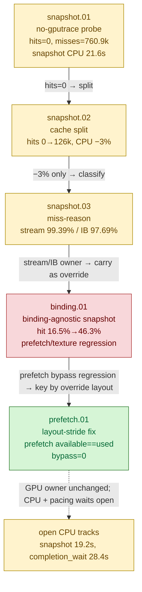

# Snapshot Cache — D3D9 frontend draw-state snapshot/rebuild CPU bottleneck

> Part of the 3DMark05 GT1 GPU-bottleneck investigation. Root map: [[overview]].

## Scope & question

This domain owns the **D3D9 importer-side draw-state snapshot/rebuild** cost — the
single largest CPU consumer in GT1 (~21s per no-gputrace run, vs ~3s queue submit).
It covers the `CachedBaseDrawState` instrumentation, the hot-state/uniform
invalidation split, the miss-reason classification (which found stream/IB handle
churn dominates), the binding-agnostic snapshot that tripled hit rate but exposed a
PSO-prefetch/texture mismatch, and the layout-stride fix that made PSO prefetch
functional again. It is a **CPU track**, distinct from the GPU "hidden VS buffer
write" owner ([[hidden-backend-storage]]).

## Hypotheses & verdicts

| # | Hypothesis | Verdict | Evidence |
|---|-----------|---------|----------|
| H1 | Snapshot rebuild is a first-class CPU bottleneck; the base cache serves zero hits | confirmed (model) | [[snapshot-cache-snapshot.01]] |
| H2 | Splitting hot-state vs uniform-only invalidation lifts hits and cuts CPU | partial / inconclusive (hits 0→126k, CPU −3% only) | [[snapshot-cache-snapshot.02]] |
| H3 | Remaining misses are dominated by stream/IB handle churn | confirmed (model) | [[snapshot-cache-snapshot.03]] |
| H4 | A binding-agnostic snapshot (stream/IB carried in override) raises hit rate | accepted hit-rate (16.5%→46.3%) but regresses pipeline-lookup CPU | [[snapshot-cache-binding.01]] |
| H5 | Preserving extra-stream stride in the layout restores usable PSO prefetch | accepted | [[snapshot-cache-prefetch.01]] |
| H6 | Fixing the snapshot/prefetch path reduces the GPU bottleneck | rejected (GPU owner unchanged; CPU/pacing waits remain) | [[snapshot-cache-prefetch.01]] |

## Verification methods

- `d3d9_draw_state_cache_hits` / `_misses` / `_hit_with_index` / `_miss_with_index`
  / `_hit_no_index` / `_miss_no_index` / `_uniform_refreshes` — proves whether the
  base draw-state cache serves any hit and whether the indexed path is the misser.
- `d3d9_snapshot_draw_submission_cpu_ms` (+ `_max/_p50/_p95/_p99`) — the direct CPU
  proof that snapshot rebuild churn moved.
- `d3d9_draw_state_cache_miss_after_{draw_packet,stream,index_buffer,texture,shader,fvf_vdecl}`
  — classifies which state delta caused each remaining miss (stream/IB dominate).
- `commit_chunk_draw_delta_stream_handle` / `_ib_handle` — confirms real handle
  churn (not packet-mask noise) backing the miss pattern.
- `encode_draw_pso_prefetch_handle_available` / `_used` /
  `_bypass_binding_override` / `_binding_override_compatible` / `_incompatible` —
  proves the binding-override PSO prefetch is functional (available == used,
  bypass == 0) without the stream-less-layout texture regression.
- `encode_draw_pipeline_lookup_cpu_ms`, `encode_draw_stream_bind_cpu_ms`,
  `completion_wait_ms` — track the residual open CPU/pacing costs.
- Native: `drawRunSubmissionStatesCompatibleForBatch()` +
  `dxmt9-dod-replay-observer-spec` assert stream/IB + uniform changes stay
  batch-compatible while a texture change splits compatibility.

## Experiment dependency graph

## Results synthesis

Settled: the D3D9 draw-state snapshot rebuild is the dominant CPU cost in GT1
(~21s/run, larger than queue submit or backend encode). The base cache started at
**zero hits** because const upload and especially **stream/IB handle churn**
invalidated the whole hot state every draw — the miss-reason counters pinned this
on stream (99.39%) and IB (97.69%) deltas, backed by ~1.04M stream and ~0.75M IB
real handle changes. The hot-state/uniform split lifted hits off zero but only cut
CPU ~3%; the binding-agnostic snapshot (stream/IB moved into `DrawBindingOverride`)
tripled hit rate to ~46% and fixed draw-run batch compatibility, but bypassing the
stream-less prefetched PSO handle spiked pipeline-lookup CPU to ~6.7s. The
layout-stride fix preserved the extra-stream stride so the prefetched handle is
override-compatible again — prefetch counters now show available == used,
bypass == 0, correct textures.

Open: this is a CPU/correctness recovery, **not** a GPU win. Under the
layout-stride frame50 replay the GPU owner is unchanged (`34.379ms`, top-3 VS
buffer write `1627.287MiB`) — that bucket belongs to [[hidden-backend-storage]].
Snapshot CPU (`19251.620ms`) and the pacing `completion_wait_ms`
(`28413.664ms`) remain open CPU tracks for future work.

## Cross-references

- [[state-churn-encode]] — stream/IB handle churn, draw-run batching, and the
  `DrawBindingOverride` mechanism this domain reuses for snapshot reuse.
- [[index-cache-locality]] — the indexed draw path that owns nearly all snapshot
  misses; the one accepted GPU win lives there.
- [[const-upload]] — VS/PS const uploads that drove the uniform-only invalidation
  branch and the const passthrough/break counters.
- [[hidden-backend-storage]] — the GPU bottleneck owner that this CPU work does
  *not* move.
- [[overview]] — root priority DAG / synthesis.
- [[perfomance-bottleneck]] — CPU-side counter design doc backing these counters.
