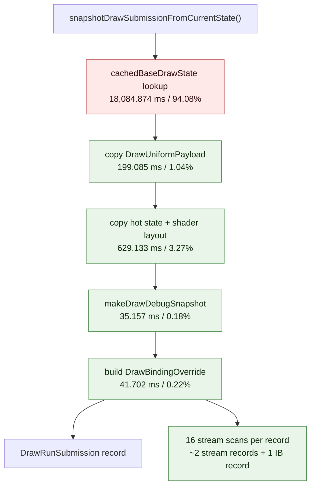

# Snapshot Submission Subphase Attribution

**Question / hypothesis.** After [[state-churn-encode-encode-phase.08]] cut the
binding-packet cache path, the largest named CPU bucket was still
`d3d9_snapshot_draw_submission_cpu_ms` at about `19.7s` per 1,440-present run.
Split `Device::snapshotDrawSubmissionFromCurrentState()` into lookup, copy,
debug snapshot, and binding-override subphases before choosing the next
implementation target.

**Implementation.**

- Added subphase timers for cache lookup, uniform copy, state copy, debug
  snapshot construction, and binding-override construction.
- Added binding-override shape counters for stream scans, stream records, and
  index records.
- Kept the instrumentation attribution-only. It names a CPU owner; it does not
  attempt to optimize the path.

**Method.**

```bash
bash scripts/tools/run_3dmark05_perf_probe.sh \
  --suffix snapshot-subphase-split-r1 \
  --frame 50 \
  --no-gputrace \
  --no-encoder-breakdown \
  --timeout 180

python3 scripts/tools/compare_3dmark05_perf_counters.py \
  experiments/output/app-d3d9-3dmark05-binding-packet-plan-direct-r1 \
  experiments/output/app-d3d9-3dmark05-snapshot-subphase-split-r1 \
  --before-label plan-direct \
  --after-label snapshot-subphase-split \
  --output experiments/output/app-d3d9-3dmark05-snapshot-subphase-split-r1/dxmt9-perf-counter-comparison-vs-plan-direct.md
```

The wrapper exited through the expected watchdog status `124` after writing
postprocess artifacts. `actual.png` is a normal GT1 frame with the robot,
flare, and HUD visible (`FPS: 14`, `Time: 0:55.81`, `Frame: 858`).

**Runtime shape versus plan-direct.**

| Metric | Plan-direct | Snapshot split | Delta |
|---|---:|---:|---:|
| `present_encoded` | 1,440 | 1,440 | 0 |
| `draw_calls` | 1,052,843 | 1,052,966 | +0.01% |
| `render_pass_begin` | 16,895 | 16,896 | +0.01% |
| `render_pass_tile_preservation_bytes` | 180,734,390,272 | 180,622,446,592 | -0.06% |
| `gpu_command_buffer_time_ms` | 4,297.915 | 4,387.443 | +2.08% |
| `completion_wait_ms` | 32,087.046 | 32,586.916 | +1.56% |
| `encode_draw_cpu_ms` | 14,541.767 | 14,737.744 | +1.35% |

The workload shape is stable enough for attribution. Parent CPU counters should
not be read as an optimization result because this run adds hot-path timers.

**Snapshot subphase result.**

| Counter | Value | Parent share | Per record |
|---|---:|---:|---:|
| `d3d9_snapshot_draw_submission_cpu_ms` | 19,222.686 ms | 100.00% | 27.469 us |
| `d3d9_snapshot_cache_lookup_cpu_ms` | 18,084.874 ms | 94.08% | 25.843 us |
| `d3d9_snapshot_state_copy_cpu_ms` | 629.133 ms | 3.27% | 0.899 us |
| `d3d9_snapshot_uniform_copy_cpu_ms` | 199.085 ms | 1.04% | 0.284 us |
| `d3d9_snapshot_binding_override_cpu_ms` | 41.702 ms | 0.22% | 0.060 us |
| `d3d9_snapshot_debug_snapshot_cpu_ms` | 35.157 ms | 0.18% | 0.050 us |

The subphase timers account for about `98.79%` of the parent bucket. The cache
lookup itself is the owner; copy and binding-override construction are too small
to be the next high-leverage target.

**Binding-override shape.**

| Counter | Value | Per draw-submission record |
|---|---:|---:|
| `commit_chunk_draw_submission_batch_records` | 699,788 | 1.000 |
| `d3d9_snapshot_binding_override_stream_scans` | 11,196,608 | 16.000 |
| `d3d9_snapshot_binding_override_stream_records` | 1,399,520 | 2.000 |
| `d3d9_snapshot_binding_override_index_records` | 699,788 | 1.000 |

The current binding-override loop scans all 16 D3D9 streams per draw-submission
record, but that scan costs only `41.702ms` in this run. It can be cleaned up
later with an active-stream list, but it is not the primary CPU owner.



**Verdict.** Accepted attribution. The next snapshot CPU target is not
`DrawUniformPayload` copy, state copy, debug snapshot creation, or the
stream/IB override loop. It is the cache lookup itself: the call into
`cachedBaseDrawState*()` consumes `18.085s`, or `94.08%` of the snapshot
submission CPU bucket.

**Next.** Split or redesign the cache lookup path. The first follow-up should
separate lookup hash/key construction from hit/miss rebuild work inside
`cachedBaseDrawState*()`, then test a cheaper persistent key or incremental
dirty-token check. A 16-stream active-list cleanup is lower priority until the
lookup bucket moves.

**Related.** [[snapshot-cache]] · [[snapshot-cache-snapshot.03]] ·
[[state-churn-encode-encode-phase.08]] · [[present-pacing]].
