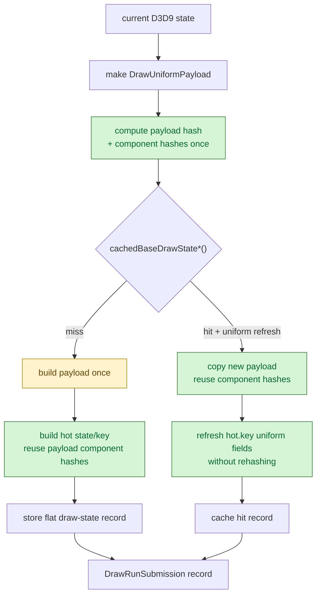

# Snapshot Uniform Component Hash Reuse

**Question / hypothesis.** [[snapshot-cache-snapshot.04]] showed
`cachedBaseDrawState*()` lookup owned `18.085s` of the snapshot submission
bucket. The follow-up split showed the lookup was not pure table probe cost:
the hit path rebuilt and rehashed the uniform payload, and the miss path rebuilt
both the uniform payload and the hot-state key. Reuse the component hashes
already computed while building `DrawUniformPayload`, then apply those hashes to
the flat hot-state key instead of hashing the same uniform fields again.

**Implementation.**

- Added `DrawUniformPayloadHashes` for the six uniform component hashes:
  vertex constants, pixel constants, WVP, FFP blend WVP, texture transforms,
  and clip planes.
- Changed `hashDrawUniformPayload()` and `makeDrawUniformPayloadFromState()` to
  optionally return those component hashes with the payload hash.
- Changed flat draw-state key/record construction and cache refresh paths to
  reuse the component hashes when updating `hot` and `hot.key`.
- Kept the binding/layout identity unchanged. This change reduces duplicate CPU
  hashing; it does not change draw state semantics.

**Method.**

```bash
bash scripts/tools/run_3dmark05_perf_probe.sh \
  --suffix snapshot-hash-reuse-r1 \
  --frame 50 \
  --no-gputrace \
  --no-encoder-breakdown \
  --timeout 180

python3 scripts/tools/compare_3dmark05_perf_counters.py \
  experiments/output/app-d3d9-3dmark05-snapshot-lookup-split-r1 \
  experiments/output/app-d3d9-3dmark05-snapshot-hash-reuse-r1 \
  --before-label snapshot-lookup-split \
  --after-label snapshot-hash-reuse \
  --output experiments/output/app-d3d9-3dmark05-snapshot-hash-reuse-r1/dxmt9-perf-counter-comparison-vs-lookup-split.md
```

The wrapper exited through the expected watchdog status `124` after writing
postprocess artifacts. `actual.png` is a normal GT1 frame with the robot,
flare, and HUD visible (`FPS: 15`, `Time: 0:56.06`, `Frame: 939`).

**Shape caveat.** This is a supervised-timeout partial workload. The hash-reuse
run reached `1620` presents before the timeout, while the lookup-split baseline
reached `1440` presents. Total counters therefore should not be read directly
as a fixed-workload fps proof. The stable comparison is per-present and
per-call normalization.

**Runtime shape.**

| Metric | Lookup split | Hash reuse | Delta |
|---|---:|---:|---:|
| `present_encoded` | 1,440 | 1,620 | +12.50% |
| `draws_per_present` | 730.773 | 729.202 | -0.21% |
| `passes_per_present` | 11.716 | 11.720 | +0.03% |
| `gpu_command_buffer_time_ms / present` | 2.991 ms | 2.974 ms | -0.55% |
| `completion_wait_ms / present` | 22.454 ms | 22.431 ms | -0.10% |
| `encode_draw_cpu_ms / present` | 10.136 ms | 10.285 ms | +1.47% |

The draw/pass shape and GPU time per present stay effectively flat. The extra
`180` presents are useful throughput evidence, but not a complete scene-time
gate because the final-frame watchdog stopped both runs.

**Snapshot normalized result.**

| Metric | Lookup split | Hash reuse | Delta |
|---|---:|---:|---:|
| `d3d9_snapshot_draw_submission_cpu_ms / present` | 13.603 ms | 8.269 ms | -39.21% |
| `d3d9_snapshot_cache_lookup_cpu_ms / present` | 12.807 ms | 7.463 ms | -41.73% |
| `d3d9_snapshot_cache_uniform_refresh_cpu_ms / refresh` | 23.655 us | 12.666 us | -46.45% |
| `d3d9_snapshot_cache_uniform_build_cpu_ms / refresh` | 12.319 us | 12.427 us | +0.87% |
| `d3d9_snapshot_cache_uniform_hash_cpu_ms / refresh` | 11.205 us | 0.080 us | -99.28% |
| `d3d9_snapshot_cache_miss_uniform_build_cpu_ms / miss` | 12.332 us | 12.426 us | +0.77% |
| `d3d9_snapshot_cache_miss_hot_build_cpu_ms / miss` | 14.287 us | 3.174 us | -77.78% |
| cache hit rate | 46.368% | 46.352% | -0.03% |

The intended mechanism moved: uniform hash time was essentially eliminated from
the refresh path, and miss hot-state build cost fell because the hot key no
longer rehashes the uniform components. Uniform payload construction itself is
flat; this was a hash reuse fix, not a payload-build reduction.



**Verdict.** Accepted CPU win for the PE-side snapshot cache. The per-present
snapshot submission bucket drops from `13.603ms` to `8.269ms`, and cache lookup
drops from `12.807ms` to `7.463ms`. This does not claim a GPU win or a
vsync-on fps win: GPU command-buffer time per present is flat, completion wait
per present is flat, and the run is a timeout-partial sample.

**Next.** The remaining snapshot cost is no longer duplicate component hashing.
The next CPU target is the actual uniform payload construction (`~12.4us` per
refresh/miss) plus residual shader-layout/hot-state work. A future fps claim
needs a fixed-workload or complete-GT1 wallclock gate, not another raw total
counter comparison from a watchdog-limited run.

**Related.** [[snapshot-cache]] · [[snapshot-cache-snapshot.04]] ·
[[present-pacing]] · [[state-churn-encode]].
