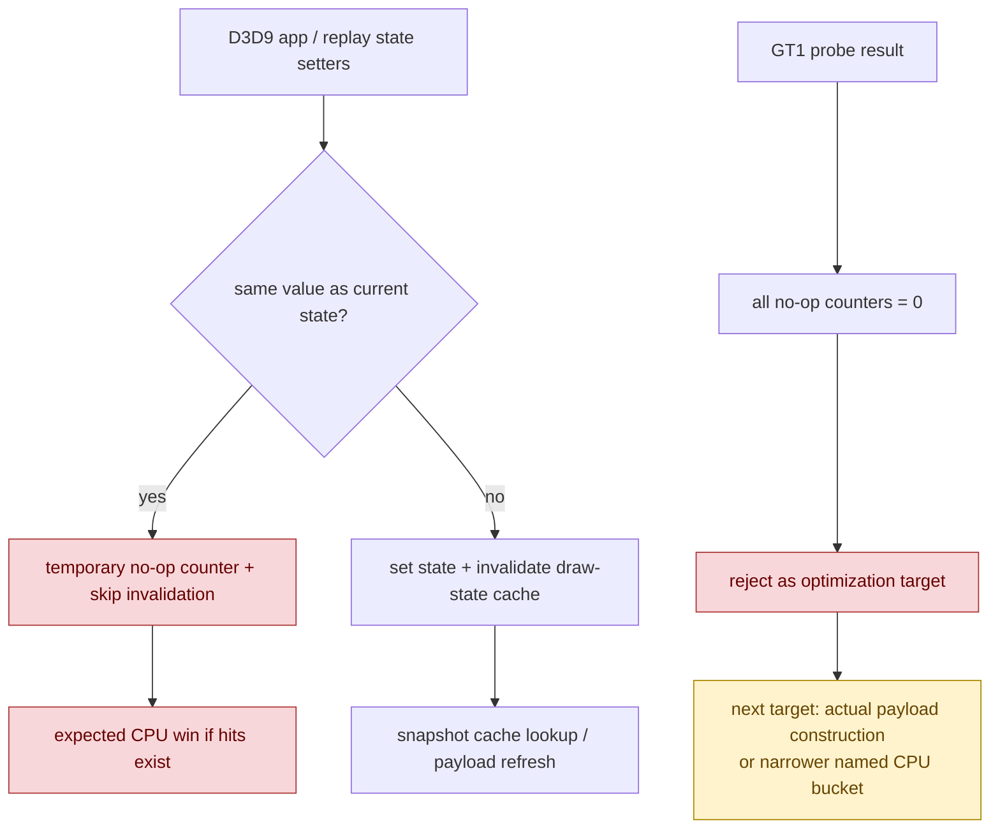

# State-Set No-Op Guard Probe

> **Outdated — every artifact this leaf cites in `source:` is gone from disk.** The numbers below cannot be re-derived or re-checked. Kept as history; do not cite it as current evidence.

**Question / hypothesis.** After [snapshot-cache-snapshot.05](snapshot-cache-snapshot.05.md), the remaining
snapshot path still spends about `12.4us` per uniform refresh or miss building
payloads. One possible low-risk explanation was redundant D3D9 API state sets:
if the app or replay path repeatedly calls setters with the same value, the
frontend would invalidate snapshot state and rebuild keys even though the
semantic state did not change.

**Implementation probe.** A temporary branch added conservative same-value
guards plus counters around D3D9 state setters: render state, texture,
FVF/vertex declaration, shader, render-target/depth, viewport/scissor,
texture-stage/sampler, FFP state, and clip plane. The probe counted both a
total `d3d9_state_set_noop` and per-category subcounters. The code was not
retained after this result because it had zero hits and would add branch/counter
overhead without a load-bearing mechanism.

**Method.**

```bash
bash scripts/tools/run_3dmark05_perf_probe.sh \
  --suffix state-noop-guard-r1 \
  --frame 50 \
  --no-gputrace \
  --no-encoder-breakdown \
  --timeout 180

python3 scripts/tools/compare_3dmark05_perf_counters.py \
  experiments/output/app-d3d9-3dmark05-snapshot-hash-reuse-r1 \
  experiments/output/app-d3d9-3dmark05-state-noop-guard-r1 \
  --before-label snapshot-hash-reuse \
  --after-label state-noop-guard \
  --output experiments/output/app-d3d9-3dmark05-state-noop-guard-r1/dxmt9-perf-counter-comparison-vs-hash-reuse.md
```

The wrapper exited through the expected watchdog status `124` after writing
postprocess artifacts. `actual.png` is a normal GT1 frame with the robot, flare,
and HUD visible (`FPS: 17`, `Time: 0:54.95`, `Frame: 916`).

**Probe counters.**

| Counter | Value |
|---|---:|
| `d3d9_state_set_noop` | `0` |
| `d3d9_state_set_noop_render_state` | `0` |
| `d3d9_state_set_noop_texture` | `0` |
| `d3d9_state_set_noop_fvf_vdecl` | `0` |
| `d3d9_state_set_noop_shader` | `0` |
| `d3d9_state_set_noop_render_target_depth` | `0` |
| `d3d9_state_set_noop_viewport_scissor` | `0` |
| `d3d9_state_set_noop_texture_stage_sampler` | `0` |
| `d3d9_state_set_noop_ffp_state` | `0` |
| `d3d9_state_set_noop_clip_plane` | `0` |

**Normalized comparison against [snapshot-cache-snapshot.05](snapshot-cache-snapshot.05.md).**

| Metric | Hash reuse | No-op guard probe | Delta |
|---|---:|---:|---:|
| `present_encoded` | 1,620 | 1,560 | -3.70% |
| `draws_per_present` | 729.202 | 734.296 | +0.70% |
| `passes_per_present` | 11.720 | 11.755 | +0.30% |
| `d3d9_snapshot_draw_submission_cpu_ms / present` | 8.269 ms | 8.299 ms | +0.36% |
| `d3d9_snapshot_cache_lookup_cpu_ms / present` | 7.463 ms | 7.500 ms | +0.51% |
| cache hit rate | 46.352% | 46.369% | +0.04% |
| `uniform_refresh_cpu_ms / refresh` | 12.666 us | 12.647 us | -0.15% |
| `miss_uniform_build_cpu_ms / miss` | 12.426 us | 12.418 us | -0.07% |
| `miss_hot_build_cpu_ms / miss` | 3.174 us | 3.157 us | -0.55% |
| `encode_draw_cpu_ms / present` | 10.285 ms | 10.236 ms | -0.48% |
| `gpu_command_buffer_time_ms / present` | 2.974 ms | 3.026 ms | +1.73% |
| `completion_wait_ms / present` | 22.431 ms | 22.416 ms | -0.07% |

The run is a supervised-timeout partial workload, so the total counter decrease
mostly reflects `60` fewer presents before the watchdog. The normalized numbers
show no meaningful mechanism movement, and the probe counters prove the guard
itself never fired.



**Verdict.** Rejected. Same-value D3D9 state setters are not a load-bearing
source of snapshot churn in this GT1 path. Either the recorder/replay path
already avoids those redundant setters, or this workload simply does not issue
them at a meaningful rate. Do not keep general D3D9 state-set no-op guards as a
3DMark05 optimization.

**Next.** Continue from the accepted [snapshot-cache-snapshot.05](snapshot-cache-snapshot.05.md) state:
the remaining snapshot-cache work is actual uniform payload construction,
residual shader-layout/hot-state work, or another explicitly measured CPU
bucket. Another broad "skip unchanged state" bet should first prove non-zero
hits with cheap instrumentation.

**Related.** [snapshot-cache](index.md) · [snapshot-cache-snapshot.05](snapshot-cache-snapshot.05.md) ·
[present-pacing](../present-pacing/index.md) · [state-churn-encode](../state-churn-encode/index.md).
