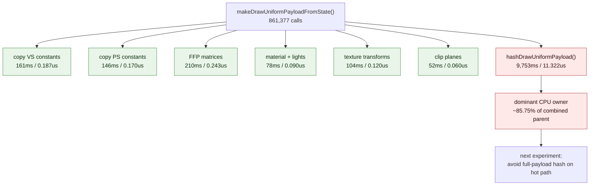

# Snapshot Uniform Payload Build Split

**Question / hypothesis.** [[snapshot-cache-snapshot.05]] removed the duplicated
component hash work, and [[snapshot-cache-snapshot.06]] rejected same-value D3D9
setter skips. The remaining snapshot-cache cost was the actual
`makeDrawUniformPayloadFromState()` payload construction, measured at roughly
`12.4us` per refresh/miss in prior runs. Split that function to determine
whether the owner is large constant copies, FFP matrix/lighting construction,
texture/clip work, or the first payload hash.

**Implementation.** Added snapshot-only subphase counters inside
`makeDrawUniformPayloadFromState()`:

- `d3d9_snapshot_uniform_build_calls`
- `d3d9_snapshot_uniform_build_vs_const_copy_cpu_ms`
- `d3d9_snapshot_uniform_build_ps_const_copy_cpu_ms`
- `d3d9_snapshot_uniform_build_ffp_matrix_cpu_ms`
- `d3d9_snapshot_uniform_build_ffp_material_light_cpu_ms`
- `d3d9_snapshot_uniform_build_texture_transform_cpu_ms`
- `d3d9_snapshot_uniform_build_clip_plane_cpu_ms`
- `d3d9_snapshot_uniform_build_hash_cpu_ms`

The counters are only recorded for the snapshot-cache build/refresh path and
only when `DXMT_PERF_COUNTERS` is enabled. Fixture/helper callers do not enable
this attribution path.

**Method.**

```bash
bash scripts/tools/run_3dmark05_perf_probe.sh \
  --suffix snapshot-payload-split-r1 \
  --frame 50 \
  --no-gputrace \
  --no-encoder-breakdown \
  --timeout 180

python3 scripts/tools/compare_3dmark05_perf_counters.py \
  experiments/output/app-d3d9-3dmark05-snapshot-hash-reuse-r1 \
  experiments/output/app-d3d9-3dmark05-snapshot-payload-split-r1 \
  --before-label snapshot-hash-reuse \
  --after-label snapshot-payload-split \
  --output experiments/output/app-d3d9-3dmark05-snapshot-payload-split-r1/dxmt9-perf-counter-comparison-vs-hash-reuse.md
```

The wrapper exited through the expected watchdog status `124` after writing
postprocess artifacts. `actual.png` is a normal GT1 frame with the robot, flare,
and HUD visible (`FPS: 18`, `Time: 0:54.81`, `Frame: 917`).

**Run shape caveat.** This is an attribution run with extra per-build timers.
The hash-reuse baseline reached `1620` presents, while this run reached `1560`
presents before the watchdog. Draw/pass shape remains close (`draws_per_present`
`+0.62%`, `passes_per_present` `+0.16%`), but the new timers add overhead. Do
not read this run as a throughput optimization.

**Payload build split.**

| Subphase | Total | Per build call |
|---|---:|---:|
| `d3d9_snapshot_uniform_build_calls` | 861,377 | n/a |
| `vs_const_copy` | 161.301 ms | 0.187 us |
| `ps_const_copy` | 146.052 ms | 0.170 us |
| `ffp_matrix` | 209.580 ms | 0.243 us |
| `ffp_material_light` | 77.500 ms | 0.090 us |
| `texture_transform` | 103.742 ms | 0.120 us |
| `clip_plane` | 52.011 ms | 0.060 us |
| `payload_hash` | 9,752.759 ms | 11.322 us |

The build call count exactly matches `uniform_refreshes + misses`
(`399,119 + 462,258 = 861,377`), so the split covers the intended snapshot
payload-build population.

**Parent buckets.**

| Metric | Value | Per build call |
|---|---:|---:|
| `cache_uniform_build_cpu_ms` | 5,267.370 ms | 6.117 us |
| `miss_uniform_build_cpu_ms` | 6,106.170 ms | 7.091 us |
| combined parent payload build | 11,373.540 ms | 13.206 us |
| split `payload_hash` share of combined parent | 85.75% | n/a |



**Verdict.** Accepted attribution. The remaining snapshot payload-build cost is
not large VS/PS constant copy, FFP matrix construction, texture transform
construction, or clip-plane construction. It is the first full
`hashDrawUniformPayload()` pass, especially the full payload/constant hashing
that still remains after [[snapshot-cache-snapshot.05]] removed duplicate
component rehashing.

**Next.** The next implementation candidate is to separate "payload lookup
bucket hash" from "semantic equality" and avoid hashing the full VS/PS constant
arrays every payload build. Correctness can remain protected by the existing
`record.payload == payload` equality check in `ChunkSlot::findDrawUniformPayload`;
the risk is lookup collision rate and hot-key compatibility, not silent payload
aliasing. A safe follow-up should first introduce a distinct narrow hash policy
or range/usage-based hash and measure both `payload_hash` time and uniform
lookup collision/hit behavior.

**Related.** [[snapshot-cache]] · [[snapshot-cache-snapshot.05]] ·
[[snapshot-cache-snapshot.06]] · [[state-churn-encode]].
